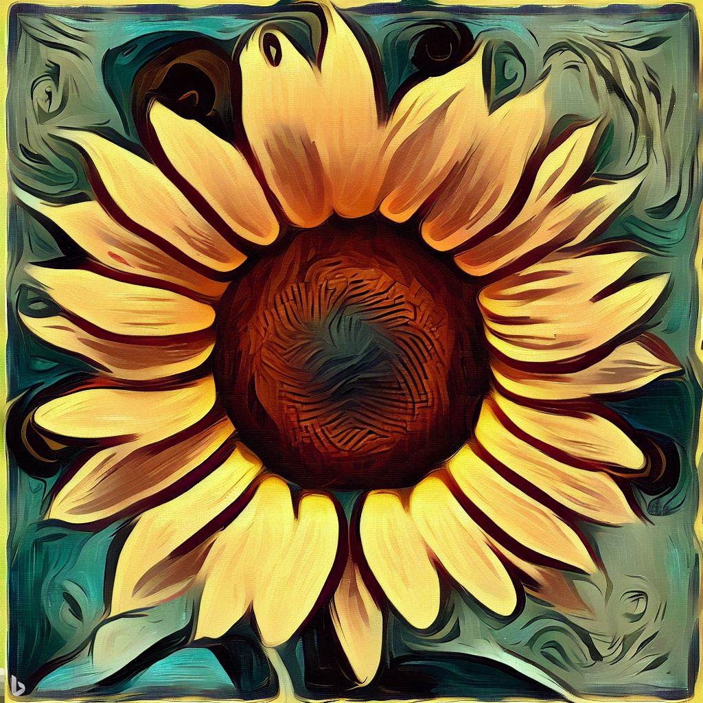
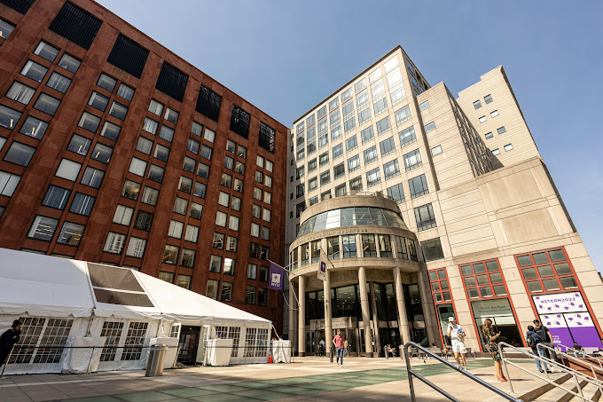
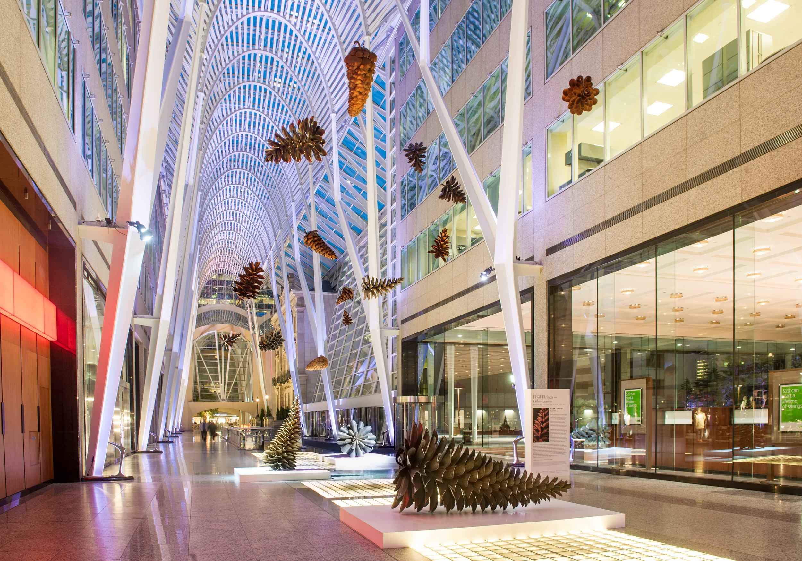
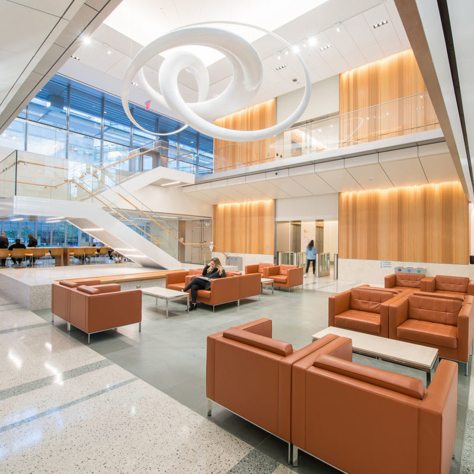
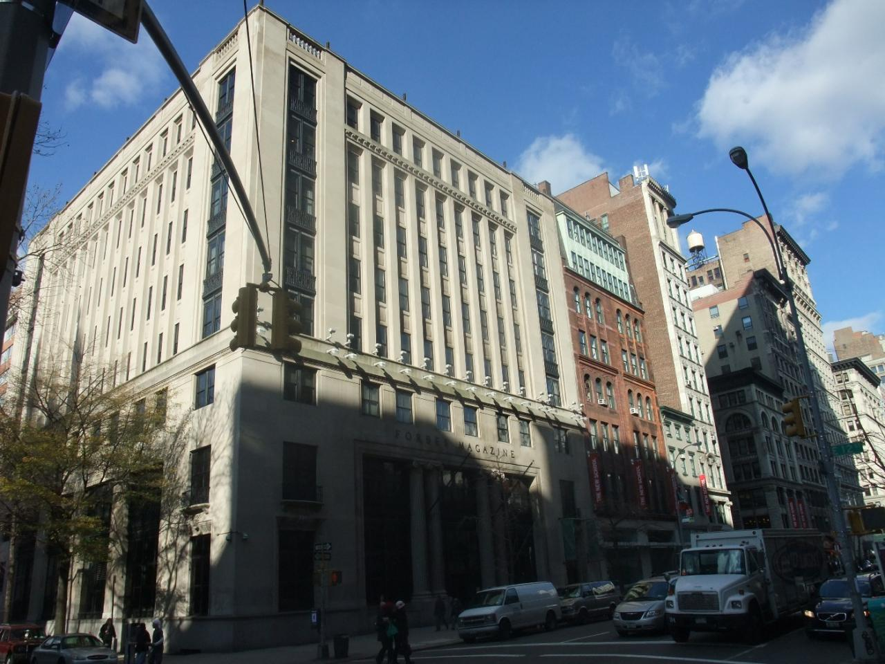

<figure>
    
    <figcaption align="center">A lovely sunflower in the style of Van Gogh</figcaption>
</figure>

## 👋 Hi! I'm Sunny

I grew up in a small town with a bustling perhiphery, hosting (at one end) one of the busiest bridges in the world.

The below is our *historic* view overlooking New York City from the west:

<figure>
    
    <figcaption align="center">Our <i>historic</i> view overlooking the GW Bridge</figcaption>
</figure>

I went to both primary and secondary school in my hometown, where I found an interest in STEM and participated in sports (Track and Field) as well as band (where I played the Trumpet 🎺).

Thereafter, I went to NYU where I majored in Business with concentrations in Finance, and Computing & Data Science, with a Minor in Mathematics.

<figure>
    
    <figcaption align="center">The daily view on the NYU campus</figcaption>
</figure>

However, I actually started out as an Accounting major, intending for examination as a CPA, but realized that I did not deeply enjoy the field as much as I had thought/hoped.

Over my freshman year summer, I studied abroad in Cape Town, South Africa where I worked for a creative consulting company help with logistics for a cosmetics startup. The summer thereafter, I worked for Brookfield, where I helped with low frequency trading using language models.

<figure>
    
    <figcaption align="center">Brookfield Place was always so refined</figcaption>
</figure>

It was during this time that I found Data Science and enjoyed its multidisciplinary nature, realizing the importance of quantizing a true part of the world.

I took two years off working odd jobs here and there, acting as an Analyst at Two Sigma to a consultant at Deloitte. These roles (some with a negative reinforcement) only reaffirmed my decision that Data Science was for me.

I then returned to classes, working part-time as a Data Scientist at NYU Langone, where I processed, pipelined, and used semi/supervised methods to analyze genetic data.

<figure>
    
    <figcaption align="center">NYU Langone's Lobby, looking friendly for conversation</figcaption>
</figure>

The classes that I took during this time were.. to say excellent would be an understatement. They really pushed for a feeling of eased understanding, focused into three things being: *the real world*, *mathematics*, and *code* assisting one another to bring about insights. It was also an exteme mix of the visual and the expressive; as I took classes, learned techniques, and was made to understand concepts that allowed computers to (in a way) *perceive* the world as we do, and more importantly for us to interact with such machines. 

<figure>
    
    <figcaption align="center">Always a bit far from campus, NYU's Center for Data Science</figcaption>
</figure>

Most of these experiences were definitely challenging, however trepidation and persistence were key.

There is much more out there, and this website is my hope to be able to document all the in-betweens and through-outs for all that I experience