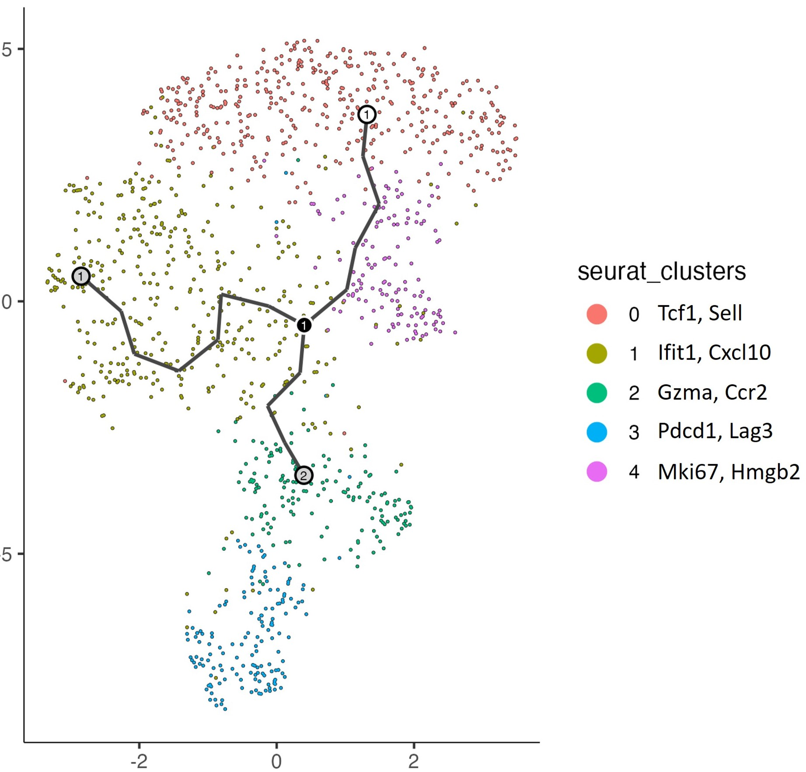

## Taking Off Where Was Left Off 🚀

In the previous post, Monocle was explained up to and including the optimization relevant to an abstracted view in terms of obtaining a graph descriptive of the data. Analogies between a ball being thrown and its parameters in terms of position and parameterization using its initial position, initial velocity, and throwing force. This is otherwise known as kinematics, or the physics subfield studying the motion of objects.

Let us revisit the completed figure of both the ball in it's discrete and continuous states:

<figure style="text-align: center;" id="fig1">
    
    <figcaption align="center"><i>Fig. 1</i>. The combined image of both the snapshots and the continuous trajectory from the first post</figcaption>
</figure>

Here, the trajectory is represented simultaneously by the continuous line of travel and the discrete set of images on the relative position of the ball to ambient space. If the continuous line were not present, then the only truth about where the ball is would be relative to the viewpoint of the thrower and the location of the ball through space.

Given the technology's initial application to biology, we would like to once again begin the potentially uncomfortable transition to a more mathematical description/approach, and thus shift toward that field. Instead of time as a parameterization, more unintuitively, we must consider *space* as the identifying factor representing the data, in this case - the state of cells given the expression of different values/combinations of genes.

To show this, the image below provides an overview of the differentiaion process of T cells in particular, and how the expression of different genes can be used to identify the state of the cell.

<figure style="text-align: center;" id="fig2">
    
    <figcaption align="center"><i>Fig. 2</i>. A sample Monocle output with statistically signifigcant biological markers (<a href="https://www.nature.com/articles/s41590-023-01443-y">Steele et. al</a href>)</figcaption>
</figure>

While these *markers* (the actual combinations of numerical representation of genes) are arbitrary to the extent of an empirical meaning to expression, any applied algorithm to potentially identify such nuanced changes must be coroborated by *function* and *utility*. In other words, the genes themselves hold no meaning, but rather the usefulness of the expressed genes arise from a functionally biological perspective (related to the cause and effect of biological changes as an effect of the expression of the genes in question). These cells that then express certain genes are associated with certain biological functions, and thus the expression of these genes can be used to identify the state of the cell to that extent.

As a throwback of sorts, this type of branching mechanism is exactly what was described as the lower-dimensional graph (web) in the previous post, expressing the maximally simplified (this will be clarified later on) implementation of what high-dimensional expressions of genes per cell are available at every datapoint. The connection to the ball analogy is made more powerful given the below, where we will consider an actual concept of pseudo*time*, using the equivalent of different snapshots and a startpoint to identify a continuous trajectory to describe the state of the cell.

## Diving into DDRTree

Recall that the algorithm that Monocle attempts to optimize is described as follows:

$$
\min_{\mathcal{G} \in G_b}{} \min_{f_{\mathcal{G}} \in \mathcal{F}}{} \min_{Z}{} \sum_{i=1}^{N} || \mathbf{x}_i - f_G (\mathbf{z}_i) ||^2
$$

$$
\text{+} \frac{\lambda}{2} \sum_{(V_i, V_j) \in \mathcal{E}} b_{i,j} || f_G (\mathbf{z}_i) - f_G (\mathbf{z}_j) ||^2
$$

Where it attempts to triply optimize over three factors of every graph $\mathcal{G}$, every projection function $\mathcal{f_G}$, and every low-dimensional latent point $Z$. But how does it achieve this goal, and to what end/using what methods does it do this? While the above only provides for the vague function $f_\mathcal{G}$, its specific definition is never provided.