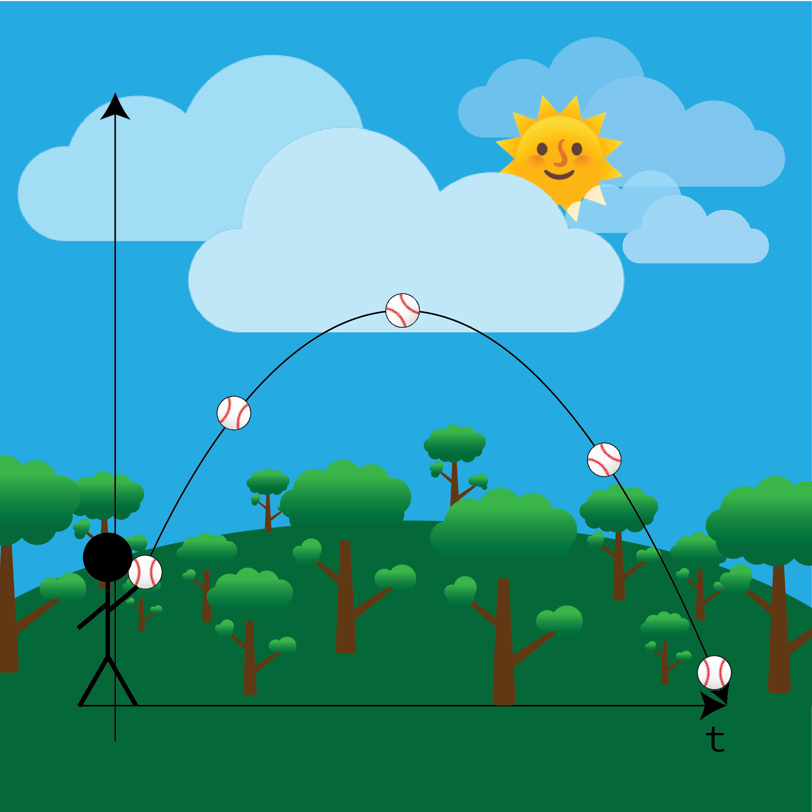
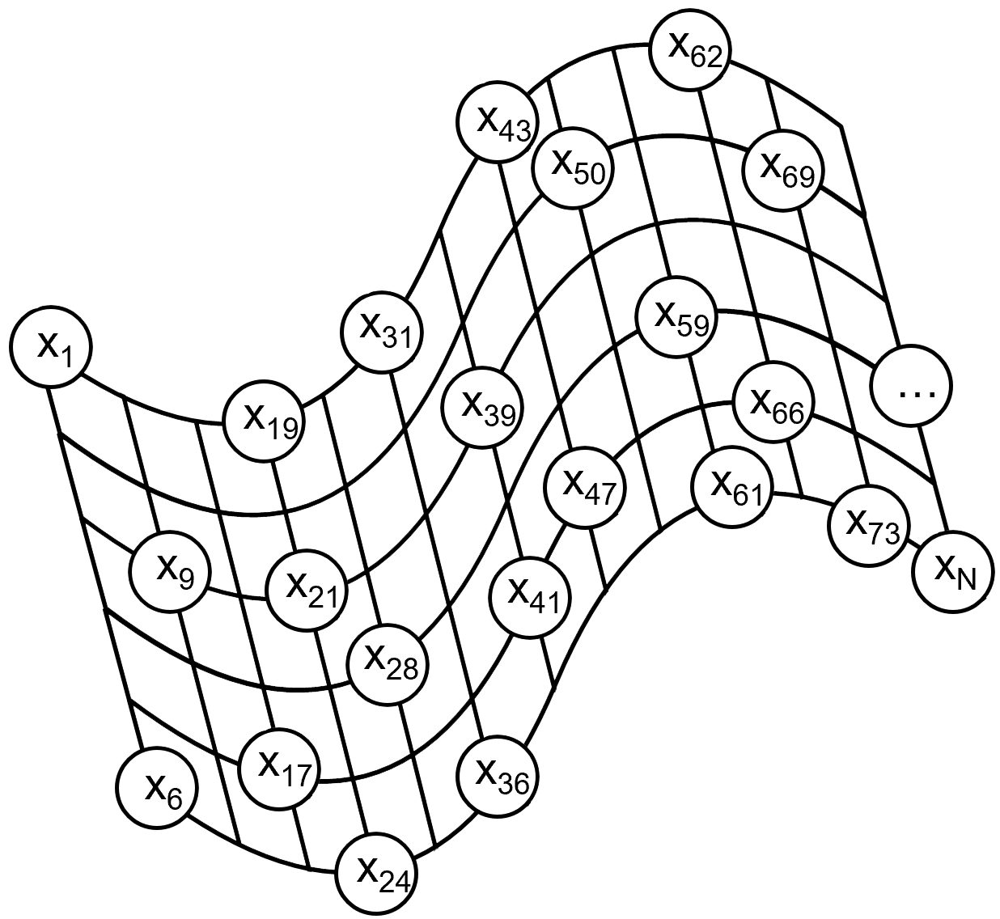
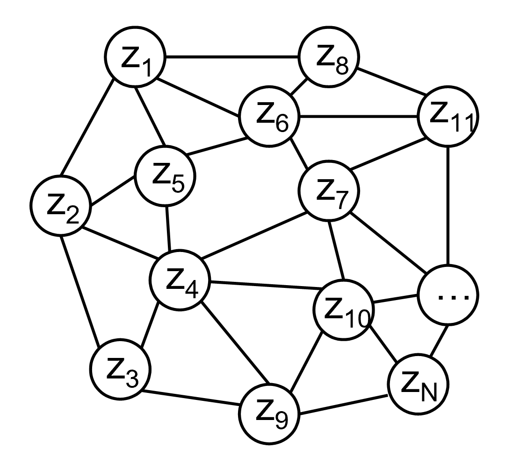
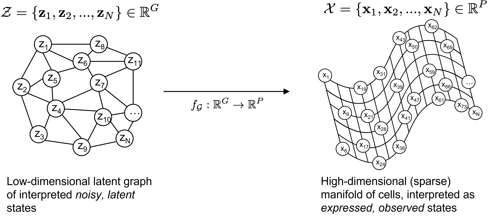

# Everything is Not What They Seem

More than just a throwback to Wizards of Waverly Place, I really do think latent models are quite neat. They hint at the idea that there exists a fundamental discrepancy between *what* is overtly shown and *how* these patterns come to be.

This concept shines brightly in the intricate systems governing gene expression. Here, phenotypes (the observable traits of an organism, such as the fiery red versus raven black hair in humans, or the varying petal lengths among different iris species) aren't always directly correlated with genotypes (the specific sequence of *ATCG*: *Adenine*, *Thymine*, *Cytosine*, and *Guanine* in DNA). 

In the vast and diverse landscape of the medical field, the phenotypes of a particular organism can sometimes seem like a cryptic puzzle when viewed in the context of the genes involved. As it turns out, the experimental observations of cellular expression (in terms of the genes active in each cell) exist in a lower dimensional *latent* space. This is in stark contrast to the more complex, higher dimensional variables that we might initially expect.

So, in essence, the world of gene expression is not unlike a magic trick. What we see on the surface is just the tip of the iceberg, with a whole world of complexity hidden beneath. And much like a good magic trick, it's this hidden complexity that makes it all the more fascinating.

# The Analogy of the Soaring Ball: Unraveling Reverse Graphs

To demystify the complexities of reverse graph embeddings, let's employ a straightforward yet effective analogy. Picture someone launching a ball into the air. You're armed with a camera, tracking the ball's trajectory from a third-person perspective off the $z$-axis. You capture the journey in a series of snapshots, *click*, *click*, *click*, *click*, ... , *CLICK*. Once the film is developed, you're left with a series of distinct photos.

These snapshots serve as frozen moments in time, each providing a unique perspective on the ball's position relative to its surroundings. The photos might resemble something like this:

<figure id="fig1">
    
    <figcaption align="center"><i>Fig. 1</i>. The five distinct photos capturing the ball's trajectory through the air... Ohhh <i>Snaap</i></figcaption>
</figure>

While you've captured a total of five images, this number can be generalized to *N*, allowing for as many or as few snapshots as desired. Each snapshot provides an accurate representation of the ball's location at that specific moment. A more comprehensive view emerges when we zoom out to consider the bigger picture:

<figure style="text-align: center;" id="fig2">
    
    <figcaption align="center"><i>Fig. 2</i>. Perspective from the z-axis of a ball being thrown into the air, with each ball representing a snapshot in time</figcaption>
</figure>

For a more holistic understanding, we can juxtapose the *discrete* snapshots with the *continuous* trajectory of the ball. The image below illustrates this, overlaying the snapshots at each time point:

<figure style="text-align: center;" id="fig3">
    
    <figcaption align="center"><i>Fig. 3</i>. The combined image of both the snapshots and the continuous trajectory</figcaption>
</figure>

To infuse some mathematical intuition into these images, we can use a simple kinematics equation representing a point-like object (our ball):

$$
x(t) = \frac{1}{2} a_it^2 + v_it + x_i, \ t \in \mathbb{R}; \ x_i, v_i, a_i \in \mathbb{R}^n
$$

Here, $x_i$ is the initial position of the ball, $v_i$ is the initial velocity, and $a_i$ is the initial acceleration, with all variables existing in a *hypothetical* $n$-dimensional space. $t$ represents the time elapsed since the ball was tossed.

For a moment, let's pretend we know nothing about the *continuous* path that the ball takes, what we consider to be the [*closed-form solution*](https://en.wikipedia.org/wiki/Closed-form_expression), or the above equation that represents the ball's position ($x_i$). Instead, let's ponder: how can we piece together the ball's trajectory from the discrete images shown in [Fig. 1](#fig1)?

Drawing inspiration from the combined discrete/continuous image ([Fig. 3](#fig3)), which bridges the time-agnostic ([Fig. 1](#fig1)) and time-aware ([Fig. 2](#fig2)) figures, we notice that the most significant difference in each discrete image is the background (with the *ball* serving as a constant reference). 

Can we now quantify this difference of background? The answer lies in the change in the *position* of the ball, which alters the background from the perspective of a third-party observer. This insight is precisely the foundation of dimensionality reduction through graph learning: to find the *path* of the ball (the closed equation) that best describes all the images of the ball, given its position (the discrete images) at different timepoints when we know nothing about the realities of our world, specifically how we live in a $3$d world or the laws of physics (kinematics) that need to be followed.

This analogy serves as a bridge between a simpler, physical representation and the complex biological processes it aims to explain. By generalizing, we can align this analogy with what the algorithm was designed to represent: cells and their expressed genes. In this context, gene expression can be likened to the snapshots of individual cells, and the latent distribution of *possible* outcomes (moderated by time) can be viewed as the continuous trajectory. This continuous trajectory (which will be completed in a following post) exists in a lower dimension than the number of dimensions for the expressed phenotype (the total number of expressed genes). But how do we determine this optimal lower dimension to reduce our entire dataset to?

# Riding the Waves and Webs: A Dive into Genotypes and Phenotypes

The previous analogy, while effective as a broad concept, is somewhat *deterministic*. Given the parameters $x_i$, $v_i$, and $a_i$, the height $x(t)$ can be calculated with precision. However, this approach doesn't quite capture the randomness inherent in our genotype vs. phenotype conundrum.

To clarify, let's extend our analogy by drawing inspiration from nature, specifically waves and water:

<figure style="text-align: center;" id="fig4">
    
    <figcaption align="center"><i>Fig. 4</i>. Water waves with refractions as seen from above</figcaption>
</figure>

Beyond its aesthetic appeal, this image carries a metaphorical significance. The randomness depicted in the waves, demonstrated by the unpredictable *splash and splatter* of the water, alongside the seemingly continuous *fabric* of the water's surface, more accurately represents the nature of gene expression (phenotype) than a simple ball toss. Even better, it presents as a *surface* rather than a point-like, individual object able to describe a whole spectra of quantities.

So, where does the genotype fit into this picture? Think of the genotype as a spider web, subtly fluctuating under the force of the wind, yet never so erratic as to lose its structural integrity. In many ways, it's more stable than the phenotype, thanks to the codified nature of DNA. However, it's also *simpler*, given the relatively minor variation between one instance of genotype and another (as seen when comparing gene expression in cells).

<figure style="text-align: center;" id="fig5">
    
    <figcaption align="center"><i>Fig. 5</i>. The simplicity of a spider web in comparison to water waves</figcaption>
</figure>

With a deeper understanding of this metaphor, we're now ready to introduce mathematical concepts and numbers into our discussion.

# The Peaks and Valleys: A Mathematical Perspective

As previously discussed, waves can represent the high-dimensional output of genes that are expressed as a phenotype.

<figure style="text-align: center;" id="fig6">
    
    <figcaption align="center"><i>Fig. 6</i>. Our mathematical model of high-dimensional waves</figcaption>
</figure>

In this mathematical model, we assume there's a method to sequentially number all states of the expressed genes (phenotypes) in the high-dimensional space, denoted as $\mathcal{X}=\{\mathbf{x}_1,\mathbf{x}_2,...,\mathbf{x}_N\}$, where $N \in \mathbb{I}$ is the total number of cells. Essentially, this is a comprehensive list of the dimensions associated with each cell (i.e., the vector of genes expressed per cell) for every cell in the sampled tissue.

<figure style="text-align: center;" id="fig7">
    
    <figcaption align="center"><i>Fig. 7</i>. Our mathematical model of low-dimensional webs</figcaption>
</figure>

In the lower-dimensional space, we define the variables associated with the diversity of gene expressions (genotypes) across individual cells as $\mathcal{Z}=\{\mathbf{z}_1, \mathbf{z}_2,...,\mathbf{z}_N\}$, where $N \in \mathbb{I}$ is the total number of cells. However, in this context, the representation of each variable is less clear. They consist of *latent* (unseen) nodes, each representing a cell's true phenotype-generating distribution. In simpler terms, these latent variables are not directly observed but are inferred from the observed gene expressions. They serve as a representation of the underlying biological states or properties of each cell.

## Charting the Course: A Map(ping) to Guide Us

As we stand on the precipice of defining the structured relationship between the web and the wave, we're essentially trying to distill a high-dimensional output into a low-dimensional insight. The first step in this journey is to visualize *how* we define this low-dimensional web that we're aiming to describe. In other words, we need to identify the abstract qualities that our web should possess. 

If we take a gander at [Fig. 7](#fig7), a few initial qualities jump out at us:

1. The circular components that house each of the cells, which we'll affectionately dub as *nodes* henceforth.
2. The lines that serve as the social glue connecting these circles, playing the role of *edges*.
3. The culmination of these elements, which we'll refer to as a *graph*.

To put on our math hats for a moment, we can now express that the Graph $\mathcal{G}=(\mathcal{V}, \mathcal{E})$ comprises a set of vertices $\mathcal{V}=\{\mathcal{V}_1, \mathcal{V}_2,...,\mathcal{V}_N\}$ and a set of weighted, undirected edges $\mathcal{E}$. This is a far cry from unweighted and directed edges. The former lacks a mechanism to represent the numerical degree of connection between any two vertices, while the latter implies a sense of directionality or pointing from one node vertex to another. 

# Reverse Graph Embeddings: Setting Sail with Our Captain

Now, let's dive into the actual process of mapping from the higher dimension to the low. For this, we'll employ a nifty tool known as Reverse Graph Embeddings. Here's the equation that makes the magic happen:

$$
\min_{\mathcal{G} \in G_b}{} \min_{f_{\mathcal{G}} \in \mathcal{F}}{} \min_{Z}{} \sum_{(V_i, V_j) \in \mathcal{E}} b_{i,j}  || f_G (\mathbf{z}_i) - f_G (\mathbf{z}_j) ||^2
$$

To break it down, this equation is the hero of our adventure that helps us transform (defeat) a complex, high-dimensional data structure into a simpler, low-dimensional representation. It's like turning a spaghetti monster into a neat, orderly pasta. And who doesn't love a good pasta?

## Frustrating Minimums (Argghh Mins)

Let's delve into the intricacies of a triple nested optimization problem, a prevalent construct in machine learning. This complex structure, akin to a Russian nesting doll, involves the pursuit of optimal model parameters that minimize a specific loss function. Despite its initial complexity, we will systematically dissect it for a clearer understanding.

$$
\min_{\mathcal{G} \in G_b}{} \min_{f_{\mathcal{G}} \in \mathcal{F}}{} \min_{Z}{}
$$

The target objective comes in the form of a triple nested optimization problem, which is common in machine learning when we're trying to find the best model parameters that minimize a certain loss function. Let's start from the inside and work our way out:

1. The First $\min$ selects the optimal graph $\mathcal{G}$: 

    $$
    \min_{\mathcal{G} \in \mathcal{G}_b}
    $$

    At the core of Reverse Graph Embeddings lies a graph $\mathcal{G}$ that captures the relationships between data points. However, not all graphs are created equal. The first $\min$ allows us to explore different graphs within the set $\mathcal{G}_b$ and identify the one that best represents the underlying structure of the data.

2. The Second $\min$ optimizes the embedding function $\mathcal{f}_{\mathcal{G}}$:

    $$
    \min_{\mathcal{f}_{\mathcal{G}} \in \mathcal{F}}
    $$

    Once we've identified the optimal graph $\mathcal{G}$, the next step is to determine the most suitable embedding function, denoted as $\mathcal{f}_{\mathcal{G}}$. This function is responsible for mapping data points from a higher-dimensional space to a lower-dimensional one, akin to representing a 3D globe on a 2D map. The challenge lies in preserving the relationships between data points and the graph's structure during this transformation.

    The second $\min$ guides us through the set $\mathcal{F}$ of potential embedding functions, helping us find the optimal $\mathcal{f}_{\mathcal{G}}$ that simplifies our data while maintaining its inherent structure and relationships. This balancing act is essential for effective machine learning.

3. The Third $\min$ finds the Optimal Embeddings $Z$:
   
    $$
    \min_{Z}
    $$

   With the graph $\mathcal{G}$ and the embedding function $\mathcal{f}_{\mathcal{G}}$ in place, the third $\min$ seeks to identify the optimal low-dimensional embeddings $Z$. These embeddings are representations of the data points in the lower-dimensional space that minimize the loss function defined by the summation in the equation.

## (Simplified) Loss Functions

Now, we get to the simplified loss function, or the part of the equation stated as:

$$
\sum_{(V_i, V_j) \in \mathcal{E}} b_{i,j}  || f_G (\mathbf{z}_i) - f_G (\mathbf{z}_j) ||^2
$$

The objective of the loss function is to measure the similarity or dissimilarity between two data points in the graph $\mathcal{G}$. As we traverse the graph's edges represented by $(V_i, V_j)$ in the set $\mathcal{E}$, the loss function computes the difference between the embeddings of these connected data points.

Graph-Based Weights:

The loss function incorporates the notion of graph-based weights $b_{i,j}$. These weights allow us to assign different levels of importance to the edges connecting data points within the graph $\mathcal{G}$. By introducing these weights, we can emphasize or de-emphasize certain relationships, depending on their significance in the overall data representation.

Optimizing Low-Dimensional Embeddings:

The central aim of Reverse Graph Embeddings is to minimize the loss function. As the triple nested optimization progresses, the graph $\mathcal{G}$ and the embedding function $\mathcal{f}_{\mathcal{G}}$ are fine-tuned to achieve the optimal low-dimensional embeddings $Z$. These embeddings represent the data in a compact and meaningful manner in the lower-dimensional space.

Preserving Graph Structure:

Through the process of minimizing the loss function, the algorithm ensures that the relationships between data points observed in the original graph $\mathcal{G}$ are maintained in the lower-dimensional space. This preservation of graph structure is essential for extracting meaningful insights and knowledge from the data.

## Complete Loss Function and Visualization

This is a simplified version of the complete Reverse Graph Embedding, *only* considering graph structures in the latent (genotype) state, but not the observed phenotypes within the optimization parameters. To find a way to connect the high and low dimensions, RGE both ensures that

1. The image under the function $\mathcal{f}_{\mathcal{G}}$ (points in the high-dimensional space as a *function* of the low-dimensional space) are close to one another as we described previously, multiplied by the weigbht of the associated edge $\mathcal{E}$, but save for the $\lambda$ hyperparameter which will be explained later on:

$$
\frac{\lambda}{2} \sum_{(V_i, V_j) \in \mathcal{E}} b_{i,j}  || f_G (\mathbf{z}_i) - f_G (\mathbf{z}_j) ||^2
$$

2. An addended portion states that points which are neighbors on the low-dimensional principal graph are also "neighbors" in the input dimension, meaning for a given $\mathbf{z}_i$ (where $i$ is the index of the vector associated with a specific cell), the *estimated* phenotypes expressed must also be similar to the *real* phenotypes expressed by the cell in the high-dimension:

$$
\sum_{i=1}^{N} || \mathbf{x}_i - f_G (\mathbf{z}_i) ||^2
$$

Resulting in the combined equation:

$$
\begin{aligned}
\min_{\mathcal{G} \in G_b}{} \min_{f_{\mathcal{G}} \in \mathcal{F}}{} \min_{Z}{} &\sum_{i=1}^{N} || \mathbf{x}_i - f_G (\mathbf{z}_i) ||^2 \\\\ 
+ &\frac{\lambda}{2} \sum_{(V_i, V_j) \in \mathcal{E}} b_{i,j}  || f_G (\mathbf{z}_i) - f_G (\mathbf{z}_j) ||^2
\end{aligned}
$$

Which when held together, represents the optimization constraints required to find and reduce a set of vectors associated with the high number of dimensions for each cell to an optimal number of lower dimensions for each cell. The below figure best summarizes the math behind what is taking place:

<figure style="text-align: center;" id="fig8">
    
    <figcaption align="center"><i>Fig. 8</i>. Our completed, mathematically sound model of webs to waves</figcaption>
</figure>

The image essentially illustrates that there is a function $\mathcal{f}_{\mathcal{G}}$ that maps lower-dimensional vectors in $\mathbb{R}^G$ (meaning they have $G$ number of dimensions) to a higher-dimensional space $\mathbb{R}^P$ (meaning they have $P$ number of expressed genes). The lower-dimensional graph, represented as a simpler web, is mapped to the higher-dimensional manifold (a smooth collection of points), depicted as a wave. This is a characteristic process in Monocle, a tool used for single-cell RNA-seq analysis.

And where does this lead in the end? In all honesty, the battle is only half over. The first half we just completed deals with creating the road that we will decide on how to drive down, finding the "optimal" (most likely) graph of latent variables that generates the phenotypes captured by whatever genes were sequenced. The next half finally buys a car and sets the direction of travel, lending to understanding a pseudo-temporal ordering of expression and how similarity in the lower-dimensional means for general similarity in time as well.

This will take us back, to revisit and understand further the analogy of the ball toss and how time can be used as a red-thread of fate to tie together the disparate destinies of each individual cell.

# The Conclusion?

In this post, we've journeyed through concepts surrounding latent models, gene expression, and the intricate systems that govern these phenomena. We've used analogies that (I hope) would make even the most hardened scientist crack a smile, and visual aids that might make my high school art teacher finally be proud of me, all to help us understand these complex concepts.

We've delved into the mathematical wonderland of Reverse Graph Embeddings, a powerful tool for dimensionality reduction. We've seen how these techniques can illuminate the relationship between genotypes and phenotypes, and how they can map high-dimensional data onto a lower-dimensional space while preserving the underlying structure of the data. It's like fitting an elephant into a phone booth, but without violating any animal rights!

We've also explored how these techniques help us identify the optimal graph, the most suitable embedding function, and the best low-dimensional embeddings that represent the data. We've looked at the role of graph-based weights in assigning different levels of importance to the edges connecting data points within the graph.

And let's not forget how the algorithm ensures that the relationships between data points observed in the original graph are maintained in the lower-dimensional space, like moving across the country but still finding the bandwith to keep in touch with your old friends.

The main paper on Monocle, which you can find [here](https://cole-trapnell-lab.github.io/pdfs/papers/qiu-monocle2.pdf), takes this concept even further. It explores how *trees* are employed to create a pseudo-temporal map of cells in various states of division, a thrilling adventure which will be saved for our next post. (Yes, I'm leaving you on a cliffhanger and no, I'm not sorry).

Thank you for reading, and please look forward to the next post that will cover the rest of graph embeddings for bioinformatic analysis. I promise it'll be worth the wait!