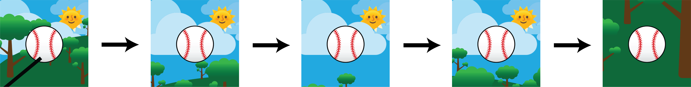
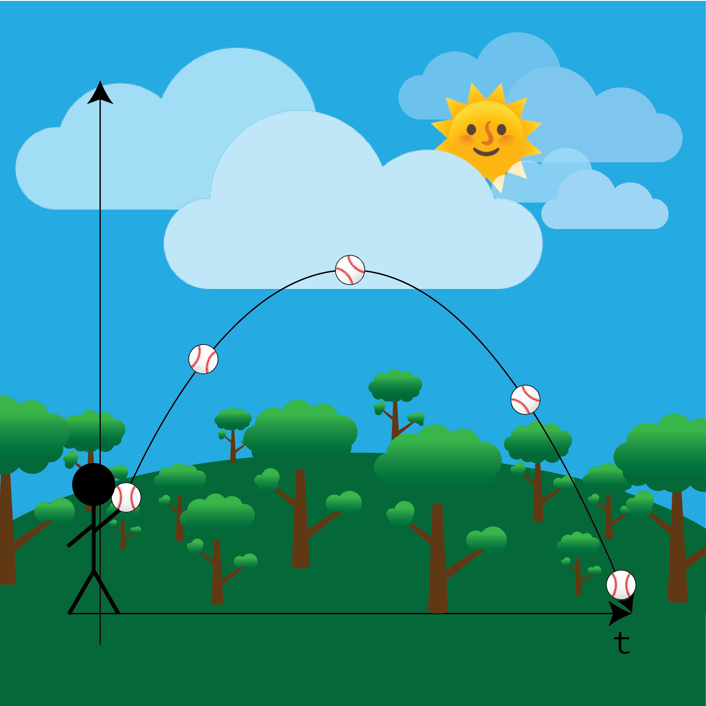
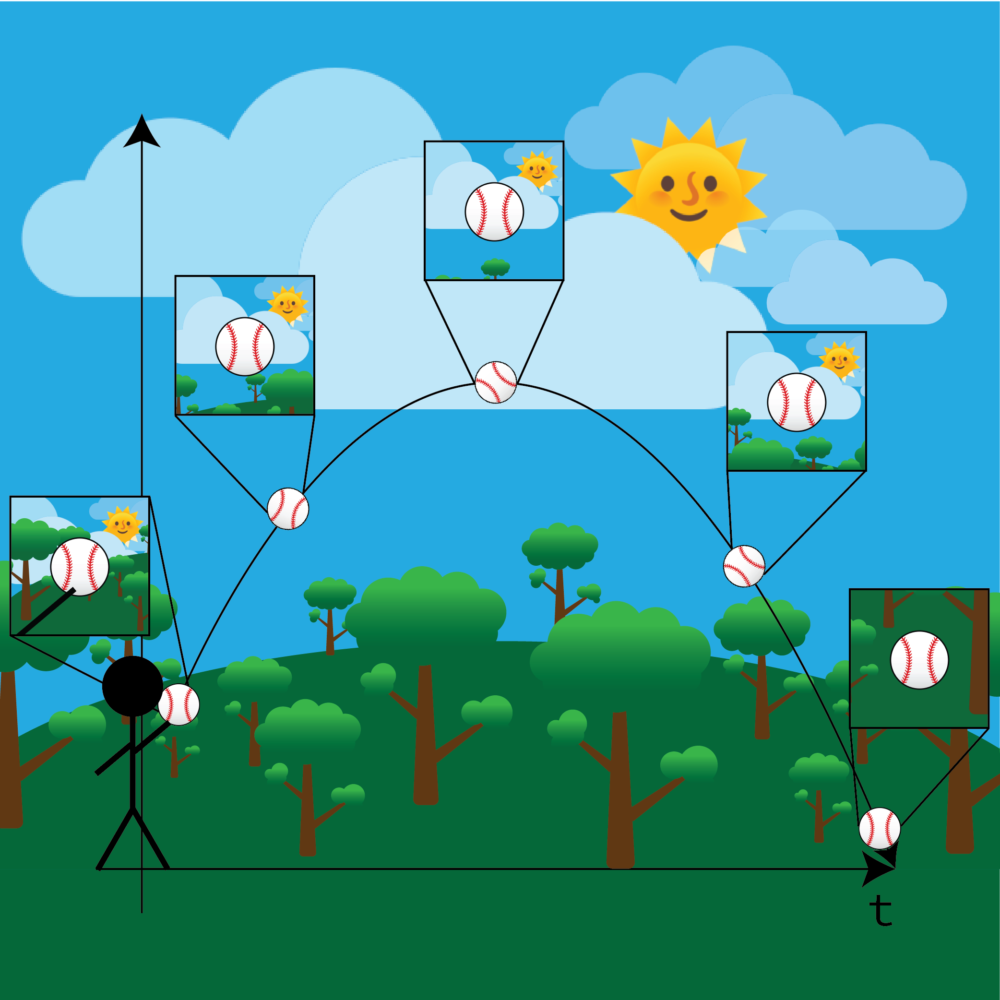
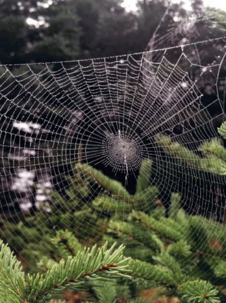

# Everything is not what it seems

I think latent models are quite neat, the idea that there exists a fundamental discrepency between *what* is overtly shown and *how* the patterns came to be.

Nowhere is this as present as the complex systems involved in gene expression, where phenotypes (what characteristics we see on an organism, e.g. red hair and a lack of a soul expressed in gingers vs. black hair and a soul expressed in literally anyone else) are not always explained by genotypes (the literal ATCG in DNA). 

However in many cases across the medical field, the phenotypes of a specific organism (most of the time) might or might not make sense given the context of the genes at play.

As it turns out, the experimental observations of cellular expression (in terms of the genes to each of the cells) lie in a lower dimension (as a moment generating function) than the more complex assortment of observed expressions.

# When You Throw a Ball Into the Air, is it Really the Same Ball?

The analogy that helped me better understand how reverse graph embeddings operate was a simple one you can do at home, with your eyes closed. Imagine someone tossing a ball into the air, with you holding a camera pointing at the ball (tracing it's path through the air) from a third-person perspective off of the $z$-axis, taking snapshots every now and then, *snap*, *snap*, *snap*, *snap*, ... , *SNAP*. The film is developed, and out come five different photos.

You can imagine the snapshots as allegories of the ball stuck in time, with each picture giving context to where the ball is relative to everything around it. The photos look something like the following:

<figure id="fig1">
    
    <figcaption align="center"><i>Fig. 1</i>. The five distinct photos taken of the ball on it's trajectory through the air... Ohhh <i>Snaap</i></figcaption>
</figure>

While you just took a total of five pictures, this number can be generalized to *N*, making it as arbitrarily large or small as you would like. From the instantaneous timeframe of these pictures, each one would be an accurate representation of where the ball was at that time. A more descriptive view can be shown through zooming out and looking at the larger picture:

<figure style="text-align: center;" id="fig2">
    
    <figcaption align="center"><i>Fig. 2</i>. Perspective from the z-axis of a ball being thrown into the air, with each ball representing a snapshot in time</figcaption>
</figure>

For clearer presentation, the previous two images can be concatenated - juxtaposing what can be considered the *discrete* timeframe of the photos you just took and the *continuous* live-demonstration of the ball being thrown. The below image demonstrates this, providing a graphical overlay of the photos at each time:

<figure style="text-align: center;" id="fig3">
    
    <figcaption align="center"><i>Fig. 3</i>. The connected image of both the photos and what is happening</figcaption>
</figure>

To put math towards the intuition of the previous images, we use a simple equation from kinematics representing a point-like object (which will be referred to as a ball from now on):

$$
x(t) = \frac{1}{2}a_it^2 + v_it + x_i, \ t \in \mathbb{R}; \ x_i, v_i, a_i \in \mathbb{R}^n
$$

where $x_i$ is the initial position of the ball, $v_i$ is the initial velocity of the ball, and $a_i$ is the acceleration of mass on earth (~$9.98 m/s$) (both variables in some *hypothetical* $n$-dimensional space), and $t$ is the time passed since the ball was first thrown up in the air.

For a brief moment, let's assume we know nothing about the *continuous* path that the ball takes, what we consider to be the closed-form solution of the position of the ball (equivalent to $x_i$). Instead let's now ask: how can we feasibly piece together the trajectory of the ball from the discrete images in the third figure?

To draw inspiration, we can look at the combined discrete/continuous image ([Fig. 3](#fig3)), which connects the time embedded and non-time embedded figures shown previously. For each of the smaller, discrete images, we can see that the most stark detail of difference (with the *ball* acting as a common reference frame throughout) is the background of each of the image.

Now what can be asked is: how do we put the question of a difference in background into a quantifiable detail? Well, the background is different only because of a change in the *position* of the ball (from *any* viewpoint of a 3rd party observer). This intuition is *EXACTLY* how graph dimensionality-reduction learning operates at a high level: to find the *path* of the ball (the generalized equation of sorts) that best describes all of the images of the ball, given its position (the discrete images of the ball) at different timepoints.

This is the loose analogy between a simpler, physical representation of the mechanisms at play and what the process is actually explaining (a biological one). Through generalization, we can finally get closer to what the algorithm was meant to represent: cells and expressed genes. Across all of our samples of cells with genes as features, expression can be interpreted as pictures of individual cells and the latent distribution of *possible* outcomes (moderated by time) as the continuous point of view.

# Learning High & Low - Surfing Both Oceans and Webs

While the previous analogy works well as a high-level concept, it is far too *deterministic*, as given the parameters $x_i$, $v_i$, and $a_i$, the height $x(t)$ can be calculated precisely. This is not the case with the randomness present in our genotype vs. phenotype dilemma.

To explain, we need to draw our analogy out futher through taking inspiration from nature, particularly waves and water:

<figure style="text-align: center;" id="fig4">
    
    <figcaption align="center"><i>Fig. 4</i>. Water waves with refractions as seen from above</figcaption>
</figure>

While the image is pretty to say the least, there does exist a degree of allegorical importance separate from the aesthetic. The sort of randomness present in the waves expressed through the height of the *pish, pash, splatter* of the water, alongside the seemingly continuous nature of the *fabric* at the surface of the liquid, is closer to the nature of the genes expressed (phenotype) than a simple ball toss.

But then what of the genotype? In some terms, the genotype can bs seen as a spider web, still yet fluctuating against the force of wind, but never so sporadic as to leave parts in tandem with unseen possibility. In some terms, it is far more stable than the phenotype, given the codified nature of DNA, but also *simpler* given a substantial lack of variation between one instance of genotype and another (as in a comparison between the expression in cells).

<figure style="text-align: center;" id="fig5">
    
    <figcaption align="center"><i>Fig. 5</i>. The simplicity of a spider web in comparison to water waves</figcaption>
</figure>

Now, with a more comprehensive grasp of this allegory, we can begin to add mathematical concepts and numbers to our allegory.

# The Map(ping) to Follow

