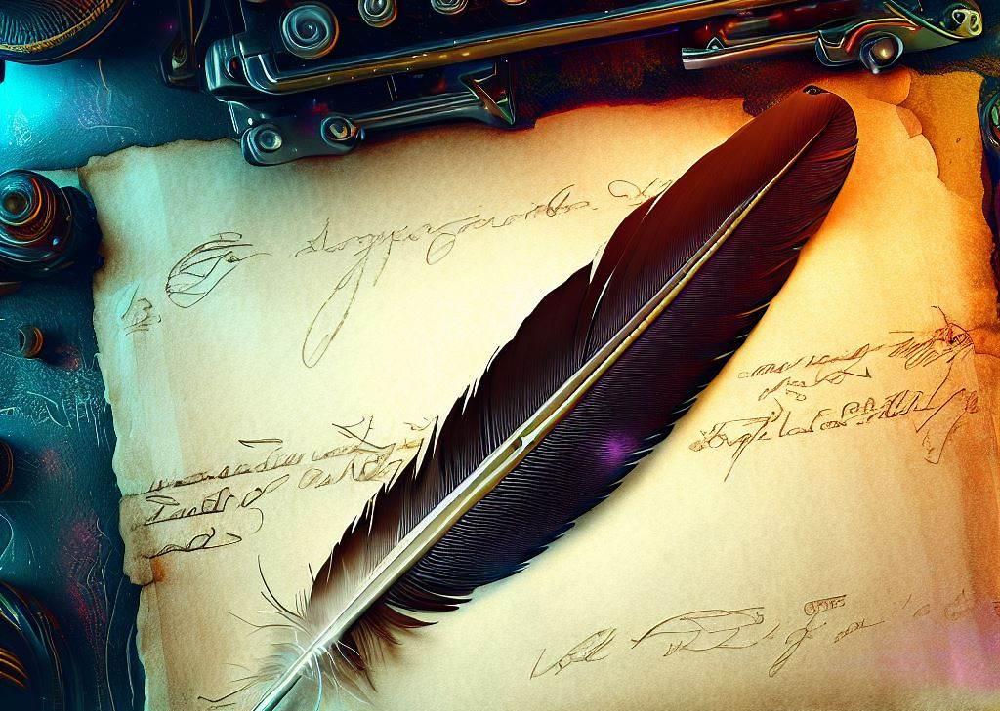

## Like Post-Its, with images and sometimes fancy graphs

From time to time, I'd like to think we all have thoughts we'd like to remember. Personally, it was always a shame in the fleeting nature of such things, sometimes relegated to a quick jot on the notes app in my phone, without context nor specification. 

Here's to fixing that.

Credits to DALLE for the above image, made using a prompt of:

*rennaissance image of a quill, ink, and parchment on a high-tech, sci-fi desk and background, perspective from near directly above*