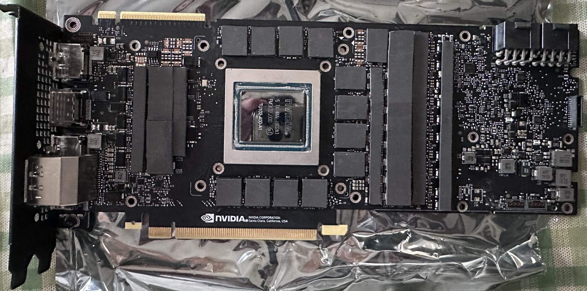
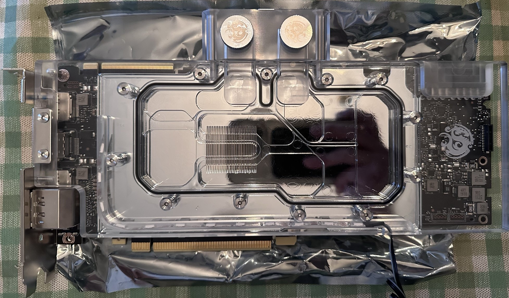
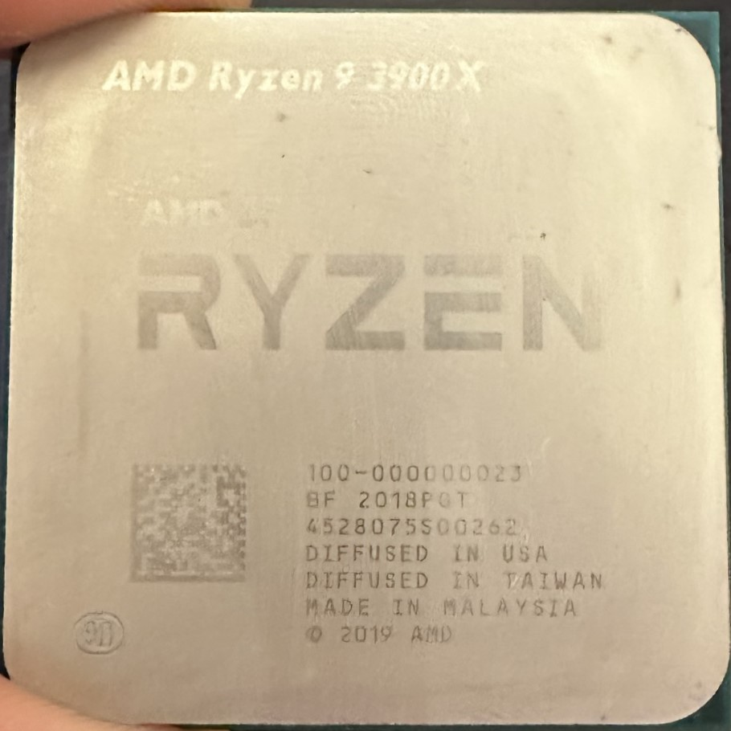
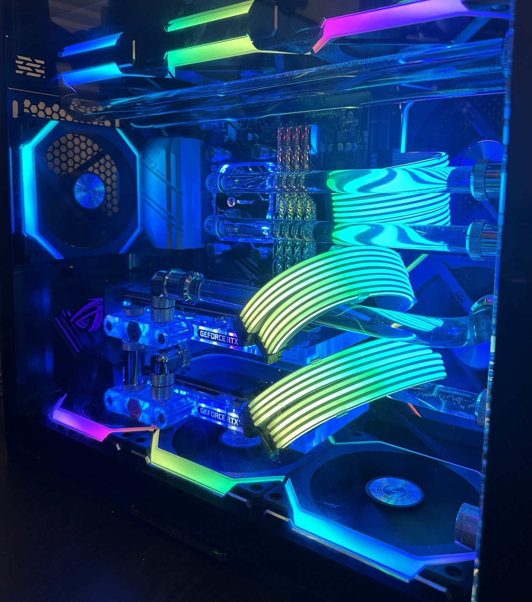

## Reduce, reuse?

In all honesty, whilst building RIEGSIL v2 for ML applications, I just happened to have leftover graphics processors, a CPU, and power supply

With the GPUs having already been fitted with waterblocks, they were made very difficult to sell and as in the interest of reusability, I headed over to the local Micro Center (and a quick browse of the web) and bought a few parts to assemble a smaller form-factor PC than the original RIEGSIL v1.

I may have been gassing up how simple this whole process was, as the whole procedure of buying, returning, guaging, and building took a few months. However, the result was well worth it:

## Parts list

This is an exhaustive list of parts used in this build:

| Type | Item | Link |
| :---- | :----: | ----: |
| **CPU** | 1x AMD Ryzen 9 3900X 3.8 GHz 12-Core Processor | [@ Amazon](https://www.amazon.com/dp/B07SXMZLP9?tag=pcpapi-20&linkCode=ogi&th=1&psc=1) |
| **Motherboard** | 1x ASRock X570M Pro4 Micro ATX AM4 Motherboard | [@ Newegg](https://www.newegg.com/asrock-x570m-pro4/p/N82E16813157887) |
| **Memory** | 2x G.Skill Trident Z Royal 32 GB (2 x 16 GB) DDR4-3600 CL19 Memory | [@ Amazon](https://www.amazon.com/dp/B07SQ3T4X3?tag=pcpapi-20&linkCode=ogi&th=1&psc=1) |
| **Storage** | 2x Seagate IronWolf NAS 12 TB 3.5" 7200 RPM Internal Hard Drive | [@ Newegg](https://www.newegg.com/seagate-ironwolf-st12000vn0008-12tb/p/1JW-001N-00027?Item=1JW-001N-00027&nm_mc=AFC-RAN-COM&cm_mmc=afc-ran-com-_-PCPartPicker&utm_medium=affiliate&utm_campaign=afc-ran-com-_-PCPartPicker&utm_source=afc-PCPartPicker&AFFID=2558510&AFFNAME=PCPartPicker&ACRID=1&ASID=https%3a%2f%2fpcpartpicker.com%2f&ranMID=44583&ranEAID=2558510&ranSiteID=8BacdVP0GFs-HPYWcPc.wqLNeIWmTYX2aQ) |
| **Storage** | Samsung 980 Pro SSD 1TB PCIe 4.0 NVMe Gen 4 Gaming M.2 Internal Solid State Drive Memory Card | [@ Amazon](https://www.amazon.com/SAMSUNG-PCIe-Internal-Gaming-MZ-V8P1T0B/dp/B08GLX7TNT?source=ps-sl-shoppingads-lpcontext&ref_=fplfs&psc=1&smid=ATVPDKIKX0DER) |
| **Video Card** | 2x NVIDIA TITAN RTX TITAN RTX 24 GB Video Card | [@ Amazon](https://www.amazon.com/dp/B07L8YGDL5?tag=pcpapi-20&linkCode=ogi&th=1&psc=1) |
| **Cable Management** | 1x ARGB Hub 5V 3Pin SYNC 11 Ports Splitter w/ Magnetic Standoff & PMMA Case,SATA to 3pin Addressable RGB Adpater | [@ Newegg](https://www.newegg.com/p/1W7-005X-00093?Item=9SIACJFCAZ4145) |
| **Cable Management** | 2x LIAN LI Strimer Plus V2 8 Pin Addressable RGB VGA Power Cable | [@Newegg](https://www.newegg.com/p/1W7-00BS-00061?Item=9SIAFSTH198049) |
| **Cable Management** | 1x LIAN LI STRIMER PLUS V2 24 Pin Addressable RGB Power Extension Cable | [@Newegg](https://www.newegg.com/p/1W7-00BS-00060?Item=9SIAFSTH197486) |
| **Networking** | 1x Intel WiFi 6 AX200 Gig M2.2230 Kit | [@ Micro Center](https://www.microcenter.com/product/636193/intel-wifi-6-ax200-gig-m22230-kit) |
| **Waterblock** | 2x Bitspower GPU Waterblock for NVIDIA GeForce RTX 2080Ti / 2080 Reference Cards with Accessory Set | [@ Newegg](https://www.newegg.com/p/37B-000X-003Y5?Item=9SIAEMWAZE0901) |
| **Fan** | 7x Lian-Li UNI FAN SL120 Revolutionized Daisy-Chain 120mm ARGB Fan | [@ Amazon](https://www.amazon.com/Lian-Li-SL120-Pack-Black/dp/B08HD75K4X) |
| **Fan** | 2x LIAN LI UNI FAN SL140 RGB BLACK | [@ Newegg](https://www.newegg.com/lian-li-uf-sl140-1b-case-fan/p/1YF-005G-00017) |
| **Watercooling** | 1x Bitspower G1/4" Adjustable Aqua Link Pipe (41-69mm), Silver Shining | [@ Newegg](https://www.newegg.com/bitspower-bp-dg14aalpii-fittings/p/2YM-0001-00012?Item=9SIAEKS6MM8126) |
| **Case, Watercooling & Most Fittings** | 1x Bitspower TITAN ONE MINI 2.0 | [@ Micro Center](https://www.microcenter.com/product/661034/bitspower-titan-one-mini-20-tempered-glass-microatx-mini-tower-computer-case-black) |
| **Power Supply** | 1x Silverstone SX1000-LPT 1000 W 80+ Platinum Certified Fully Modular SFX Power Supply | [@ Micro Center](https://www.google.com/search?q=silverstone+1000w+sfx+psu&rlz=1C1QMKX_enUS1049US1049&oq=silverstone+sff+psu+1000&gs_lcrp=EgZjaHJvbWUqCggBEAAYCBgNGB4yBggAEEUYOTIKCAEQABgIGA0YHtIBCDczNTdqMGo3qAIAsAIA&sourceid=chrome&ie=UTF-8) |

## Getting started

The first step involved a bit of cleaning, actually - a lot of cleaning. 

Due to the Titan RTX GPUs having been removed from their original [EKWB](https://www.ekwb.com/) waterblocks used in RIEGSIL v1 (post coming shortly), and repurposed with [Bitspower](https://bitspower.com/) waterblocks I bought on sale (thanks to the outdated nature of the Titan RTX), extensive cleaning was needed on the GPU chip.

<figure>
    
    <figcaption align="center">The disassembled GPU, air cooler removed, processing chip cleaned, and thermal pads attached</figcaption>
</figure>

<figure>
    
    <figcaption align="center">The Titan RTX after attaching the Bitspower waterblock</figcaption>
</figure>

Wanting to try an new PC parts company and utilizing that company's parts throughout the build, I settled on Lian Li's [TITAN ONE MINI 2.0](https://bitspower.com/titanseries/titan_one_mini_2.0/) for its simplicity and present integration with Bitspower watercooling parts, as well the brands innovative daisychain [Uni Fan SL v2s](https://lian-li.com/product/uni-fan-sl-v2/), of which there are 7x 120mm and 2x 140mm (for side ventilation).

For the CPU, I went with one already present for a previous build, the ever-so-trusty Ryzen 9 3900X, with 12-core, 24-thread capabilities:

<figure>
  
  
  <figcaption align="center">The CPU, featuring my left thumb</figcaption>
</figure>

## Final steps

Unfortunately, I have no media for the rest of the installation process, but at one point, there were fears of one or both of the GPUs having been bricked, given that the reason for the disassembly of its previous housing (RIEGSIL v1) was water leakage.

After careful testing (and at one point even painstakingly draining all of the liquid *already* in the system), everything was connected and thankfully, the build POSTed.

That was the completion of a PC, with a name I don't know the meaning of, only because I thought it would be cool.

<figure>
    
    <figcaption align="center">IEGSIL, completed</figcaption>
</figure>
