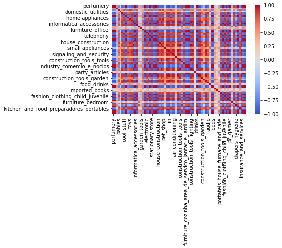

<p align="center">

</p>

## <b>1 <span style='color:#F1A424'>|</span> Initial Setup</b> 

<div style="color:white;display:fill;border-radius:8px;
            background-color:#03112A;font-size:150%;
            letter-spacing:1.0px;background-image: url(https://miro.medium.com/v2/resize:fit:1024/format:webp/1*WO2tpR1ElY2QcVLQrhwbpQ.jpeg)">
    <p style="padding: 8px;color:white;"><b><b><span style='color:#F1A424'>1.1 |</span></b> Package Installation</b></p>
</div>

- `numpy` and `pandas` for basic data-manipulation
- `sklearn` and associated modules to run our machine learning algorithms
- `scipy` associated modules (`norm`) to compute the cosime similarity later on
- `seaborn` to output graphs
- Miscellaneous packages for flow of the notebook


```python
! pip install utils
! pip install scikit-learn
```


```python
import pandas as pd
import numpy as np
from numpy.linalg import norm
import scipy as sc

from sklearn.neighbors import KNeighborsClassifier
from sklearn.impute import KNNImputer
from sklearn import preprocessing

from scipy.linalg import norm

import seaborn as sns

from typing import List
from utils import *
import re
from collections import Counter
import sys
```

<div style="color:white;display:fill;border-radius:8px;
            background-color:#03112A;font-size:150%;
            letter-spacing:1.0px;background-image: url(https://miro.medium.com/v2/resize:fit:1024/format:webp/1*WO2tpR1ElY2QcVLQrhwbpQ.jpeg)">
    <p style="padding: 8px;color:white;"><b><b><span style='color:#F1A424'>1.2 |</span></b> Connecting to Github and Google Drive</b></p>
</div>

- This notebook is connected to the associated Github repository for easy access and version contol
- Optionally, it is also tested and connected to Google Drive if possible


```python
if 'google.colab' in sys.modules:
    %cd /content
!rm -rf Datathon_F22
!git clone https://github.com/sunnydigital/Datathon_F22
%cd Datathon_F22
```


```python
if 'google.colab' in sys.modules:
    from google.colab import drive
    drive.mount('/content/drive')
```

<div style="color:white;display:fill;border-radius:8px;
            background-color:#03112A;font-size:150%;
            letter-spacing:1.0px;background-image: url(https://miro.medium.com/v2/resize:fit:1024/format:webp/1*WO2tpR1ElY2QcVLQrhwbpQ.jpeg)">
    <p style="padding: 8px;color:white;"><b><b><span style='color:#F1A424'>1.3 |</span></b> Preprocessing Product Category Names</b></p>
</div>

- After initally reading in the `product_category_name_translation.csv` we need to transform the data into a useable format
- An initial inspection of the number of products uder each category is displayed
- The english translations for product names are given (from the associated column in the `product_category_name_translation.csv`)
- For each category, the individual words making up the category is split using `re.split`


```python
trans_df = pd.read_csv('datasets/product_category_name_translation.csv')

og_cat_name = trans_df['product_category_name'].to_numpy()
og_cat_name = np.append(og_cat_name, ['portateis_cozinha_e_preparadores_de_alimentos', 'pc_gamer', 'pcs', 'other'])

og_name_to_idx = {}
for i, name in enumerate(og_cat_name):
  og_name_to_idx[name] = i
display(og_name_to_idx)

product_categories = trans_df['product_category_name_english'].to_numpy()
product_categories = np.append(product_categories, ['portateis_cozinha_e_preparadores_de_alimentos', 'pc_gamer', 'pcs', 'other'])
display(product_categories)


product_categories_list = []
for category in product_categories:
   product_categories_list.append(re.split('_| ', category))

product_categories_list
```


    {'beleza_saude': 0,
     'informatica_acessorios': 1,
     'automotivo': 2,
     'cama_mesa_banho': 3,
     'moveis_decoracao': 4,
     'esporte_lazer': 5,
     'perfumaria': 6,
     'utilidades_domesticas': 7,
     'telefonia': 8,
     'relogios_presentes': 9,
     'alimentos_bebidas': 10,
     'bebes': 11,
     'papelaria': 12,
     'tablets_impressao_imagem': 13,
     'brinquedos': 14,
     'telefonia_fixa': 15,
     'ferramentas_jardim': 16,
     'fashion_bolsas_e_acessorios': 17,
     'eletroportateis': 18,
     'consoles_games': 19,
     'audio': 20,
     'fashion_calcados': 21,
     'cool_stuff': 22,
     'malas_acessorios': 23,
     'climatizacao': 24,
     'construcao_ferramentas_construcao': 25,
     'moveis_cozinha_area_de_servico_jantar_e_jardim': 26,
     'construcao_ferramentas_jardim': 27,
     'fashion_roupa_masculina': 28,
     'pet_shop': 29,
     'moveis_escritorio': 30,
     'market_place': 31,
     'eletronicos': 32,
     'eletrodomesticos': 33,
     'artigos_de_festas': 34,
     'casa_conforto': 35,
     'construcao_ferramentas_ferramentas': 36,
     'agro_industria_e_comercio': 37,
     'moveis_colchao_e_estofado': 38,
     'livros_tecnicos': 39,
     'casa_construcao': 40,
     'instrumentos_musicais': 41,
     'moveis_sala': 42,
     'construcao_ferramentas_iluminacao': 43,
     'industria_comercio_e_negocios': 44,
     'alimentos': 45,
     'artes': 46,
     'moveis_quarto': 47,
     'livros_interesse_geral': 48,
     'construcao_ferramentas_seguranca': 49,
     'fashion_underwear_e_moda_praia': 50,
     'fashion_esporte': 51,
     'sinalizacao_e_seguranca': 52,
     'pcs': 73,
     'artigos_de_natal': 54,
     'fashion_roupa_feminina': 55,
     'eletrodomesticos_2': 56,
     'livros_importados': 57,
     'bebidas': 58,
     'cine_foto': 59,
     'la_cuisine': 60,
     'musica': 61,
     'casa_conforto_2': 62,
     'portateis_casa_forno_e_cafe': 63,
     'cds_dvds_musicais': 64,
     'dvds_blu_ray': 65,
     'flores': 66,
     'artes_e_artesanato': 67,
     'fraldas_higiene': 68,
     'fashion_roupa_infanto_juvenil': 69,
     'seguros_e_servicos': 70,
     'portateis_cozinha_e_preparadores_de_alimentos': 71,
     'pc_gamer': 72,
     'other': 74}


    array(['health_beauty', 'computers_accessories', 'auto', 'bed_bath_table',
           'furniture_decor', 'sports_leisure', 'perfumery', 'housewares',
           'telephony', 'watches_gifts', 'food_drink', 'baby', 'stationery',
           'tablets_printing_image', 'toys', 'fixed_telephony',
           'garden_tools', 'fashion_bags_accessories', 'small_appliances',
           'consoles_games', 'audio', 'fashion_shoes', 'cool_stuff',
           'luggage_accessories', 'air_conditioning',
           'construction_tools_construction',
           'kitchen_dining_laundry_garden_furniture',
           'costruction_tools_garden', 'fashion_male_clothing', 'pet_shop',
           'office_furniture', 'market_place', 'electronics',
           'home_appliances', 'party_supplies', 'home_confort',
           'costruction_tools_tools', 'agro_industry_and_commerce',
           'furniture_mattress_and_upholstery', 'books_technical',
           'home_construction', 'musical_instruments',
           'furniture_living_room', 'construction_tools_lights',
           'industry_commerce_and_business', 'food', 'art',
           'furniture_bedroom', 'books_general_interest',
           'construction_tools_safety', 'fashion_underwear_beach',
           'fashion_sport', 'signaling_and_security', 'computers',
           'christmas_supplies', 'fashio_female_clothing',
           'home_appliances_2', 'books_imported', 'drinks', 'cine_photo',
           'la_cuisine', 'music', 'home_comfort_2',
           'small_appliances_home_oven_and_coffee', 'cds_dvds_musicals',
           'dvds_blu_ray', 'flowers', 'arts_and_craftmanship',
           'diapers_and_hygiene', 'fashion_childrens_clothes',
           'security_and_services',
           'portateis_cozinha_e_preparadores_de_alimentos', 'pc_gamer', 'pcs',
           'other'], dtype=object)


    [['health', 'beauty'],
     ['computers', 'accessories'],
     ['auto'],
     ['bed', 'bath', 'table'],
     ['furniture', 'decor'],
     ['sports', 'leisure'],
     ['perfumery'],
     ['housewares'],
     ['telephony'],
     ['watches', 'gifts'],
     ['food', 'drink'],
     ['baby'],
     ['stationery'],
     ['tablets', 'printing', 'image'],
     ['toys'],
     ['fixed', 'telephony'],
     ['garden', 'tools'],
     ['fashion', 'bags', 'accessories'],
     ['small', 'appliances'],
     ['consoles', 'games'],
     ['audio'],
     ['fashion', 'shoes'],
     ['cool', 'stuff'],
     ['luggage', 'accessories'],
     ['air', 'conditioning'],
     ['construction', 'tools', 'construction'],
     ['kitchen', 'dining', 'laundry', 'garden', 'furniture'],
     ['costruction', 'tools', 'garden'],
     ['fashion', 'male', 'clothing'],
     ['pet', 'shop'],
     ['office', 'furniture'],
     ['market', 'place'],
     ['electronics'],
     ['home', 'appliances'],
     ['party', 'supplies'],
     ['home', 'confort'],
     ['costruction', 'tools', 'tools'],
     ['agro', 'industry', 'and', 'commerce'],
     ['furniture', 'mattress', 'and', 'upholstery'],
     ['books', 'technical'],
     ['home', 'construction'],
     ['musical', 'instruments'],
     ['furniture', 'living', 'room'],
     ['construction', 'tools', 'lights'],
     ['industry', 'commerce', 'and', 'business'],
     ['food'],
     ['art'],
     ['furniture', 'bedroom'],
     ['books', 'general', 'interest'],
     ['construction', 'tools', 'safety'],
     ['fashion', 'underwear', 'beach'],
     ['fashion', 'sport'],
     ['signaling', 'and', 'security'],
     ['computers'],
     ['christmas', 'supplies'],
     ['fashio', 'female', 'clothing'],
     ['home', 'appliances', '2'],
     ['books', 'imported'],
     ['drinks'],
     ['cine', 'photo'],
     ['la', 'cuisine'],
     ['music'],
     ['home', 'comfort', '2'],
     ['small', 'appliances', 'home', 'oven', 'and', 'coffee'],
     ['cds', 'dvds', 'musicals'],
     ['dvds', 'blu', 'ray'],
     ['flowers'],
     ['arts', 'and', 'craftmanship'],
     ['diapers', 'and', 'hygiene'],
     ['fashion', 'childrens', 'clothes'],
     ['security', 'and', 'services'],
     ['portateis', 'cozinha', 'e', 'preparadores', 'de', 'alimentos'],
     ['pc', 'gamer'],
     ['pcs'],
     ['other']]


## <b>2 <span style='color:#F1A424'>|</span> GloVe Embeddings</b> 

<div style="color:white;display:fill;border-radius:8px;
            background-color:#03112A;font-size:150%;
            letter-spacing:1.0px;background-image: url(https://miro.medium.com/v2/resize:fit:1024/format:webp/1*WO2tpR1ElY2QcVLQrhwbpQ.jpeg)">
    <p style="padding: 8px;color:white;"><b><b><span style='color:#F1A424'>2.1 |</span></b> Indexer Object and Embedding initialization</b></p>
</div>

- An Indexer Object is created to map words to a dictionary
- `read_wrod_embeddings` is used to interface between the stored GloVe-50d embeddings in the file `glove.6B.50d-relativized.txt` and the dictionary protocal defined previously in the Indexer Object
- Finally an indexer object, `word_indexer` and the embedded dictionary `embeddings` object is returned


```python
class Indexer(object):
    """
    Bijection between objects and integers starting at 0. Useful for mapping
    labels, features, etc. into coordinates of a vector space.

    Attributes:
        @objs_to_ints
        @ints_to_objs
    """
    def __init__(self):
        self.objs_to_ints = {}
        self.ints_to_objs = {}

    def __repr__(self):
        return str([str(self.get_object(i)) for i in range(0, len(self))])

    def __str__(self):
        return self.__repr__()

    def __len__(self):
        return len(self.objs_to_ints)

    def get_object(self, index):
        """
            @param index: integer index to look up
            @return: Returns the object corresponding to the particular index or None if not found
        """
        if (index not in self.ints_to_objs):
            return None
        else:
            return self.ints_to_objs[index]

    def contains(self, object):
        """
            @param object: object to look up
            @return: Returns True if it is in the Indexer, False otherwise
        """
        return self.index_of(object) != -1

    def index_of(self, object):
        """
            @param object: object to look up
            @return: Returns -1 if the object isn't present, index otherwise
        """
        if (object not in self.objs_to_ints):
            return -1
        else:
            return self.objs_to_ints[object]

    def add_and_get_index(self, object, add=True):
        """
        Adds the object to the index if it isn't present, always returns a nonnegative index
            @param object: object to look up or add
            @param add: True by default, False if we shouldn't add the object. If False, equivalent to index_of.
            @return: The index of the object
        """
        if not add:
            return self.index_of(object)
        if (object not in self.objs_to_ints):
            new_idx = len(self.objs_to_ints)
            self.objs_to_ints[object] = new_idx
            self.ints_to_objs[new_idx] = object
        return self.objs_to_ints[object]
```


```python
def read_word_embeddings(embeddings_file: str):
    """
    Loads the given embeddings (ASCII-formatted) into a WordEmbeddings object. Augments this with an UNK embedding
    that is the 0 vector. Reads in all embeddings with no filtering -- you should only use this for relativized
    word embedding files.
        @param embeddings_file: path to the file containing embeddings
        @return: WordEmbeddings object reflecting the words and their embeddings
    """
    f = open(embeddings_file)
    word_indexer = Indexer()
    vectors = []
    # Make position 0 a PAD token, which can be useful if you
    word_indexer.add_and_get_index("PAD")
    # Make position 1 the UNK token
    word_indexer.add_and_get_index("UNK")
    for line in f:
        if line.strip() != "":
            space_idx = line.find(' ')
            word = line[:space_idx]
            numbers = line[space_idx+1:]
            float_numbers = [float(number_str) for number_str in numbers.split()]
            vector = np.array(float_numbers)
            word_indexer.add_and_get_index(word)
            # Append the PAD and UNK vectors to start. Have to do this weirdly because we need to read the first line
            # of the file to see what the embedding dim is
            if len(vectors) == 0:
                vectors.append(np.zeros(vector.shape[0]))
                vectors.append(np.zeros(vector.shape[0]))
            vectors.append(vector)
    f.close()
    print("Read in " + repr(len(word_indexer)) + " vectors of size " + repr(vectors[0].shape[0]))
    # Turn vectors into a 2-D numpy array
    return word_indexer, np.array(vectors)
```


```python
word_indexer, embeddings = read_word_embeddings('glove/glove.6B.50d-relativized.txt')
```

    Read in 14923 vectors of size 50
    

<div style="color:white;display:fill;border-radius:8px;
            background-color:#03112A;font-size:150%;
            letter-spacing:1.0px;background-image: url(https://miro.medium.com/v2/resize:fit:1024/format:webp/1*WO2tpR1ElY2QcVLQrhwbpQ.jpeg)">
    <p style="padding: 8px;color:white;"><b><b><span style='color:#F1A424'>2.2 |</span></b> Embedding Concatenation</b></p>
</div>

- `get_embedding` is a functon defined to obtain the embedding for any product category, meant to deal with multiple words describing any category
- Two ways of dealing with multi-word properties of product categories are included:
  - `mean` where the mean of embedding values for each word in the the GloVe-50d dictionary is found, for each word across all 50 dimensions
  - `sum` where the sum of embedding values for each word in the GloVe-50d dictionary is found, for each word, summed across all 50 dimensions
- The embedding for each product category is returned based on the previously determined methodology for word handling


```python
def get_embedding(word_indexer, embeddings, product_categories, reduce='mean'):
    """
        @param word_indexer returns the index of the word in the embedding
        @param embeddings the embeddings matrix of all words in GloVe-50d
        @param product_categories the categories of all products represented in a [N x 1] array
    """
    category_embeddings = {}
    for category, category_list in zip(product_categories, product_categories_list):
        category_embed = []
        for word in category_list:
            index_word = word_indexer.index_of(word)
            embed = embeddings[index_word]
            category_embed.append(embed)
        if reduce == 'mean': 
            embed = np.mean(category_embed, axis=0)
        if reduce == 'sum':
            embed = np.sum(category_embed, axis=0)
        category_embeddings[category] = embed
    
    return category_embeddings
```


```python
embeddings = get_embedding(word_indexer, embeddings, product_categories)
embeddings
```


    {'perfumery': array([-0.45596  , -0.13718  , -0.23754  , -0.63402  , -0.10487  ,
            -0.42744  ,  0.83699  ,  0.23567  , -0.078916 ,  0.5      ,
             0.08264  ,  0.2316   ,  0.77999  ,  0.47049  , -0.32597  ,
            -0.51283  ,  0.30945  ,  0.47881  ,  0.55381  , -0.24994  ,
            -0.47739  , -0.073831 ,  0.072328 , -0.10644  ,  0.25275  ,
             0.97813  , -0.38809  ,  0.29865  ,  0.29393  ,  0.35823  ,
            -1.1929   ,  0.071931 ,  0.034599 ,  0.027147 , -0.38162  ,
             0.73098  ,  0.062593 , -0.14562  , -0.38141  , -0.072509 ,
             0.20806  , -0.54812  , -0.21912  ,  0.51654  ,  0.64665  ,
            -0.65962  ,  0.10605  ,  0.17607  ,  0.29246  ,  0.0042172]),
     'artes': array([-0.45596  , -0.13718  , -0.23754  , -0.63402  , -0.10487  ,
            -0.42744  ,  0.83699  ,  0.23567  , -0.078916 ,  0.5      ,
             0.08264  ,  0.2316   ,  0.77999  ,  0.47049  , -0.32597  ,
            -0.51283  ,  0.30945  ,  0.47881  ,  0.55381  , -0.24994  ,
            -0.47739  , -0.073831 ,  0.072328 , -0.10644  ,  0.25275  ,
             0.97813  , -0.38809  ,  0.29865  ,  0.29393  ,  0.35823  ,
            -1.1929   ,  0.071931 ,  0.034599 ,  0.027147 , -0.38162  ,
             0.73098  ,  0.062593 , -0.14562  , -0.38141  , -0.072509 ,
             0.20806  , -0.54812  , -0.21912  ,  0.51654  ,  0.64665  ,
            -0.65962  ,  0.10605  ,  0.17607  ,  0.29246  ,  0.0042172]),
     'sport_leisure': array([-6.5777500e-01,  2.3660000e-01, -5.2690000e-01, -1.0300000e-03,
            -3.7766500e-01, -2.4336400e-01,  1.1789000e-01, -2.6644000e-01,
             1.3412000e-02,  2.1341800e-01,  5.8577000e-01,  6.4220000e-02,
            -8.8555000e-02,  1.7286500e-01,  2.5672500e-01, -3.4311500e-01,
             2.7832000e-01,  1.2754050e+00,  1.1235000e-02, -8.0732000e-01,
            -6.4122500e-01,  1.1676450e-01, -2.9102100e-01,  4.8428000e-01,
             1.5141000e-01, -1.3723500e-01, -6.3680000e-01,  3.7784500e-01,
             1.5137115e-01,  3.4792000e-01,  5.6390000e-01,  6.3726550e-01,
            -2.4579550e-01, -9.4106500e-02, -2.6462000e-01,  4.5140000e-01,
            -4.5003500e-02,  1.4046500e-01, -5.2468500e-01, -2.7534950e-01,
             1.5362100e-01, -5.9103000e-01,  6.8940000e-02,  4.5214500e-01,
             2.8340550e-01, -3.7257450e-01, -1.5898500e-01,  2.5181000e-01,
             5.0931500e-01, -1.2091640e-01]),
     'babies': array([ 0.69898 , -0.056312,  0.34178 , -1.4674  ,  0.54603 ,  1.7752  ,
            -0.57618 , -0.60623 ,  0.83499 ,  0.42334 ,  0.50787 , -0.57778 ,
             1.0339  ,  0.27791 ,  1.4515  ,  0.58806 , -0.96275 ,  0.33018 ,
             0.45507 , -0.24377 , -0.15741 ,  0.95016 ,  0.71083 ,  0.23539 ,
             0.66137 , -0.61362 , -0.50664 , -0.24646 ,  0.32122 , -0.50601 ,
             1.5551  ,  1.1833  , -0.19435 ,  0.40841 ,  0.50837 ,  0.11851 ,
             0.82978 , -0.22482 ,  0.84309 , -0.27989 , -1.2027  , -0.50551 ,
             0.49102 ,  0.5024  ,  1.5571  , -0.025314, -0.032675, -0.68783 ,
            -0.072284, -0.22732 ]),
     'domestic_utilities': array([-0.2169885 , -0.259665  , -0.089036  , -0.232085  ,  0.02123   ,
             0.02266   ,  0.303745  , -0.30865   ,  0.304807  ,  0.24873115,
             0.27609   ,  0.182715  ,  0.44881   ,  0.297305  ,  0.20334   ,
            -0.2240425 ,  0.0246    ,  0.3544    ,  0.21105   , -0.38053   ,
             0.289055  , -0.3395355 , -0.114346  , -0.12142   , -0.0075    ,
            -0.118635  ,  0.00909   ,  0.02115   ,  0.324625  ,  0.756815  ,
             1.0631    ,  0.6046155 ,  0.4585545 , -0.0684765 , -0.31949   ,
             0.4114665 , -0.3848335 , -0.1004675 , -0.565625  , -0.2515545 ,
            -0.339595  , -0.245639  ,  0.28604   ,  0.173715  ,  0.44828   ,
            -0.3250159 , -0.2789    ,  0.435085  ,  0.45348   ,  0.0225586 ]),
     'musical instruments': array([-0.06468   ,  0.322055  , -0.963365  , -0.114635  , -0.177675  ,
             0.54965   , -0.1838395 , -0.4549    , -0.64644   ,  1.3871    ,
             0.57586   ,  0.94313   ,  0.151145  ,  1.07977   , -0.49424   ,
            -0.380291  , -0.17956   ,  0.1215325 , -0.297625  , -0.85511   ,
             0.865405  ,  0.562785  , -0.186045  , -0.499275  ,  0.152454  ,
            -0.0582182 , -1.35372   , -0.50429   , -0.154655  , -0.653355  ,
             2.9801    , -0.507645  ,  0.638315  , -0.33097815,  0.5617    ,
             0.35252   ,  0.186936  ,  0.0288775 , -0.228075  ,  0.122783  ,
             0.05871   ,  0.03846   ,  0.147365  , -0.122755  , -0.14569   ,
             0.339465  ,  0.54428   , -0.093315  , -1.1327    ,  0.159625  ]),
     'cool_stuff': array([-4.932950e-01,  2.035540e-01, -8.313395e-02, -4.249600e-01,
             9.794000e-02, -4.397210e-01, -3.272700e-01, -2.336160e-01,
            -3.763900e-01,  6.511450e-01, -5.402300e-01,  3.683300e-01,
            -1.061500e-02,  6.245650e-01,  5.724015e-01,  5.704455e-01,
             3.654400e-01,  4.361400e-01, -1.085555e-01, -1.033350e+00,
            -5.114250e-02,  5.775950e-01,  8.279250e-01,  3.179500e-01,
             4.330600e-01, -8.627450e-01, -8.960600e-01,  1.115915e+00,
             1.720000e+00, -2.354450e-01,  2.476200e+00,  2.326425e-01,
            -7.899500e-03,  1.246350e-01, -1.432040e-01,  5.095900e-01,
            -3.377350e-01,  3.771100e-01,  3.613050e-01, -7.046750e-01,
             1.961800e-01,  3.419200e-01, -9.439450e-02,  3.296600e-01,
             4.638600e-01,  4.373350e-01,  4.684150e-01, -4.642925e-01,
             2.028000e-03,  6.441700e-01]),
     'furniture_decoration': array([-0.45596  , -0.13718  , -0.23754  , -0.63402  , -0.10487  ,
            -0.42744  ,  0.83699  ,  0.23567  , -0.078916 ,  0.5      ,
             0.08264  ,  0.2316   ,  0.77999  ,  0.47049  , -0.32597  ,
            -0.51283  ,  0.30945  ,  0.47881  ,  0.55381  , -0.24994  ,
            -0.47739  , -0.073831 ,  0.072328 , -0.10644  ,  0.25275  ,
             0.97813  , -0.38809  ,  0.29865  ,  0.29393  ,  0.35823  ,
            -1.1929   ,  0.071931 ,  0.034599 ,  0.027147 , -0.38162  ,
             0.73098  ,  0.062593 , -0.14562  , -0.38141  , -0.072509 ,
             0.20806  , -0.54812  , -0.21912  ,  0.51654  ,  0.64665  ,
            -0.65962  ,  0.10605  ,  0.17607  ,  0.29246  ,  0.0042172]),
     'home appliances': array([-0.11147   ,  0.160835  ,  0.01424   , -0.297908  ,  0.231035  ,
            -0.46969   , -0.473055  ,  0.333195  , -0.0387957 ,  0.258926  ,
            -0.216425  , -0.15653   ,  0.26442   ,  0.047085  ,  0.04186   ,
            -0.221237  ,  0.024125  ,  0.23801655,  0.0201    ,  0.02417   ,
            -0.166215  ,  0.2318245 , -0.276051  ,  0.153675  ,  0.016345  ,
            -0.324785  , -0.048915  ,  0.14006   ,  0.401985  , -0.12704   ,
             1.02255   ,  0.4103305 ,  0.1114745 ,  0.024657  ,  0.09831   ,
             0.6256    ,  0.1077315 ,  0.135195  ,  0.085595  , -0.2381195 ,
             0.013745  , -0.16949   , -0.228925  ,  0.31469   ,  0.319578  ,
            -0.04022   , -0.16518   , -0.316485  ,  0.24828   , -0.0955514 ]),
     'toys': array([ 0.11738 , -0.78864 ,  0.20307 ,  0.40609 ,  0.53572 ,  0.66853 ,
            -1.0303  , -2.0666  ,  0.67746 ,  0.41301 , -0.036541,  0.57572 ,
             0.2052  , -0.13067 ,  1.1972  ,  0.69488 , -0.7459  ,  1.0515  ,
             0.22374 , -1.0436  ,  1.1563  ,  0.12272 , -0.091888, -0.070431,
            -0.35183 , -0.37046 , -1.4255  , -0.078561,  0.716   , -1.3362  ,
             1.3186  ,  0.995   ,  0.52411 ,  0.38252 ,  0.73561 ,  1.1922  ,
             0.30399 , -0.19526 , -0.036646, -0.48951 , -0.36473 ,  0.2109  ,
             0.16709 ,  0.18673 ,  1.3641  ,  1.1111  , -0.17835 , -0.31437 ,
             0.12497 , -0.14976 ]),
     'bed table bath': array([ 0.121282  ,  1.07551   , -0.50220667, -0.33427333,  0.37935   ,
            -0.153277  , -0.141247  ,  0.02063833, -0.05749   , -0.60773667,
            -0.4423    ,  0.2403    , -0.190591  ,  0.27271   ,  0.21277667,
             0.86095667,  0.09901333,  0.06610467, -0.13987933, -0.73049667,
             0.68601   ,  0.55938333,  0.48579333,  0.25348   , -0.37527667,
            -0.423359  , -0.130161  ,  0.77310667,  0.42638333,  0.09753433,
             2.26126667,  0.27597467, -0.23237503,  0.67459667,  0.37090333,
             0.82384333,  0.57042   ,  0.48660667,  0.932469  , -0.33592333,
             0.46510333, -0.20701167, -0.30365333,  0.71547   ,  0.31835667,
             0.42810333,  0.18425667, -1.03925233,  0.38622333, -0.54126   ]),
     'construction_tools_security': array([ 0.50816667, -0.15552927,  0.61994   ,  0.21229467, -0.02190367,
            -0.32106667, -0.30894   , -0.80907333,  0.16325333, -0.592376  ,
            -0.16282   , -0.10930333, -0.347921  , -0.05749967, -0.32407333,
             0.31827333,  0.13833333,  0.25797333,  0.58916667, -0.494492  ,
             0.94635   , -0.05304667, -0.88858   , -0.78261   , -0.048928  ,
            -1.00035333,  0.02441667, -0.399411  ,  0.35588333,  0.09051667,
             3.3164    , -0.50588333, -0.39591667, -0.65001233,  0.01619   ,
             0.8768    ,  0.254316  ,  0.20291667, -0.09791267,  0.423946  ,
            -0.13481333, -0.37350333,  0.4858    ,  0.20931667,  0.53948267,
            -0.29450233, -0.04733667,  0.60774667,  0.18903   , -0.15894333]),
     'informatica_accessories': array([-0.45596  , -0.13718  , -0.23754  , -0.63402  , -0.10487  ,
            -0.42744  ,  0.83699  ,  0.23567  , -0.078916 ,  0.5      ,
             0.08264  ,  0.2316   ,  0.77999  ,  0.47049  , -0.32597  ,
            -0.51283  ,  0.30945  ,  0.47881  ,  0.55381  , -0.24994  ,
            -0.47739  , -0.073831 ,  0.072328 , -0.10644  ,  0.25275  ,
             0.97813  , -0.38809  ,  0.29865  ,  0.29393  ,  0.35823  ,
            -1.1929   ,  0.071931 ,  0.034599 ,  0.027147 , -0.38162  ,
             0.73098  ,  0.062593 , -0.14562  , -0.38141  , -0.072509 ,
             0.20806  , -0.54812  , -0.21912  ,  0.51654  ,  0.64665  ,
            -0.65962  ,  0.10605  ,  0.17607  ,  0.29246  ,  0.0042172]),
     'beauty_health': array([ 0.149462 ,  0.837515 , -0.658989 ,  0.11762  ,  0.156495 ,
             0.311425 , -0.2985085, -0.72018  ,  1.114425 ,  0.224965 ,
             0.18148  , -0.1437515,  0.36231  , -0.316605 ,  0.29906  ,
             0.187535 , -0.318833 ,  0.19092  ,  0.534318 , -0.15734  ,
            -0.095259 ,  1.056855 , -0.295065 , -0.079285 ,  0.14422  ,
            -1.22806  , -1.06188  , -0.15872  , -0.05257  ,  0.38244  ,
             2.6115   ,  0.681295 , -0.01553  , -0.803845 , -0.079915 ,
             0.240563 , -0.286601 ,  0.450905 ,  0.700525 , -0.472489 ,
            -0.326875 ,  0.212085 ,  0.4923   ,  0.25222  ,  0.270245 ,
             0.37235  , -0.448995 , -0.188735 ,  0.56276  ,  0.34234  ]),
     'bags_accessories': array([-0.09753  , -0.21828  ,  0.39673  , -0.541435 ,  0.28565  ,
            -0.250009 ,  0.16389  , -0.432615 ,  0.587842 , -0.11338  ,
             0.13238  ,  0.034195 ,  0.52179  ,  0.371215 ,  0.406465 ,
             0.015975 , -0.30545  ,  0.43989  ,  0.361695 , -1.02972  ,
             0.11384  , -0.02404  ,  0.438889 , -0.109875 , -0.292865 ,
             0.148435 , -0.41799  ,  0.785775 ,  0.695215 , -0.208865 ,
             0.1957   ,  0.6654155, -0.2863305,  0.4026785,  0.102555 ,
             1.22624  ,  0.2838865,  0.30733  ,  0.079865 ,  0.0776355,
             0.35376  ,  0.099455 ,  0.17175  ,  0.439675 ,  0.51477  ,
            -0.338477 , -0.051525 , -0.07325  ,  0.385935 , -0.5949414]),
     'garden_tools': array([-0.13122  , -0.45077  ,  0.20832  , -0.15525  , -0.0177905,
            -0.273765 ,  0.207975 , -0.589265 ,  0.100587 ,  0.265581 ,
             0.0123335,  0.303705 ,  0.4274135,  0.2284005, -0.441685 ,
            -0.167755 ,  0.30533  ,  0.4014   ,  0.67399  , -0.67052  ,
             0.135475 , -0.0920255, -0.201911 , -0.296385 ,  0.375905 ,
             0.38115  , -0.546515 , -0.447175 ,  0.41337  , -0.095075 ,
             0.8753   , -0.3589695, -0.2505255, -0.3293365, -0.10512  ,
             1.16314  , -0.0027195,  0.341125 , -0.140954 , -0.0208605,
             0.459025 , -0.554825 , -0.05076  ,  0.85532  ,  1.007625 ,
            -0.3457835,  0.583475 ,  0.42408  ,  0.202085 , -0.1239964]),
     'furniture_office': array([-0.100575  , -0.0411355 ,  0.043105  , -0.209865  ,  0.18825   ,
            -0.59084   ,  0.02806   , -0.02936   , -0.0272195 , -0.39515   ,
            -0.306055  , -0.054165  ,  0.205645  ,  0.2346751 ,  0.092645  ,
            -0.11909   , -0.277255  ,  0.274721  ,  0.58935   , -0.1465255 ,
             0.294605  ,  0.0838895 , -0.231836  , -0.210795  , -0.24414   ,
            -0.562935  , -0.1818305 ,  0.36765   , -0.19358   ,  0.27433   ,
             0.8427    , -0.0921145 , -0.2660805 , -0.5448265 , -0.340315  ,
             0.51402   ,  0.2321565 ,  0.036925  ,  0.131865  , -0.1284995 ,
            -0.039955  ,  0.025175  , -0.247405  ,  0.25581025, -0.044475  ,
            -0.40652   , -0.442715  ,  0.0650475 ,  0.508945  ,  0.2105486 ]),
     'automotive': array([-0.45596  , -0.13718  , -0.23754  , -0.63402  , -0.10487  ,
            -0.42744  ,  0.83699  ,  0.23567  , -0.078916 ,  0.5      ,
             0.08264  ,  0.2316   ,  0.77999  ,  0.47049  , -0.32597  ,
            -0.51283  ,  0.30945  ,  0.47881  ,  0.55381  , -0.24994  ,
            -0.47739  , -0.073831 ,  0.072328 , -0.10644  ,  0.25275  ,
             0.97813  , -0.38809  ,  0.29865  ,  0.29393  ,  0.35823  ,
            -1.1929   ,  0.071931 ,  0.034599 ,  0.027147 , -0.38162  ,
             0.73098  ,  0.062593 , -0.14562  , -0.38141  , -0.072509 ,
             0.20806  , -0.54812  , -0.21912  ,  0.51654  ,  0.64665  ,
            -0.65962  ,  0.10605  ,  0.17607  ,  0.29246  ,  0.0042172]),
     'electronic': array([-6.6594e-01, -6.5510e-01,  9.2148e-01,  6.8301e-01, -4.7822e-01,
            -2.8030e-01, -5.3848e-01, -1.0404e+00,  8.6666e-01,  9.4106e-01,
             6.8266e-01,  1.6785e-01,  2.7838e-01,  1.1826e+00, -4.1586e-01,
            -5.3318e-02, -1.2734e+00, -2.2728e-01,  8.7516e-02, -9.1505e-01,
             1.7087e+00, -1.1551e-01, -7.6449e-01,  2.7068e-02, -2.9328e-02,
            -7.2308e-01, -7.4972e-01, -7.2909e-01,  4.0463e-01, -5.0634e-01,
             2.9845e+00, -5.8706e-01,  3.0288e-01, -5.0952e-01, -3.2629e-01,
             4.3184e-01,  2.9218e-01, -2.9649e-01, -1.7555e-03,  1.2518e-01,
             1.0972e+00,  1.6128e-01,  2.2262e-01,  6.7454e-01,  1.5689e-01,
             2.6961e-01,  7.8616e-01,  3.6450e-01, -4.2447e-01, -5.8735e-02]),
     'fashion_shoes': array([-0.529271  ,  0.187405  , -0.706595  , -0.150854  ,  0.257785  ,
            -0.062465  , -0.64265   , -1.31045   ,  0.1302085 ,  0.121555  ,
             0.15193675, -0.2591685 , -0.87015   ,  0.13515   ,  0.622815  ,
             0.30194   , -0.52321   ,  0.184355  ,  0.289615  , -1.27407   ,
             0.267221  ,  0.79496   , -0.58884   ,  0.123875  , -0.49169   ,
            -0.965705  , -1.28342   ,  0.82245   ,  0.54177   , -0.765955  ,
             1.8377    ,  0.77242   ,  0.12483   ,  0.23106   , -0.020515  ,
             0.487787  , -0.031645  ,  0.97589   , -0.577765  , -0.24196   ,
             0.33837   ,  0.358545  ,  0.41685   ,  0.10506   ,  0.753915  ,
            -0.498315  ,  0.04316   , -0.85085   ,  0.0436    ,  0.16844   ]),
     'telephony': array([-0.45596  , -0.13718  , -0.23754  , -0.63402  , -0.10487  ,
            -0.42744  ,  0.83699  ,  0.23567  , -0.078916 ,  0.5      ,
             0.08264  ,  0.2316   ,  0.77999  ,  0.47049  , -0.32597  ,
            -0.51283  ,  0.30945  ,  0.47881  ,  0.55381  , -0.24994  ,
            -0.47739  , -0.073831 ,  0.072328 , -0.10644  ,  0.25275  ,
             0.97813  , -0.38809  ,  0.29865  ,  0.29393  ,  0.35823  ,
            -1.1929   ,  0.071931 ,  0.034599 ,  0.027147 , -0.38162  ,
             0.73098  ,  0.062593 , -0.14562  , -0.38141  , -0.072509 ,
             0.20806  , -0.54812  , -0.21912  ,  0.51654  ,  0.64665  ,
            -0.65962  ,  0.10605  ,  0.17607  ,  0.29246  ,  0.0042172]),
     'stationary store': array([ 0.431825 , -0.159595 ,  0.7213   ,  0.0359543,  0.5905305,
            -0.276996 , -0.849492 , -0.3911   ,  0.629875 , -0.1776875,
             0.5078325, -0.59475  , -0.20207  ,  0.137035 ,  0.00635  ,
             0.40943  , -0.61595  ,  0.677255 , -0.25467  , -1.192875 ,
             0.8558665, -0.411145 , -0.565025 ,  0.826405 , -0.09058  ,
            -0.349225 , -0.38166  ,  0.59205  ,  1.1161   , -0.07926  ,
             1.7939   , -0.210345 ,  0.169255 , -0.096005 ,  0.29153  ,
             0.1508485,  0.194135 ,  0.55134  ,  0.201635 ,  0.543336 ,
             0.490335 , -0.2112085, -0.356055 ,  0.361025 , -0.00265  ,
            -0.22146  ,  0.32249  , -0.780135 ,  0.39682  , -0.009155 ]),
     'fashion_bolsas_e_acessorios': array([-0.3612355 , -0.0531225 , -0.496455  , -0.4822595 , -0.00221   ,
            -0.3775225 ,  0.4505125 , -0.1233975 , -0.08142025,  0.5212425 ,
             0.06148088,  0.0285875 ,  0.3185425 ,  0.4761475 , -0.11933   ,
            -0.41105   ,  0.146635  ,  0.276585  ,  0.4649475 , -0.38809   ,
            -0.2147625 ,  0.12867925, -0.1729265 ,  0.103575  ,  0.078905  ,
             0.530345  , -0.7632925 ,  0.3161625 ,  0.29196   ,  0.237145  ,
            -0.360725  ,  0.17938325,  0.11933925, -0.11785975, -0.3642725 ,
             0.566631  , -0.04145275,  0.16126   , -0.4949825 , -0.13645425,
             0.2658775 , -0.3131925 , -0.1265925 ,  0.33689   ,  0.6194475 ,
            -0.5635775 ,  0.15796   , -0.0090975 ,  0.30098   ,  0.2050404 ]),
     'pcs': array([-0.45596  , -0.13718  , -0.23754  , -0.63402  , -0.10487  ,
            -0.42744  ,  0.83699  ,  0.23567  , -0.078916 ,  0.5      ,
             0.08264  ,  0.2316   ,  0.77999  ,  0.47049  , -0.32597  ,
            -0.51283  ,  0.30945  ,  0.47881  ,  0.55381  , -0.24994  ,
            -0.47739  , -0.073831 ,  0.072328 , -0.10644  ,  0.25275  ,
             0.97813  , -0.38809  ,  0.29865  ,  0.29393  ,  0.35823  ,
            -1.1929   ,  0.071931 ,  0.034599 ,  0.027147 , -0.38162  ,
             0.73098  ,  0.062593 , -0.14562  , -0.38141  , -0.072509 ,
             0.20806  , -0.54812  , -0.21912  ,  0.51654  ,  0.64665  ,
            -0.65962  ,  0.10605  ,  0.17607  ,  0.29246  ,  0.0042172]),
     'house_construction': array([ 0.70555   ,  0.293185  ,  0.179376  , -0.08316   ,  0.05319   ,
             0.189115  , -0.89585   , -0.2394795 , -0.44347   , -0.729345  ,
            -0.9164635 , -0.29398   , -0.1271705 , -0.20140725, -0.0930295 ,
             0.31127   ,  0.028011  ,  0.237485  ,  0.254165  , -0.539355  ,
             1.42785   , -0.197095  , -1.077485  , -0.758905  , -0.204447  ,
            -1.257615  , -0.097675  ,  0.124841  , -0.017775  ,  0.153878  ,
             3.13085   , -0.98483   , -0.22145   , -0.2723735 ,  0.171395  ,
             0.0940355 ,  0.41796   ,  0.220105  ,  0.33042   ,  0.07027   ,
            -0.579885  , -0.345695  , -0.00575   , -0.055565  ,  0.007649  ,
             0.01957   , -0.75081   , -0.545575  ,  0.154991  , -0.043825  ]),
     'watches_gifts': array([ 0.13938  ,  0.490805 , -0.10947  ,  0.016295 ,  0.826165 ,
            -0.07303  , -0.56479  , -0.260535 ,  0.559345 ,  0.360701 ,
            -0.179925 ,  0.609995 ,  0.801685 , -0.12088  ,  1.1018   ,
             0.113595 , -0.871335 ,  0.008045 ,  0.19502  , -0.88376  ,
             0.995565 ,  0.2234605, -0.1203995, -0.45073  ,  0.03505  ,
            -0.87461  , -0.81466  , -0.01929  ,  0.48275  , -0.923825 ,
             1.1388   ,  1.145715 ,  0.375925 ,  0.1000245,  0.015275 ,
             0.761995 , -0.1934265,  0.38571  , -0.425525 , -0.185705 ,
             0.298155 ,  0.665945 ,  0.1537   ,  0.508755 ,  0.110155 ,
            -0.35469  , -0.365415 , -0.245515 , -0.395905 , -0.26568  ]),
     'construction_tools_construction': array([ 6.04326667e-01, -5.40133333e-02,  4.78586667e-01,  2.83800000e-01,
            -4.04690333e-01,  3.73033333e-02, -6.85740000e-01, -8.43093333e-01,
            -1.14010000e-01, -1.70072667e-01, -7.47566667e-03, -1.00790000e-01,
            -1.81647667e-01, -2.78849667e-01, -3.55140000e-01,  2.03773333e-01,
             1.87083333e-01,  5.66763333e-01,  3.55830000e-01, -6.04233333e-01,
             1.33764667e+00, -5.36506667e-01, -1.31845000e+00, -1.02777667e+00,
             1.58164000e-01, -5.60030000e-01, -8.85000000e-02, -4.28098667e-01,
             4.28930000e-01,  8.98000000e-03,  3.32730000e+00, -9.14663333e-01,
            -2.63333333e-04, -2.79684667e-01,  9.72200000e-02,  7.08906667e-01,
             3.31869333e-01,  6.13723333e-01,  2.10327333e-01,  5.75602667e-01,
            -2.77223333e-01, -8.02490000e-01,  3.61586667e-01,  2.26533333e-01,
             4.81825333e-01, -3.60482333e-01, -7.28600000e-02,  1.81796667e-01,
             2.17276667e-01, -2.75956667e-01]),
     'pet_shop': array([ 0.383305  , -0.22558   , -0.1947675 , -0.02225955,  0.552615  ,
             0.13605   , -1.42445   , -0.9175    ,  0.82867   ,  0.1530525 ,
            -0.018925  ,  0.265945  ,  0.60104   ,  0.45376   ,  0.504435  ,
             0.33318   , -0.437065  ,  0.640445  ,  0.09386   , -0.64959   ,
             0.901288  ,  0.2274495 , -0.5736005 ,  0.627565  , -0.20507   ,
            -1.05225   , -0.846905  ,  0.1250828 ,  0.569395  , -0.734295  ,
             1.6631    ,  0.17512   , -0.3570085 ,  0.62313   ,  0.11078   ,
             0.520045  ,  0.22995   ,  0.216055  ,  0.75598   , -0.06704   ,
             0.154995  ,  0.1381225 , -0.166715  ,  0.671815  ,  1.207155  ,
             0.16389   , -0.39704   , -0.644335  ,  0.89743   ,  0.186325  ]),
     'small appliances': array([ 3.4297000e-01,  3.9515000e-02, -8.8830000e-02, -4.2744500e-01,
             3.0806500e-01,  6.3250000e-02, -6.7200000e-03, -1.9590000e-02,
            -5.8000000e-05, -2.2235000e-02, -4.0970000e-02, -8.0975000e-02,
             8.6283000e-01,  3.9184500e-01, -4.4992500e-01, -2.5332900e-01,
             4.1254000e-01,  5.3558000e-01,  4.9550000e-03, -6.7982000e-01,
            -1.7003000e-01, -3.7142050e-01, -4.6756000e-02,  1.7112500e-01,
            -8.8070000e-02, -7.2185000e-02, -4.1208000e-01,  4.2770500e-01,
             3.4677500e-01,  4.9295000e-02,  1.3307000e+00, -1.2948950e-01,
             2.0801950e-01,  4.3545000e-02, -9.2545000e-02,  6.1857500e-01,
            -1.7431850e-01,  8.0300000e-03, -1.1555500e-01, -6.6786000e-02,
             1.0083015e-01, -1.8001000e-01, -1.2839150e-01,  4.0629500e-01,
             5.5394500e-01, -3.2650805e-01, -1.0066500e-01, -2.3265000e-01,
             1.1707450e-01, -2.2713140e-01]),
     'agro_industry_and_trade': array([-3.6232000e-01, -1.6120825e-01, -3.0137925e-01,  2.7522175e-01,
             3.0500000e-04, -1.9281200e-02, -4.3572750e-01, -5.8117250e-01,
             1.4762350e-01,  1.8315050e-01,  2.2254500e-01,  3.1581500e-01,
            -2.4672750e-02,  2.6693750e-01,  1.0409750e-01, -8.1837500e-03,
             2.3921475e-01,  2.3425000e-02,  3.2642500e-01, -4.5122400e-01,
             6.0444750e-01, -1.7562525e-01, -1.8230300e-01, -3.1608150e-01,
            -1.7505000e-02, -7.9666750e-01, -2.9927500e-02, -6.0552500e-02,
             2.2260000e-01,  1.8546000e-01,  2.4350500e+00,  1.0978275e-01,
             2.2210275e-01, -6.2197750e-02, -4.0215250e-01, -5.1220000e-02,
            -5.3526675e-01,  1.9079650e-01, -7.6040000e-02,  2.1851750e-01,
            -4.5848575e-01, -3.6085000e-02,  3.8913000e-01, -5.1767000e-02,
             4.7119500e-01, -4.3097500e-02, -4.2938000e-01,  2.7493000e-01,
             1.1408500e-01, -5.4280700e-02]),
     'in': array([ 0.33042  ,  0.24995  , -0.60874  ,  0.10923  ,  0.036372 ,
             0.151    , -0.55083  , -0.074239 , -0.092307 , -0.32821  ,
             0.09598  , -0.82269  , -0.36717  , -0.67009  ,  0.42909  ,
             0.016496 , -0.23573  ,  0.12864  , -1.0953   ,  0.43334  ,
             0.57067  , -0.1036   ,  0.20422  ,  0.078308 , -0.42795  ,
            -1.7984   , -0.27865  ,  0.11954  , -0.12689  ,  0.031744 ,
             3.8631   , -0.17786  , -0.082434 , -0.62698  ,  0.26497  ,
            -0.057185 , -0.073521 ,  0.46103  ,  0.30862  ,  0.12498  ,
            -0.48609  , -0.0080272,  0.031184 , -0.36576  , -0.42699  ,
             0.42164  , -0.11666  , -0.50703  , -0.027273 , -0.53285  ]),
     'living room furniture': array([ 1.67513333e-01,  4.02106667e-01, -7.22100000e-02, -7.26840000e-01,
             7.17410000e-01, -2.41123333e-01, -2.67453333e-01, -2.62083333e-01,
            -1.82842000e-01,  8.89833333e-02, -1.13746667e-01, -2.46113333e-01,
             6.51142667e-01,  3.34633333e-01,  4.22633333e-01,  1.46620000e-01,
             1.24803333e-01,  3.68426667e-01,  2.28036667e-01, -2.87353333e-01,
             3.40700000e-02,  7.51323000e-01, -1.59634000e-01,  8.91543333e-02,
             2.33490000e-01, -2.35480000e-01, -3.49280000e-01,  2.41256667e-01,
             4.24886667e-01,  3.46933333e-02,  1.59026667e+00,  2.18807000e-01,
            -4.28693333e-02, -3.34637667e-01, -3.76666667e-04,  6.62646667e-01,
             2.05654333e-01,  3.62533333e-02,  3.48250000e-01, -2.08463000e-01,
            -1.81054000e-01, -8.17216667e-02,  1.29733333e-01,  6.26040000e-01,
             1.02564667e-01, -1.90523333e-01, -1.45210000e-01, -6.81410000e-01,
             9.24056667e-02, -1.19250933e-01]),
     'signaling_and_security': array([ 1.11156667e-01,  9.64066667e-04,  9.95133333e-02, -1.89446333e-01,
             1.71883333e-01, -2.29106667e-01,  2.11993333e-01, -2.31163333e-01,
             3.70213333e-02, -3.91980000e-01, -3.18066667e-02,  5.87833333e-02,
            -1.59613333e-01,  1.03470000e-01, -1.95366667e-01,  2.85850000e-02,
             1.07656333e-01,  1.13783333e-01,  3.79966667e-01, -2.66565333e-01,
             1.08866667e-01,  3.58706333e-01,  3.67493333e-02, -2.50102000e-01,
            -1.60673333e-01, -8.17556667e-01,  2.05733333e-02,  3.56850000e-02,
             1.54873000e-01,  1.41806667e-01,  2.04663333e+00,  2.11610333e-01,
            -2.49500333e-01, -5.60964333e-01, -7.81233333e-02,  6.12480000e-01,
             1.91433333e-03, -1.82360000e-01, -3.06660000e-01,  2.23910333e-01,
            -6.81943333e-02,  6.15733333e-02,  2.96260000e-01, -1.25100000e-02,
             3.70623333e-01, -2.83243333e-01, -2.56300000e-01,  2.52823333e-01,
             7.58333333e-02, -1.04514267e-01]),
     'air conditioning': array([ 0.08439  ,  0.046005 ,  0.26098  , -0.27408  , -0.793375 ,
            -0.803605 , -0.1245665,  0.010855 ,  0.4847655, -0.353585 ,
             0.91126  ,  0.1183835, -0.063325 ,  0.872935 , -0.636735 ,
             0.54369  , -0.73477  ,  0.976155 , -0.937524 , -1.147215 ,
             0.059735 ,  0.38916  , -0.273395 , -0.6447   , -0.405955 ,
            -1.05922  , -0.005155 ,  0.604635 ,  1.055195 ,  0.8969   ,
             2.568    ,  0.68065  , -0.350425 , -0.405875 ,  0.188045 ,
             0.6840155,  0.685145 ,  0.197325 ,  0.460865 ,  0.616075 ,
             0.3456   ,  0.371473 ,  0.03534  ,  0.30622  , -0.018955 ,
             0.251155 ,  0.197905 ,  0.02026  , -0.889225 ,  0.85391  ]),
     'consoles_games': array([-0.670455  ,  0.318735  , -0.084189  ,  0.50554   , -0.189155  ,
            -0.334235  , -0.06092   , -0.120755  , -0.273838  ,  0.441805  ,
             0.054707  ,  0.018565  , -0.313205  ,  0.294875  ,  0.529165  ,
            -0.654975  ,  0.08529   ,  0.45546   , -0.714095  , -0.091431  ,
            -0.54849   , -0.1767905 ,  0.284039  ,  0.01622   ,  0.148317  ,
             0.132665  , -0.079865  , -0.1243    ,  0.354785  , -0.435235  ,
             1.04355   ,  0.8325155 ,  0.0698745 , -0.1962215 , -0.136555  ,
             0.71047   ,  0.4870315 ,  0.3173    , -0.665315  , -0.1829195 ,
            -0.135135  , -0.66811   , -0.17432   ,  0.580815  ,  0.115815  ,
             0.16498   ,  0.0049695 ,  0.1625    ,  0.14231545, -0.0138379 ]),
     'general_interest_books': array([-0.13378667,  0.40633   , -0.180478  , -0.32258   ,  0.57698667,
            -0.15125333, -0.81235333, -0.78724667, -0.17347333, -0.18801   ,
            -0.10828667,  0.84404333, -0.32388033, -0.50571   ,  0.66861067,
            -0.10638333, -0.25498667, -0.40634   ,  0.00961433, -0.27365133,
             0.75540633, -0.20779667,  0.14485397, -0.28896333, -0.15458667,
            -1.32330667, -0.607391  , -0.59106667, -0.26451667,  0.41909667,
             2.96093333, -0.07119   ,  0.06087667, -0.59353333, -0.0925    ,
            -0.23531667, -0.59946833,  0.08378333,  0.00778733, -0.10507333,
             0.04876   ,  0.14108   ,  0.00764667,  0.14884   , -0.19461133,
             0.05654733, -0.11801333,  0.47503367, -0.10037333,  0.214126  ]),
     'construction_tools_tools': array([ 0.39892333, -0.40918667,  0.56638333,  0.30366   , -0.16770067,
            -0.04139333, -0.55339   , -1.12864667,  0.08304   , -0.06945533,
            -0.03272433,  0.13751   , -0.05340533, -0.14626933, -0.45627   ,
             0.19054667,  0.24414667,  0.44537667,  0.575     , -0.84766667,
             1.04299333, -0.32336333, -0.8973    , -0.75705333,  0.328612  ,
            -0.38793   , -0.39672   , -0.81054933,  0.48087   , -0.2697    ,
             3.1354    , -0.85226667, -0.26795667, -0.48275233,  0.1343    ,
             1.15210333,  0.13191867,  0.72079667,  0.15491467,  0.30319533,
             0.21638333, -0.68201   ,  0.23959333,  0.71031667,  0.92521267,
            -0.19621467,  0.49402   ,  0.42694333,  0.16449333, -0.26408333]),
     'fashion_underwear_e_moda_praia': array([-0.4035864 , -0.074576  , -0.418086  , -0.3687174 ,  0.05163   ,
            -0.194718  ,  0.3565326 , -0.331838  ,  0.0718638 ,  0.35747   ,
             0.1141707 , -0.073368  ,  0.101738  ,  0.3884804 ,  0.048456  ,
            -0.15035   , -0.142352  ,  0.329326  ,  0.495374  , -0.508146  ,
            -0.11091   ,  0.2938714 , -0.0429112 ,  0.08110864, -0.133962  ,
             0.190236  , -0.884034  ,  0.48503   ,  0.476228  ,  0.004268  ,
            -0.240858  ,  0.2754786 , -0.0439746 , -0.0122178 , -0.208024  ,
             0.6074088 , -0.04877   ,  0.298082  , -0.523692  , -0.1423354 ,
             0.27784   , -0.189706  , -0.001552  ,  0.313756  ,  0.645318  ,
            -0.640938  ,  0.166912  , -0.243998  ,  0.271598  ,  0.07568232]),
     'fashion_clothes_men': array([-0.20766067,  0.18115   , -0.58055   , -0.36946267,  0.71611   ,
            -0.06227667, -0.480974  , -0.56409   , -0.18878433, -0.17501   ,
             0.1055745 , -0.55299   , -0.601128  , -0.04001   ,  0.75262667,
             0.03583333, -0.38519333,  0.06401   ,  0.00884333, -1.02360333,
             0.10532333,  1.05513667, -0.07654333,  0.40878733, -0.4867    ,
            -1.12438667, -1.28289333,  0.28985667,  0.52306667, -0.48607333,
             2.29503333,  0.7971    , -0.01128033, -0.1677    ,  0.21522667,
             0.67615133, -0.14004467,  0.78054667, -0.49585867, -0.15393933,
             0.16505333,  0.25155667,  0.61591   ,  0.17914333,  0.84348333,
            -0.51744   , -0.09429   , -0.87343   ,  0.09008   , -0.10341667]),
     'furniture_cozinha_area_de_servico_jantar_e_jardim': array([-0.12591   ,  0.05804125, -0.3714275 , -0.45058238, -0.17667313,
            -0.6250375 ,  0.4318925 ,  0.2268    , -0.097417  ,  0.32719125,
             0.15450375,  0.0841875 ,  0.55648   ,  0.065975  , -0.3158175 ,
            -0.53394125,  0.372565  ,  0.294245  ,  0.2417575 , -0.24151   ,
            -0.4950775 , -0.04474862,  0.01052183,  0.04897125,  0.0280925 ,
             0.58375375, -0.39934212,  0.327625  ,  0.249945  ,  0.282065  ,
            -0.1091875 , -0.13682175, -0.11248325, -0.11242225, -0.23426225,
             0.45630125,  0.04041513, -0.06066375, -0.14173625,  0.15078825,
             0.22956875, -0.37743613,  0.01378625,  0.17155463,  0.274235  ,
            -0.62712375, -0.06439375, -0.1451625 ,  0.444225  ,  0.0523804 ]),
     'industry_comercio_e_nocios': array([-0.4742575 , -0.2723675 , -0.17437425, -0.232995  , -0.17193   ,
            -0.3223387 ,  0.3587175 , -0.0484675 ,  0.1350155 ,  0.4752125 ,
             0.1572025 ,  0.245885  ,  0.56979725,  0.47852   , -0.156155  ,
            -0.3005925 ,  0.3090825 ,  0.508665  ,  0.55089   , -0.430885  ,
             0.0197325 , -0.15864075, -0.1362815 , -0.1735025 ,  0.1958575 ,
             0.3657475 , -0.5008075 ,  0.1346775 ,  0.21376025,  0.449445  ,
            -0.014425  ,  0.00752575,  0.19361925,  0.00729575, -0.4523525 ,
             0.47392   , -0.19727275,  0.0138125 , -0.153285  , -0.0763395 ,
            -0.05682   , -0.3689725 , -0.0889    ,  0.383123  ,  0.659645  ,
            -0.4358525 , -0.1451525 ,  0.265465  ,  0.2715725 ,  0.0709879 ]),
     'fixed_telephony': array([-0.45596  , -0.13718  , -0.23754  , -0.63402  , -0.10487  ,
            -0.42744  ,  0.83699  ,  0.23567  , -0.078916 ,  0.5      ,
             0.08264  ,  0.2316   ,  0.77999  ,  0.47049  , -0.32597  ,
            -0.51283  ,  0.30945  ,  0.47881  ,  0.55381  , -0.24994  ,
            -0.47739  , -0.073831 ,  0.072328 , -0.10644  ,  0.25275  ,
             0.97813  , -0.38809  ,  0.29865  ,  0.29393  ,  0.35823  ,
            -1.1929   ,  0.071931 ,  0.034599 ,  0.027147 , -0.38162  ,
             0.73098  ,  0.062593 , -0.14562  , -0.38141  , -0.072509 ,
             0.20806  , -0.54812  , -0.21912  ,  0.51654  ,  0.64665  ,
            -0.65962  ,  0.10605  ,  0.17607  ,  0.29246  ,  0.0042172]),
     'construction_tools_lighting': array([ 0.30365733,  0.00852667,  0.36363   ,  0.37041   , -0.29092033,
            -0.04499667, -0.4140118 , -0.97149   , -0.06964   ,  0.04465067,
             0.05495333,  0.05082   , -0.008051  ,  0.047657  , -0.418     ,
             0.39159333,  0.00890667,  0.47169667,  0.20268333, -1.24886667,
             1.15448   , -0.11887333, -1.19068333, -0.97411   ,  0.31914867,
            -0.21629   , -0.15260933, -0.24001267,  0.53057333, -0.04279667,
             2.76066667, -0.49853   , -0.02294667, -0.74371233,  0.14017333,
             0.99637   ,  0.548296  ,  0.54722667,  0.100202  ,  0.48748933,
             0.07836   , -0.18947333,  0.11410333,  0.17226   ,  0.608706  ,
             0.02270767,  0.18668   , -0.13145333,  0.158199  , -0.04822   ]),
     'technical books': array([-2.20985000e-01,  4.93455000e-01, -3.43250000e-01, -1.47600000e-01,
            -7.72650000e-02, -9.70300000e-02, -8.05691500e-01, -1.00974850e+00,
             3.13295000e-01, -1.28325000e-01, -2.65610000e-01,  6.45660000e-01,
            -4.74145000e-01, -3.70350000e-01,  5.73275000e-01, -5.05310000e-01,
            -1.77599000e-01,  1.46670000e-01,  4.35085000e-02, -3.87222000e-01,
             9.94990000e-01,  3.77935000e-01,  7.48250000e-02,  1.97150000e-02,
             3.08385000e-01, -8.35975000e-01, -8.93880000e-01, -6.85165000e-01,
            -4.81370000e-01, -3.36228500e-01,  2.91340000e+00, -2.76622000e-01,
             1.77985000e-01, -7.18230000e-01,  1.30545000e-01,  6.03460000e-01,
            -2.49035000e-01,  5.51365000e-01, -1.67550000e-02, -9.80000000e-04,
             5.29630000e-01, -2.27780000e-01,  3.84375000e-01,  5.08770000e-01,
            -3.15765000e-01,  3.01746115e-01,  5.93825000e-01,  9.88415500e-01,
            -2.95853500e-01, -1.96015000e-01]),
     'party_articles': array([-0.50433   , -0.16026   ,  0.08696   , -0.22346   ,  0.109395  ,
             0.193285  ,  0.289325  ,  0.0988395 , -0.684108  , -0.096955  ,
            -0.1763    , -0.306285  ,  0.168245  ,  0.644075  , -0.37435   ,
            -0.38551   ,  0.26593   ,  0.116915  ,  0.65119   , -0.21915   ,
            -0.342685  , -0.0917405 ,  0.251419  ,  0.121205  ,  0.12872515,
            -0.447035  , -0.42251   , -0.14577   , -0.392985  ,  0.62462   ,
             1.04885   ,  0.3406255 , -0.9024005 ,  0.012877  , -0.79521   ,
             0.09429   , -0.0706935 , -0.078135  , -0.42978   , -0.2156945 ,
            -0.113035  , -0.219345  , -0.87891   ,  0.20523   ,  0.17079   ,
            -0.3291111 , -0.913575  , -0.126415  ,  0.65498   , -0.2975464 ]),
     'drinks': array([-0.45596  , -0.13718  , -0.23754  , -0.63402  , -0.10487  ,
            -0.42744  ,  0.83699  ,  0.23567  , -0.078916 ,  0.5      ,
             0.08264  ,  0.2316   ,  0.77999  ,  0.47049  , -0.32597  ,
            -0.51283  ,  0.30945  ,  0.47881  ,  0.55381  , -0.24994  ,
            -0.47739  , -0.073831 ,  0.072328 , -0.10644  ,  0.25275  ,
             0.97813  , -0.38809  ,  0.29865  ,  0.29393  ,  0.35823  ,
            -1.1929   ,  0.071931 ,  0.034599 ,  0.027147 , -0.38162  ,
             0.73098  ,  0.062593 , -0.14562  , -0.38141  , -0.072509 ,
             0.20806  , -0.54812  , -0.21912  ,  0.51654  ,  0.64665  ,
            -0.65962  ,  0.10605  ,  0.17607  ,  0.29246  ,  0.0042172]),
     'market_place': array([ 1.5284535e-01, -8.0640000e-02, -6.7710000e-02,  2.7467000e-01,
             6.2887500e-01, -6.9731500e-01, -6.2464500e-01, -2.7357500e-01,
            -9.7784500e-02,  6.8520000e-02,  2.2050000e-03, -2.6884350e-01,
            -5.6717500e-01, -1.5944500e-01,  3.6962000e-01,  7.0226000e-01,
             1.6200000e-01, -2.4915500e-01, -5.9524500e-01, -4.6763500e-01,
             8.5653000e-01, -4.3951000e-01, -3.1289300e-01,  3.6497100e-01,
            -1.9862000e-01, -1.2867500e+00, -2.6297500e-01,  2.3820000e-01,
             5.7564500e-01,  2.6461500e-01,  3.5481000e+00,  3.1361000e-01,
             2.8795500e-01, -7.6710000e-02,  1.5154500e-02, -4.8535000e-01,
            -3.5167500e-01,  5.5790500e-01,  1.2007150e-01, -4.4555500e-01,
            -3.7528550e-01, -2.2686600e-01,  1.4548800e-01, -4.8349500e-02,
             3.1328500e-01,  4.8606000e-01,  9.6989500e-02, -1.3875000e-01,
             6.7078000e-01,  3.5310000e-02]),
     'the kitchen': array([ 0.27307   ,  0.246495  , -0.400945  , -0.135805  ,  0.58728   ,
            -0.1657535 , -0.57513   , -0.295725  , -0.04462861, -0.68539   ,
            -0.274225  ,  0.03947   , -0.123745  ,  0.54466   ,  0.22761025,
             0.166529  , -0.14848   ,  0.341135  , -0.01943   , -0.556735  ,
             0.6389495 ,  0.1451    , -0.31323   ,  0.10856   , -0.060562  ,
            -1.11357   , -0.6186    ,  0.2788255 ,  0.319625  , -0.21072   ,
             3.0315    , -0.15982   , -0.341905  ,  0.0733    ,  0.01488257,
             0.87522245,  0.19482   ,  0.460465  ,  0.7712205 , -0.076811  ,
             0.08112   ,  0.06233   , -0.23312   ,  0.1889415 ,  0.22492   ,
             0.655975  ,  0.09658745, -0.726805  , -0.007195  , -0.299525  ]),
     'construction_tools_garden': array([ 0.18243   , -0.20012667,  0.26914333, -0.01552   , -0.22575367,
            -0.14384333, -0.13404667, -0.57869   , -0.03662867,  0.086824  ,
             0.01414667,  0.08944   ,  0.18164567,  0.01512367, -0.37912667,
            -0.03950333,  0.24689333,  0.49698333,  0.49488   , -0.56728   ,
             0.63441667, -0.31123367, -0.714474  , -0.63042333,  0.24650867,
             0.01005667, -0.29110333, -0.31333267,  0.40124333,  0.03250333,
             1.7566    , -0.56499967, -0.07787367, -0.24509667, -0.05003333,
             0.86399667,  0.17546033,  0.3963    , -0.00538933,  0.268763  ,
             0.04907333, -0.67754   ,  0.12735333,  0.48446333,  0.68456267,
            -0.405439  ,  0.17573667,  0.26160333,  0.22474333, -0.1786076 ]),
     "fashion_women's clothes": array([-0.22060067, -0.01955333, -0.70562667, -0.516526  ,  0.34408667,
            -0.25464333, -0.19523333, -0.60999667, -0.09070633,  0.28833   ,
             0.0828445 , -0.16442   , -0.07932467,  0.23266333,  0.36181   ,
             0.01922333, -0.32360667,  0.11756333,  0.54914667, -0.87356   ,
             0.17646667,  0.68122633, -0.318074  ,  0.190164  , -0.26547   ,
            -0.20931   , -1.21053   ,  0.58811667,  0.68706   , -0.19505667,
             1.00763333,  0.55689033,  0.12575933, -0.06539433, -0.06026   ,
             0.823288  , -0.14054567,  0.6144    , -0.41369867, -0.147481  ,
             0.31987   ,  0.15638667,  0.19810333,  0.1517    ,  0.71653333,
            -0.50135   ,  0.07344333, -0.50007667,  0.28248667,  0.15063907]),
     'home_comfort': array([ 0.345755  ,  0.687385  , -0.00641   , -0.318793  ,  0.80272   ,
            -0.322165  , -0.8930336 ,  0.3639    ,  0.1460923 ,  0.082116  ,
            -0.2519375 , -0.088095  ,  0.220135  , -0.497     ,  0.15241   ,
             0.237783  , -0.38234   , -0.01023895, -0.01225   , -0.41226   ,
            -0.015355  ,  0.77824   , -0.715435  ,  0.12335   ,  0.179905  ,
            -1.17656   , -0.166625  , -0.01410195,  0.79957   , -0.125265  ,
             2.59845   ,  0.971865  ,  0.113664  , -0.0476665 ,  0.528735  ,
             0.331815  ,  0.051644  ,  0.065665  ,  0.2696835 , -0.50006   ,
             0.09236   ,  0.1312875 ,  0.0487    ,  0.22047   ,  0.186458  ,
             0.40967   , -0.269445  , -0.51695   ,  0.22382   ,  0.1359    ]),
     'audio': array([-2.7164e-01, -1.0620e-01,  1.1639e+00,  8.3055e-01, -6.4055e-01,
            -3.8543e-01, -3.8031e-01, -1.0309e+00,  7.1602e-01,  1.5211e+00,
             3.7758e-01,  3.3499e-01,  2.7958e-01,  5.2931e-01, -1.3379e-01,
             4.2163e-02, -1.1169e+00,  4.0426e-01,  2.4580e-01, -4.5887e-01,
             1.1611e+00,  6.7204e-01,  7.6799e-01,  4.1851e-01,  2.4399e-01,
             5.2901e-04, -5.9963e-01, -2.3333e-01, -1.0900e-01, -3.2255e-01,
             2.7442e+00, -9.7334e-01,  1.9286e-01, -7.1449e-01,  7.5143e-01,
             1.0963e+00,  6.5071e-01, -4.2206e-01, -5.9653e-01, -4.3164e-01,
             1.7057e+00,  6.6735e-01, -1.0194e+00, -5.6485e-02, -3.5755e-01,
             3.1120e-01,  1.0823e+00,  5.9796e-01, -7.2269e-01, -2.1982e-02]),
     'food_drinks': array([ 0.00813  , -0.291315 , -0.377935 , -0.4511   ,  0.1697   ,
            -0.33926  , -0.077915 , -0.333155 ,  0.896992 ,  0.2695405,
             0.11274  ,  0.153239 ,  0.917145 ,  0.075095 ,  0.373115 ,
            -0.0348   ,  0.1596992,  0.318175 ,  0.5339   , -0.51331  ,
             0.223305 , -0.0314365,  0.330239 ,  0.06217  , -0.04503  ,
             0.046845 , -0.351505 ,  0.21263  ,  0.719215 ,  0.48299  ,
             1.12075  ,  0.3537705, -0.0518605,  0.1537985, -0.271715 ,
             0.753195 , -0.2181435,  0.15729  ,  0.26829  ,  0.1087805,
             0.13845  ,  0.02583  ,  0.160275 ,  0.227394 ,  0.972075 ,
             0.131805 , -0.3517   ,  0.262695 ,  0.3159   ,  0.1296036]),
     'musica': array([-0.45596  , -0.13718  , -0.23754  , -0.63402  , -0.10487  ,
            -0.42744  ,  0.83699  ,  0.23567  , -0.078916 ,  0.5      ,
             0.08264  ,  0.2316   ,  0.77999  ,  0.47049  , -0.32597  ,
            -0.51283  ,  0.30945  ,  0.47881  ,  0.55381  , -0.24994  ,
            -0.47739  , -0.073831 ,  0.072328 , -0.10644  ,  0.25275  ,
             0.97813  , -0.38809  ,  0.29865  ,  0.29393  ,  0.35823  ,
            -1.1929   ,  0.071931 ,  0.034599 ,  0.027147 , -0.38162  ,
             0.73098  ,  0.062593 , -0.14562  , -0.38141  , -0.072509 ,
             0.20806  , -0.54812  , -0.21912  ,  0.51654  ,  0.64665  ,
            -0.65962  ,  0.10605  ,  0.17607  ,  0.29246  ,  0.0042172]),
     'foods': array([-0.45596  , -0.13718  , -0.23754  , -0.63402  , -0.10487  ,
            -0.42744  ,  0.83699  ,  0.23567  , -0.078916 ,  0.5      ,
             0.08264  ,  0.2316   ,  0.77999  ,  0.47049  , -0.32597  ,
            -0.51283  ,  0.30945  ,  0.47881  ,  0.55381  , -0.24994  ,
            -0.47739  , -0.073831 ,  0.072328 , -0.10644  ,  0.25275  ,
             0.97813  , -0.38809  ,  0.29865  ,  0.29393  ,  0.35823  ,
            -1.1929   ,  0.071931 ,  0.034599 ,  0.027147 , -0.38162  ,
             0.73098  ,  0.062593 , -0.14562  , -0.38141  , -0.072509 ,
             0.20806  , -0.54812  , -0.21912  ,  0.51654  ,  0.64665  ,
            -0.65962  ,  0.10605  ,  0.17607  ,  0.29246  ,  0.0042172]),
     'tablets_impression_image': array([-0.077384  ,  0.13992667, -0.08127333, -0.24457667,  0.52161   ,
             0.0268    ,  0.3012193 , -0.13138667, -0.154263  ,  0.57826667,
             0.146602  ,  0.145905  ,  0.19682467,  0.18164667, -0.227789  ,
             0.03761   , -0.04343   , -0.05507267,  0.34711833, -0.46857667,
            -0.36486   ,  0.25493967, -0.13454067, -0.28168667,  0.48092667,
            -0.47859   , -0.93668333,  0.50939   ,  0.46803667,  0.03142333,
             1.06486667,  0.17615833,  0.07237967, -0.821551  , -0.53859667,
             0.411347  , -0.13504233,  0.09343   , -0.61583667, -0.72796967,
             0.31461667, -0.12306167, -0.34256333,  0.02995   ,  0.17674467,
            -0.19554367,  0.07130667,  0.06865333,  0.40138667, -0.1278366 ]),
     'imported_books': array([-0.244705 ,  0.335795 , -0.222065 , -0.78122  ,  0.08473  ,
            -0.125975 , -0.356555 , -0.847265 ,  0.175237 ,  0.32992  ,
            -0.42183  ,  0.66945  ,  0.312405 ,  0.037295 ,  0.552515 ,
            -0.62933  , -0.01369  ,  0.133375 ,  0.353835 , -0.136222 ,
             0.324805 ,  0.1226795,  0.455654 ,  0.19045  ,  0.274675 ,
             0.079355 , -0.969995 , -0.238115 ,  0.005605 , -0.1791   ,
             0.73675  , -0.2492695,  0.0702045, -0.0370065, -0.43412  ,
             0.6826   , -0.2712735,  0.02613  , -0.31941  , -0.1399095,
             0.58172  , -0.325435 ,  0.09677  ,  0.62292  ,  0.174805 ,
            -0.02849  ,  0.20121  ,  0.0775005, -0.17929  , -0.2912714]),
     'portateis_house_furnace_and_cafe': array([-0.099666  ,  0.003426  , -0.2046856 , -0.4632126 ,  0.109458  ,
            -0.064172  ,  0.204808  ,  0.0623822 , -0.2286756 ,  0.034732  ,
            -0.266516  ,  0.151062  ,  0.3890798 ,  0.2014771 , -0.2018558 ,
            -0.218973  ,  0.1768202 ,  0.264802  ,  0.356504  , -0.397182  ,
             0.027362  ,  0.1166374 ,  0.0579048 , -0.1238992 ,  0.052086  ,
            -0.045282  , -0.3376    ,  0.191854  ,  0.0964178 ,  0.1259412 ,
             0.60202   , -0.0926374 , -0.0940206 , -0.1818258 , -0.106402  ,
             0.4904742 ,  0.0271738 , -0.035798  , -0.125744  , -0.1147594 ,
             0.0332394 , -0.208786  , -0.180152  ,  0.290114  ,  0.434124  ,
            -0.255654  , -0.171102  , -0.226338  ,  0.1334044 , -0.03362768]),
     'fashion_sport': array([-0.468326  ,  0.404715  , -1.04473   ,  0.302491  , -0.172345  ,
            -0.143529  , -0.655065  , -0.984575  ,  0.0084035 ,  0.255903  ,
             0.54345175, -0.341805  , -1.01145   ,  0.18418   ,  0.670005  ,
            -0.139555  , -0.04731   ,  0.870955  , -0.16649   , -1.08362   ,
            -0.11597   ,  0.521785  , -0.78153   ,  0.90431   , -0.19628   ,
            -1.032805  , -1.387205  ,  0.41287   ,  0.14743115,  0.10575   ,
             2.22825   ,  0.85217   , -0.076315  , -0.38412   , -0.229925  ,
             0.122702  , -0.253095  ,  0.754225  , -0.75183   , -0.40324   ,
             0.269256  , -0.121175  ,  0.253995  ,  0.092845  ,  0.2290005 ,
            -0.1804895 , -0.055165  , -0.118525  ,  0.526355  ,  0.28073   ]),
     'Christmas articles': array([-0.45596  , -0.13718  , -0.23754  , -0.63402  , -0.10487  ,
            -0.42744  ,  0.83699  ,  0.23567  , -0.078916 ,  0.5      ,
             0.08264  ,  0.2316   ,  0.77999  ,  0.47049  , -0.32597  ,
            -0.51283  ,  0.30945  ,  0.47881  ,  0.55381  , -0.24994  ,
            -0.47739  , -0.073831 ,  0.072328 , -0.10644  ,  0.25275  ,
             0.97813  , -0.38809  ,  0.29865  ,  0.29393  ,  0.35823  ,
            -1.1929   ,  0.071931 ,  0.034599 ,  0.027147 , -0.38162  ,
             0.73098  ,  0.062593 , -0.14562  , -0.38141  , -0.072509 ,
             0.20806  , -0.54812  , -0.21912  ,  0.51654  ,  0.64665  ,
            -0.65962  ,  0.10605  ,  0.17607  ,  0.29246  ,  0.0042172]),
     'fashion_clothing_child_juvenile': array([-0.1697005 ,  0.0846225 , -0.7907775 , -0.4484795 ,  0.4509025 ,
             0.621975  , -0.3533375 , -0.8179925 ,  0.67582675,  0.147415  ,
             0.01591088, -0.243015  ,  0.0388425 , -0.08315852,  0.804845  ,
            -0.151865  , -0.4756445 , -0.043465  ,  0.37923   , -0.3736475 ,
             0.16074   ,  0.524215  , -0.3643075 ,  0.427535  , -0.64324   ,
            -1.110075  , -0.7682625 , -0.10014   ,  0.3830925 , -0.25006   ,
             2.06795   ,  0.1736875 ,  0.1705775 , -0.4934725 ,  0.209775  ,
             0.558596  ,  0.02229   ,  0.23991   , -0.010885  , -0.6099635 ,
            -0.264945  ,  0.144368  ,  0.53343   ,  0.44280175,  0.7556875 ,
            -0.43805   ,  0.10335   , -0.811935  ,  0.24922   ,  0.41137   ]),
     'dvds_blu_ray': array([-0.39314667,  0.23061333,  0.14749667, -0.25329667, -0.13175667,
            -0.36274333,  0.33394   , -0.02583333,  0.12817933,  0.54910333,
             0.20746667,  0.5596    ,  0.29848   ,  0.42703   , -0.17808667,
            -0.16627   ,  0.14480667,  0.17625333,  0.11319333, -0.39455   ,
            -0.57405667,  0.128786  ,  0.33444533, -0.27324333,  0.05667667,
             0.34940333, -0.34053667,  0.22059967,  0.168559  ,  0.14592   ,
            -0.39446667, -0.05937933, -0.00499733, -0.33766867,  0.10468667,
             0.56092333,  0.37097533, -0.04510667, -0.03376667,  0.00296733,
             0.19969667,  0.20785333, -0.44646   ,  0.24233333,  0.47532667,
            -0.39343   ,  0.08812667, -0.32198667,  0.0627    ,  0.34477813]),
     'arts_and_crafts': array([-0.49332   ,  0.52681667, -1.10482333, -0.02062333,  0.0057    ,
            -0.18179667, -0.61973333, -0.95736   , -0.26367767,  0.16554   ,
             0.11252254, -0.06041   ,  0.29226   , -0.16823067, -0.35258   ,
            -0.24899167,  0.298813  ,  0.61835   , -0.240977  , -0.36598   ,
             1.23992667,  0.55204333, -0.40991667,  0.066313  , -0.20028933,
            -0.56011667, -0.65885   , -0.65188667, -0.29332033, -0.57256   ,
             2.65833333,  0.16821933, -0.04925   , -0.691857  ,  0.02931667,
             0.62099333, -0.3367    ,  0.52606333,  0.11731667,  0.47442423,
             0.141009  , -0.03214667,  0.213229  , -0.115837  ,  0.27594   ,
             0.18471467, -0.09605433, -0.61017   , -0.23260733, -0.0574    ]),
     'pc_gamer': array([-0.45596  , -0.13718  , -0.23754  , -0.63402  , -0.10487  ,
            -0.42744  ,  0.83699  ,  0.23567  , -0.078916 ,  0.5      ,
             0.08264  ,  0.2316   ,  0.77999  ,  0.47049  , -0.32597  ,
            -0.51283  ,  0.30945  ,  0.47881  ,  0.55381  , -0.24994  ,
            -0.47739  , -0.073831 ,  0.072328 , -0.10644  ,  0.25275  ,
             0.97813  , -0.38809  ,  0.29865  ,  0.29393  ,  0.35823  ,
            -1.1929   ,  0.071931 ,  0.034599 ,  0.027147 , -0.38162  ,
             0.73098  ,  0.062593 , -0.14562  , -0.38141  , -0.072509 ,
             0.20806  , -0.54812  , -0.21912  ,  0.51654  ,  0.64665  ,
            -0.65962  ,  0.10605  ,  0.17607  ,  0.29246  ,  0.0042172]),
     'furniture_bedroom': array([ 0.30487  ,  0.294645 ,  0.00895  , -0.69152  ,  0.473915 ,
            -0.14226  ,  0.08369  ,  0.017115 , -0.307513 ,  0.219474 ,
            -0.54438  , -0.22494  ,  0.465365 ,  0.490195 ,  0.163165 ,
             0.01455  , -0.174765 ,  0.368275 ,  0.583415 , -0.33221  ,
             0.150465 ,  0.7285345, -0.538586 ,  0.173255 , -0.15098  ,
             0.341725 , -0.33548  ,  0.592765 ,  0.496655 , -0.037535 ,
             0.1988   , -0.1238095,  0.1784445,  0.1923785,  0.213045 ,
             0.92709  ,  0.2747815, -0.007905 ,  0.326995 , -0.4153545,
             0.169175 , -0.10017  , -0.0981945,  0.649535 ,  0.15375  ,
            -0.448295 ,  0.189645 , -1.025065 ,  0.174305 , -0.0934664]),
     'cinema_photo': array([-0.2630185,  0.69991  ,  0.125545 ,  0.25244  ,  0.194055 ,
            -0.69504  , -0.559845 , -1.09955  ,  0.111025 ,  0.549665 ,
            -0.102665 , -0.39955  , -0.06765  ,  0.816255 ,  0.51171  ,
            -0.182385 , -0.511395 ,  0.22274  , -0.357578 , -0.08566  ,
             1.154225 ,  0.72874  , -0.4275679,  0.6007   , -0.038558 ,
            -0.669535 , -1.46215  , -0.00609  , -0.24865  , -0.269616 ,
             1.77855  , -0.170537 , -0.009405 , -0.742215 , -0.402225 ,
             0.568995 ,  0.27262  ,  0.0691885, -0.61864  , -0.433645 ,
             0.962525 ,  0.431915 , -0.03867  , -0.49001  , -0.074865 ,
             0.02116  ,  0.27405  , -0.57604  ,  0.28907  ,  0.0622715]),
     'diapers_hygiene': array([-0.59861   , -0.123945  ,  0.109115  , -0.644945  , -0.135375  ,
             0.41613   ,  0.167965  , -0.681365  ,  0.395462  ,  0.0864    ,
             0.446075  ,  0.22311   ,  0.63748   ,  0.05853   ,  0.1684    ,
             0.429185  , -0.701975  ,  0.637835  ,  0.57862   , -0.76477   ,
            -0.038235  ,  0.3163095 ,  0.560914  , -0.374225  , -0.022415  ,
             0.417105  , -0.65033   ,  0.56355   ,  0.934065  ,  0.1461375 ,
            -0.646965  ,  0.9586655 , -0.4055955 ,  0.1694585 , -0.1692205 ,
             0.70821   ,  0.02711195,  0.225575  ,  0.1838    , -0.0665475 ,
             0.00714   , -0.3096115 , -0.0689485 ,  0.61335   ,  0.56992   ,
            -0.3076395 , -0.007655  , -0.22928   ,  0.362775  , -0.0895764 ]),
     'flores': array([-0.45596  , -0.13718  , -0.23754  , -0.63402  , -0.10487  ,
            -0.42744  ,  0.83699  ,  0.23567  , -0.078916 ,  0.5      ,
             0.08264  ,  0.2316   ,  0.77999  ,  0.47049  , -0.32597  ,
            -0.51283  ,  0.30945  ,  0.47881  ,  0.55381  , -0.24994  ,
            -0.47739  , -0.073831 ,  0.072328 , -0.10644  ,  0.25275  ,
             0.97813  , -0.38809  ,  0.29865  ,  0.29393  ,  0.35823  ,
            -1.1929   ,  0.071931 ,  0.034599 ,  0.027147 , -0.38162  ,
             0.73098  ,  0.062593 , -0.14562  , -0.38141  , -0.072509 ,
             0.20806  , -0.54812  , -0.21912  ,  0.51654  ,  0.64665  ,
            -0.65962  ,  0.10605  ,  0.17607  ,  0.29246  ,  0.0042172]),
     'kitchen_and_food_preparadores_portables': array([-0.008676  , -0.066608  , -0.33233   , -0.3826546 ,  0.235532  ,
            -0.138756  , -0.097108  , -0.26343   ,  0.2591442 ,  0.0373122 ,
            -0.049712  ,  0.2148136 ,  0.494688  ,  0.230144  ,  0.157134  ,
            -0.044589  ,  0.05191948,  0.405222  ,  0.435294  , -0.55728   ,
             0.3219    ,  0.1871012 ,  0.1498912 ,  0.0770928 ,  0.0264332 ,
            -0.130144  , -0.3339    ,  0.1901    ,  0.5611398 ,  0.12659   ,
             1.39016   ,  0.1918784 , -0.0187264 ,  0.0551428 , -0.1131354 ,
             0.863488  , -0.1035688 ,  0.314634  ,  0.361196  ,  0.0793706 ,
             0.1753734 ,  0.030908  ,  0.04689   ,  0.2299356 ,  0.747392  ,
             0.172958  , -0.143748  , -0.240028  ,  0.154946  ,  0.01384288]),
     'insurance_and_services': array([ 3.55600000e-01,  1.31851667e-01,  1.30000000e-01,  8.22273333e-02,
            -1.94096667e-01,  5.71265333e-01, -8.71626667e-01, -3.83083333e-01,
             5.28243333e-01, -5.23333333e-01,  2.66864667e-01,  4.18070000e-01,
            -7.99466667e-03, -3.73093333e-01, -2.11763333e-01,  5.95653000e-02,
            -4.29207000e-01,  4.53833333e-02,  3.11830000e-01, -3.08379000e-01,
             9.91393333e-01,  5.60000000e-03, -5.25376667e-01, -1.30253333e-02,
            -5.31946667e-01, -1.31250000e+00,  7.14000000e-03, -7.02380000e-01,
            -4.83710000e-02, -2.24033333e-03,  3.44356667e+00,  5.46543333e-01,
             4.10760000e-01, -2.78560000e-01,  2.34540000e-02, -4.12333333e-03,
            -1.32902667e-01, -7.62000000e-02,  6.74253333e-01, -2.20366667e-02,
             5.31423333e-02, -1.58070000e-01,  4.86379667e-01,  4.46453333e-01,
            -1.05496667e-01, -2.26063333e-01, -5.88506667e-01,  2.20563333e-01,
             2.69366667e-01,  5.35540000e-01]),
     'furniture_colchao_and_upholstery': array([-0.274925  , -0.06702   , -0.2478475 , -0.47145075, -0.0501925 ,
            -0.1457725 ,  0.4994125 ,  0.0583325 , -0.1418745 ,  0.340415  ,
             0.12953   ,  0.251045  ,  0.4724625 ,  0.2496925 , -0.2693075 ,
            -0.37510125,  0.23952475,  0.3842975 ,  0.3527125 , -0.317     ,
            -0.2716475 ,  0.05693175,  0.1762235 , -0.1000465 ,  0.16426   ,
             0.3891725 , -0.3182325 ,  0.165985  ,  0.22365725,  0.1524025 ,
             0.0669    ,  0.13235325,  0.06005675, -0.11024975, -0.203665  ,
             0.6325025 , -0.04205775, -0.0281375 , -0.255955  ,  0.03341825,
             0.13878425, -0.3188775 , -0.10142   ,  0.3261125 ,  0.54844   ,
            -0.46054   ,  0.0015925 , -0.0259725 ,  0.156775  , -0.0920796 ]),
     'cds_dvds_musicais': array([-0.45596  , -0.13718  , -0.23754  , -0.63402  , -0.10487  ,
            -0.42744  ,  0.83699  ,  0.23567  , -0.078916 ,  0.5      ,
             0.08264  ,  0.2316   ,  0.77999  ,  0.47049  , -0.32597  ,
            -0.51283  ,  0.30945  ,  0.47881  ,  0.55381  , -0.24994  ,
            -0.47739  , -0.073831 ,  0.072328 , -0.10644  ,  0.25275  ,
             0.97813  , -0.38809  ,  0.29865  ,  0.29393  ,  0.35823  ,
            -1.1929   ,  0.071931 ,  0.034599 ,  0.027147 , -0.38162  ,
             0.73098  ,  0.062593 , -0.14562  , -0.38141  , -0.072509 ,
             0.20806  , -0.54812  , -0.21912  ,  0.51654  ,  0.64665  ,
            -0.65962  ,  0.10605  ,  0.17607  ,  0.29246  ,  0.0042172])}


<div style="color:white;display:fill;border-radius:8px;
            background-color:#03112A;font-size:150%;
            letter-spacing:1.0px;background-image: url(https://miro.medium.com/v2/resize:fit:1024/format:webp/1*WO2tpR1ElY2QcVLQrhwbpQ.jpeg)">
    <p style="padding: 8px;color:white;"><b><b><span style='color:#F1A424'>2.3 |</span></b> Cosine Similarity</b></p>
</div>

- The cosine similarity of any two product categories is the determined, given by the equation: $ \frac{\vec{a} \cdot \vec{b}}{|a||b|} $ where $\vec{a}$ and $\vec{b}$ are $N$ dimensional vectors
- The values are between $[-1,1]$, being similar in interpretation as a correlation
- Also returned is a dictionary mapping between the numerical name for a column in the `embedding_dict` and the categorical name


```python
len_categories = len(embeddings)
get_embeddings_lambda = lambda x: embeddings[x]
similarities = np.zeros((len_categories, len_categories))
emb_dict = {}

for i, (word1, emb1) in enumerate(embeddings.items()):
    for j, (word2, emb2) in enumerate(embeddings.items()):
        cosine_similarity = np.dot(emb1, emb2) / (norm(emb1) * norm(emb2))
        similarities[i,j] = cosine_similarity
```


```python
keys = enumerate(embeddings.keys())
embedding_dict = {}
for i, key in keys:
    embedding_dict[i] = key

embedding_dict
```


    {0: 'perfumery',
     1: 'artes',
     2: 'sport_leisure',
     3: 'babies',
     4: 'domestic_utilities',
     5: 'musical instruments',
     6: 'cool_stuff',
     7: 'furniture_decoration',
     8: 'home appliances',
     9: 'toys',
     10: 'bed table bath',
     11: 'construction_tools_security',
     12: 'informatica_accessories',
     13: 'beauty_health',
     14: 'bags_accessories',
     15: 'garden_tools',
     16: 'furniture_office',
     17: 'automotive',
     18: 'electronic',
     19: 'fashion_shoes',
     20: 'telephony',
     21: 'stationary store',
     22: 'fashion_bolsas_e_acessorios',
     23: 'pcs',
     24: 'house_construction',
     25: 'watches_gifts',
     26: 'construction_tools_construction',
     27: 'pet_shop',
     28: 'small appliances',
     29: 'agro_industry_and_trade',
     30: 'in',
     31: 'living room furniture',
     32: 'signaling_and_security',
     33: 'air conditioning',
     34: 'consoles_games',
     35: 'general_interest_books',
     36: 'construction_tools_tools',
     37: 'fashion_underwear_e_moda_praia',
     38: 'fashion_clothes_men',
     39: 'furniture_cozinha_area_de_servico_jantar_e_jardim',
     40: 'industry_comercio_e_nocios',
     41: 'fixed_telephony',
     42: 'construction_tools_lighting',
     43: 'technical books',
     44: 'party_articles',
     45: 'drinks',
     46: 'market_place',
     47: 'the kitchen',
     48: 'construction_tools_garden',
     49: "fashion_women's clothes",
     50: 'home_comfort',
     51: 'audio',
     52: 'food_drinks',
     53: 'musica',
     54: 'foods',
     55: 'tablets_impression_image',
     56: 'imported_books',
     57: 'portateis_house_furnace_and_cafe',
     58: 'fashion_sport',
     59: 'Christmas articles',
     60: 'fashion_clothing_child_juvenile',
     61: 'dvds_blu_ray',
     62: 'arts_and_crafts',
     63: 'pc_gamer',
     64: 'furniture_bedroom',
     65: 'cinema_photo',
     66: 'diapers_hygiene',
     67: 'flores',
     68: 'kitchen_and_food_preparadores_portables',
     69: 'insurance_and_services',
     70: 'furniture_colchao_and_upholstery',
     71: 'cds_dvds_musicais'}


<div style="color:white;display:fill;border-radius:8px;
            background-color:#03112A;font-size:150%;
            letter-spacing:1.0px;background-image: url(https://miro.medium.com/v2/resize:fit:1024/format:webp/1*WO2tpR1ElY2QcVLQrhwbpQ.jpeg)">
    <p style="padding: 8px;color:white;"><b><b><span style='color:#F1A424'>2.4 |</span></b> Similarity Matrix & Heatmap</b></p>
</div>

- A dataframe is created with similarity values for every product category
- Also made is a heatmap featuring all product categories, on a cool-warm scale from blue (loswest similarity) to red (highest similarity)
- Finally, the function `get_similarity` is created to obtain the similarity scores for any entered product category


```python
similarities_df = pd.DataFrame(similarities)
similarities_df = similarities_df.rename(columns=embedding_dict, index=embedding_dict)

similarities_df
```


  <div id="df-ae18751e-5fb7-4415-8122-540361c544ee">
    <div class="colab-df-container">
      <div>
<style scoped>
    .dataframe tbody tr th:only-of-type {
        vertical-align: middle;
    }

    .dataframe tbody tr th {
        vertical-align: top;
    }

    .dataframe thead th {
        text-align: right;
    }
</style>
<table border="1" class="dataframe">
  <thead>
    <tr style="text-align: right;">
      <th></th>
      <th>perfumery</th>
      <th>artes</th>
      <th>sport_leisure</th>
      <th>babies</th>
      <th>domestic_utilities</th>
      <th>musical instruments</th>
      <th>cool_stuff</th>
      <th>furniture_decoration</th>
      <th>home appliances</th>
      <th>toys</th>
      <th>...</th>
      <th>arts_and_crafts</th>
      <th>pc_gamer</th>
      <th>furniture_bedroom</th>
      <th>cinema_photo</th>
      <th>diapers_hygiene</th>
      <th>flores</th>
      <th>kitchen_and_food_preparadores_portables</th>
      <th>insurance_and_services</th>
      <th>furniture_colchao_and_upholstery</th>
      <th>cds_dvds_musicais</th>
    </tr>
  </thead>
  <tbody>
    <tr>
      <th>perfumery</th>
      <td>1.000000</td>
      <td>1.000000</td>
      <td>0.407878</td>
      <td>-0.118951</td>
      <td>0.257968</td>
      <td>-0.177004</td>
      <td>-0.087149</td>
      <td>1.000000</td>
      <td>0.033297</td>
      <td>-0.198021</td>
      <td>...</td>
      <td>-0.314922</td>
      <td>1.000000</td>
      <td>0.358496</td>
      <td>-0.242668</td>
      <td>0.526981</td>
      <td>1.000000</td>
      <td>0.100799</td>
      <td>-0.543074</td>
      <td>0.864288</td>
      <td>1.000000</td>
    </tr>
    <tr>
      <th>artes</th>
      <td>1.000000</td>
      <td>1.000000</td>
      <td>0.407878</td>
      <td>-0.118951</td>
      <td>0.257968</td>
      <td>-0.177004</td>
      <td>-0.087149</td>
      <td>1.000000</td>
      <td>0.033297</td>
      <td>-0.198021</td>
      <td>...</td>
      <td>-0.314922</td>
      <td>1.000000</td>
      <td>0.358496</td>
      <td>-0.242668</td>
      <td>0.526981</td>
      <td>1.000000</td>
      <td>0.100799</td>
      <td>-0.543074</td>
      <td>0.864288</td>
      <td>1.000000</td>
    </tr>
    <tr>
      <th>sport_leisure</th>
      <td>0.407878</td>
      <td>0.407878</td>
      <td>1.000000</td>
      <td>0.122967</td>
      <td>0.551266</td>
      <td>0.179462</td>
      <td>0.375641</td>
      <td>0.407878</td>
      <td>0.403078</td>
      <td>0.212963</td>
      <td>...</td>
      <td>0.295148</td>
      <td>0.407878</td>
      <td>0.196918</td>
      <td>0.275566</td>
      <td>0.428169</td>
      <td>0.407878</td>
      <td>0.419741</td>
      <td>0.122980</td>
      <td>0.587471</td>
      <td>0.407878</td>
    </tr>
    <tr>
      <th>babies</th>
      <td>-0.118951</td>
      <td>-0.118951</td>
      <td>0.122967</td>
      <td>1.000000</td>
      <td>0.277467</td>
      <td>0.229472</td>
      <td>0.357714</td>
      <td>-0.118951</td>
      <td>0.371962</td>
      <td>0.569182</td>
      <td>...</td>
      <td>0.221768</td>
      <td>-0.118951</td>
      <td>0.330407</td>
      <td>0.146192</td>
      <td>0.436191</td>
      <td>-0.118951</td>
      <td>0.489054</td>
      <td>0.362452</td>
      <td>0.094993</td>
      <td>-0.118951</td>
    </tr>
    <tr>
      <th>domestic_utilities</th>
      <td>0.257968</td>
      <td>0.257968</td>
      <td>0.551266</td>
      <td>0.277467</td>
      <td>1.000000</td>
      <td>0.268597</td>
      <td>0.335793</td>
      <td>0.257968</td>
      <td>0.376892</td>
      <td>0.332161</td>
      <td>...</td>
      <td>0.308662</td>
      <td>0.257968</td>
      <td>0.104937</td>
      <td>0.207909</td>
      <td>0.324601</td>
      <td>0.257968</td>
      <td>0.579326</td>
      <td>0.447626</td>
      <td>0.506631</td>
      <td>0.257968</td>
    </tr>
    <tr>
      <th>...</th>
      <td>...</td>
      <td>...</td>
      <td>...</td>
      <td>...</td>
      <td>...</td>
      <td>...</td>
      <td>...</td>
      <td>...</td>
      <td>...</td>
      <td>...</td>
      <td>...</td>
      <td>...</td>
      <td>...</td>
      <td>...</td>
      <td>...</td>
      <td>...</td>
      <td>...</td>
      <td>...</td>
      <td>...</td>
      <td>...</td>
      <td>...</td>
    </tr>
    <tr>
      <th>flores</th>
      <td>1.000000</td>
      <td>1.000000</td>
      <td>0.407878</td>
      <td>-0.118951</td>
      <td>0.257968</td>
      <td>-0.177004</td>
      <td>-0.087149</td>
      <td>1.000000</td>
      <td>0.033297</td>
      <td>-0.198021</td>
      <td>...</td>
      <td>-0.314922</td>
      <td>1.000000</td>
      <td>0.358496</td>
      <td>-0.242668</td>
      <td>0.526981</td>
      <td>1.000000</td>
      <td>0.100799</td>
      <td>-0.543074</td>
      <td>0.864288</td>
      <td>1.000000</td>
    </tr>
    <tr>
      <th>kitchen_and_food_preparadores_portables</th>
      <td>0.100799</td>
      <td>0.100799</td>
      <td>0.419741</td>
      <td>0.489054</td>
      <td>0.579326</td>
      <td>0.462568</td>
      <td>0.719475</td>
      <td>0.100799</td>
      <td>0.669633</td>
      <td>0.576797</td>
      <td>...</td>
      <td>0.624020</td>
      <td>0.100799</td>
      <td>0.500249</td>
      <td>0.424094</td>
      <td>0.423335</td>
      <td>0.100799</td>
      <td>1.000000</td>
      <td>0.519644</td>
      <td>0.476721</td>
      <td>0.100799</td>
    </tr>
    <tr>
      <th>insurance_and_services</th>
      <td>-0.543074</td>
      <td>-0.543074</td>
      <td>0.122980</td>
      <td>0.362452</td>
      <td>0.447626</td>
      <td>0.491411</td>
      <td>0.366427</td>
      <td>-0.543074</td>
      <td>0.429522</td>
      <td>0.405047</td>
      <td>...</td>
      <td>0.663339</td>
      <td>-0.543074</td>
      <td>-0.004517</td>
      <td>0.402155</td>
      <td>-0.113448</td>
      <td>-0.543074</td>
      <td>0.519644</td>
      <td>1.000000</td>
      <td>-0.170836</td>
      <td>-0.543074</td>
    </tr>
    <tr>
      <th>furniture_colchao_and_upholstery</th>
      <td>0.864288</td>
      <td>0.864288</td>
      <td>0.587471</td>
      <td>0.094993</td>
      <td>0.506631</td>
      <td>0.181650</td>
      <td>0.236841</td>
      <td>0.864288</td>
      <td>0.326945</td>
      <td>0.020209</td>
      <td>...</td>
      <td>0.094675</td>
      <td>0.864288</td>
      <td>0.446304</td>
      <td>-0.008462</td>
      <td>0.552552</td>
      <td>0.864288</td>
      <td>0.476721</td>
      <td>-0.170836</td>
      <td>1.000000</td>
      <td>0.864288</td>
    </tr>
    <tr>
      <th>cds_dvds_musicais</th>
      <td>1.000000</td>
      <td>1.000000</td>
      <td>0.407878</td>
      <td>-0.118951</td>
      <td>0.257968</td>
      <td>-0.177004</td>
      <td>-0.087149</td>
      <td>1.000000</td>
      <td>0.033297</td>
      <td>-0.198021</td>
      <td>...</td>
      <td>-0.314922</td>
      <td>1.000000</td>
      <td>0.358496</td>
      <td>-0.242668</td>
      <td>0.526981</td>
      <td>1.000000</td>
      <td>0.100799</td>
      <td>-0.543074</td>
      <td>0.864288</td>
      <td>1.000000</td>
    </tr>
  </tbody>
</table>
<p>72 rows × 72 columns</p>
</div>
      <button class="colab-df-convert" onclick="convertToInteractive('df-ae18751e-5fb7-4415-8122-540361c544ee')"
              title="Convert this dataframe to an interactive table."
              style="display:none;">

  <svg xmlns="http://www.w3.org/2000/svg" height="24px"viewBox="0 0 24 24"
       width="24px">
    <path d="M0 0h24v24H0V0z" fill="none"/>
    <path d="M18.56 5.44l.94 2.06.94-2.06 2.06-.94-2.06-.94-.94-2.06-.94 2.06-2.06.94zm-11 1L8.5 8.5l.94-2.06 2.06-.94-2.06-.94L8.5 2.5l-.94 2.06-2.06.94zm10 10l.94 2.06.94-2.06 2.06-.94-2.06-.94-.94-2.06-.94 2.06-2.06.94z"/><path d="M17.41 7.96l-1.37-1.37c-.4-.4-.92-.59-1.43-.59-.52 0-1.04.2-1.43.59L10.3 9.45l-7.72 7.72c-.78.78-.78 2.05 0 2.83L4 21.41c.39.39.9.59 1.41.59.51 0 1.02-.2 1.41-.59l7.78-7.78 2.81-2.81c.8-.78.8-2.07 0-2.86zM5.41 20L4 18.59l7.72-7.72 1.47 1.35L5.41 20z"/>
  </svg>
      </button>

  <style>
    .colab-df-container {
      display:flex;
      flex-wrap:wrap;
      gap: 12px;
    }

    .colab-df-convert {
      background-color: #E8F0FE;
      border: none;
      border-radius: 50%;
      cursor: pointer;
      display: none;
      fill: #1967D2;
      height: 32px;
      padding: 0 0 0 0;
      width: 32px;
    }

    .colab-df-convert:hover {
      background-color: #E2EBFA;
      box-shadow: 0px 1px 2px rgba(60, 64, 67, 0.3), 0px 1px 3px 1px rgba(60, 64, 67, 0.15);
      fill: #174EA6;
    }

    [theme=dark] .colab-df-convert {
      background-color: #3B4455;
      fill: #D2E3FC;
    }

    [theme=dark] .colab-df-convert:hover {
      background-color: #434B5C;
      box-shadow: 0px 1px 3px 1px rgba(0, 0, 0, 0.15);
      filter: drop-shadow(0px 1px 2px rgba(0, 0, 0, 0.3));
      fill: #FFFFFF;
    }
  </style>

      <script>
        const buttonEl =
          document.querySelector('#df-ae18751e-5fb7-4415-8122-540361c544ee button.colab-df-convert');
        buttonEl.style.display =
          google.colab.kernel.accessAllowed ? 'block' : 'none';

        async function convertToInteractive(key) {
          const element = document.querySelector('#df-ae18751e-5fb7-4415-8122-540361c544ee');
          const dataTable =
            await google.colab.kernel.invokeFunction('convertToInteractive',
                                                     [key], {});
          if (!dataTable) return;

          const docLinkHtml = 'Like what you see? Visit the ' +
            '<a target="_blank" href=https://colab.research.google.com/notebooks/data_table.ipynb>data table notebook</a>'
            + ' to learn more about interactive tables.';
          element.innerHTML = '';
          dataTable['output_type'] = 'display_data';
          await google.colab.output.renderOutput(dataTable, element);
          const docLink = document.createElement('div');
          docLink.innerHTML = docLinkHtml;
          element.appendChild(docLink);
        }
      </script>
    </div>
  </div>


```python
sns.heatmap(similarities_df.corr("pearson").round(2), cmap = 'coolwarm', annot = False, vmin=-1, vmax=1)
```


    <matplotlib.axes._subplots.AxesSubplot at 0x7f1d5161bb10>


    

    


```python
get_similarity = lambda x: similarities_df[x]
```

## <b>3 <span style='color:#F1A424'>|</span> Entity Relationship Diagrams & Preview</b> 

<div style="color:white;display:fill;border-radius:8px;
            background-color:#03112A;font-size:150%;
            letter-spacing:1.0px;background-image: url(https://miro.medium.com/v2/resize:fit:1024/format:webp/1*WO2tpR1ElY2QcVLQrhwbpQ.jpeg)">
    <p style="padding: 8px;color:white;"><b><b><span style='color:#F1A424'>3.1 |</span></b> Previewing Datasets</b></p>
</div>

- According to the below Entity Relationship Diagram, we preview tables utilized for this analysis

<p align="center">
    
</p>

<div style="color:white;display:fill;border-radius:8px;
            background-color:#03112A;font-size:150%;
            letter-spacing:1.0px;background-image: url(https://miro.medium.com/v2/resize:fit:1024/format:webp/1*WO2tpR1ElY2QcVLQrhwbpQ.jpeg)">
    <p style="padding: 8px;color:white;"><b><b><span style='color:#D3455B'>3.2 |</span></b> olist_orders_dataset</b></p>
</div>


```python
orders = pd.read_csv("datasets/olist_orders_dataset.csv")
orders
```


  <div id="df-9d9ba90a-e447-4478-9c72-db2f012231c3">
    <div class="colab-df-container">
      <div>
<style scoped>
    .dataframe tbody tr th:only-of-type {
        vertical-align: middle;
    }

    .dataframe tbody tr th {
        vertical-align: top;
    }

    .dataframe thead th {
        text-align: right;
    }
</style>
<table border="1" class="dataframe">
  <thead>
    <tr style="text-align: right;">
      <th></th>
      <th>order_id</th>
      <th>customer_id</th>
      <th>order_status</th>
      <th>order_purchase_timestamp</th>
      <th>order_approved_at</th>
      <th>order_delivered_carrier_date</th>
      <th>order_delivered_customer_date</th>
      <th>order_estimated_delivery_date</th>
    </tr>
  </thead>
  <tbody>
    <tr>
      <th>0</th>
      <td>e481f51cbdc54678b7cc49136f2d6af7</td>
      <td>9ef432eb6251297304e76186b10a928d</td>
      <td>delivered</td>
      <td>2017-10-02 10:56:33</td>
      <td>2017-10-02 11:07:15</td>
      <td>2017-10-04 19:55:00</td>
      <td>2017-10-10 21:25:13</td>
      <td>2017-10-18 00:00:00</td>
    </tr>
    <tr>
      <th>1</th>
      <td>53cdb2fc8bc7dce0b6741e2150273451</td>
      <td>b0830fb4747a6c6d20dea0b8c802d7ef</td>
      <td>delivered</td>
      <td>2018-07-24 20:41:37</td>
      <td>2018-07-26 03:24:27</td>
      <td>2018-07-26 14:31:00</td>
      <td>2018-08-07 15:27:45</td>
      <td>2018-08-13 00:00:00</td>
    </tr>
    <tr>
      <th>2</th>
      <td>47770eb9100c2d0c44946d9cf07ec65d</td>
      <td>41ce2a54c0b03bf3443c3d931a367089</td>
      <td>delivered</td>
      <td>2018-08-08 08:38:49</td>
      <td>2018-08-08 08:55:23</td>
      <td>2018-08-08 13:50:00</td>
      <td>2018-08-17 18:06:29</td>
      <td>2018-09-04 00:00:00</td>
    </tr>
    <tr>
      <th>3</th>
      <td>949d5b44dbf5de918fe9c16f97b45f8a</td>
      <td>f88197465ea7920adcdbec7375364d82</td>
      <td>delivered</td>
      <td>2017-11-18 19:28:06</td>
      <td>2017-11-18 19:45:59</td>
      <td>2017-11-22 13:39:59</td>
      <td>2017-12-02 00:28:42</td>
      <td>2017-12-15 00:00:00</td>
    </tr>
    <tr>
      <th>4</th>
      <td>ad21c59c0840e6cb83a9ceb5573f8159</td>
      <td>8ab97904e6daea8866dbdbc4fb7aad2c</td>
      <td>delivered</td>
      <td>2018-02-13 21:18:39</td>
      <td>2018-02-13 22:20:29</td>
      <td>2018-02-14 19:46:34</td>
      <td>2018-02-16 18:17:02</td>
      <td>2018-02-26 00:00:00</td>
    </tr>
    <tr>
      <th>...</th>
      <td>...</td>
      <td>...</td>
      <td>...</td>
      <td>...</td>
      <td>...</td>
      <td>...</td>
      <td>...</td>
      <td>...</td>
    </tr>
    <tr>
      <th>99436</th>
      <td>9c5dedf39a927c1b2549525ed64a053c</td>
      <td>39bd1228ee8140590ac3aca26f2dfe00</td>
      <td>delivered</td>
      <td>2017-03-09 09:54:05</td>
      <td>2017-03-09 09:54:05</td>
      <td>2017-03-10 11:18:03</td>
      <td>2017-03-17 15:08:01</td>
      <td>2017-03-28 00:00:00</td>
    </tr>
    <tr>
      <th>99437</th>
      <td>63943bddc261676b46f01ca7ac2f7bd8</td>
      <td>1fca14ff2861355f6e5f14306ff977a7</td>
      <td>delivered</td>
      <td>2018-02-06 12:58:58</td>
      <td>2018-02-06 13:10:37</td>
      <td>2018-02-07 23:22:42</td>
      <td>2018-02-28 17:37:56</td>
      <td>2018-03-02 00:00:00</td>
    </tr>
    <tr>
      <th>99438</th>
      <td>83c1379a015df1e13d02aae0204711ab</td>
      <td>1aa71eb042121263aafbe80c1b562c9c</td>
      <td>delivered</td>
      <td>2017-08-27 14:46:43</td>
      <td>2017-08-27 15:04:16</td>
      <td>2017-08-28 20:52:26</td>
      <td>2017-09-21 11:24:17</td>
      <td>2017-09-27 00:00:00</td>
    </tr>
    <tr>
      <th>99439</th>
      <td>11c177c8e97725db2631073c19f07b62</td>
      <td>b331b74b18dc79bcdf6532d51e1637c1</td>
      <td>delivered</td>
      <td>2018-01-08 21:28:27</td>
      <td>2018-01-08 21:36:21</td>
      <td>2018-01-12 15:35:03</td>
      <td>2018-01-25 23:32:54</td>
      <td>2018-02-15 00:00:00</td>
    </tr>
    <tr>
      <th>99440</th>
      <td>66dea50a8b16d9b4dee7af250b4be1a5</td>
      <td>edb027a75a1449115f6b43211ae02a24</td>
      <td>delivered</td>
      <td>2018-03-08 20:57:30</td>
      <td>2018-03-09 11:20:28</td>
      <td>2018-03-09 22:11:59</td>
      <td>2018-03-16 13:08:30</td>
      <td>2018-04-03 00:00:00</td>
    </tr>
  </tbody>
</table>
<p>99441 rows × 8 columns</p>
</div>
      <button class="colab-df-convert" onclick="convertToInteractive('df-9d9ba90a-e447-4478-9c72-db2f012231c3')"
              title="Convert this dataframe to an interactive table."
              style="display:none;">

  <svg xmlns="http://www.w3.org/2000/svg" height="24px"viewBox="0 0 24 24"
       width="24px">
    <path d="M0 0h24v24H0V0z" fill="none"/>
    <path d="M18.56 5.44l.94 2.06.94-2.06 2.06-.94-2.06-.94-.94-2.06-.94 2.06-2.06.94zm-11 1L8.5 8.5l.94-2.06 2.06-.94-2.06-.94L8.5 2.5l-.94 2.06-2.06.94zm10 10l.94 2.06.94-2.06 2.06-.94-2.06-.94-.94-2.06-.94 2.06-2.06.94z"/><path d="M17.41 7.96l-1.37-1.37c-.4-.4-.92-.59-1.43-.59-.52 0-1.04.2-1.43.59L10.3 9.45l-7.72 7.72c-.78.78-.78 2.05 0 2.83L4 21.41c.39.39.9.59 1.41.59.51 0 1.02-.2 1.41-.59l7.78-7.78 2.81-2.81c.8-.78.8-2.07 0-2.86zM5.41 20L4 18.59l7.72-7.72 1.47 1.35L5.41 20z"/>
  </svg>
      </button>

  <style>
    .colab-df-container {
      display:flex;
      flex-wrap:wrap;
      gap: 12px;
    }

    .colab-df-convert {
      background-color: #E8F0FE;
      border: none;
      border-radius: 50%;
      cursor: pointer;
      display: none;
      fill: #1967D2;
      height: 32px;
      padding: 0 0 0 0;
      width: 32px;
    }

    .colab-df-convert:hover {
      background-color: #E2EBFA;
      box-shadow: 0px 1px 2px rgba(60, 64, 67, 0.3), 0px 1px 3px 1px rgba(60, 64, 67, 0.15);
      fill: #174EA6;
    }

    [theme=dark] .colab-df-convert {
      background-color: #3B4455;
      fill: #D2E3FC;
    }

    [theme=dark] .colab-df-convert:hover {
      background-color: #434B5C;
      box-shadow: 0px 1px 3px 1px rgba(0, 0, 0, 0.15);
      filter: drop-shadow(0px 1px 2px rgba(0, 0, 0, 0.3));
      fill: #FFFFFF;
    }
  </style>

      <script>
        const buttonEl =
          document.querySelector('#df-9d9ba90a-e447-4478-9c72-db2f012231c3 button.colab-df-convert');
        buttonEl.style.display =
          google.colab.kernel.accessAllowed ? 'block' : 'none';

        async function convertToInteractive(key) {
          const element = document.querySelector('#df-9d9ba90a-e447-4478-9c72-db2f012231c3');
          const dataTable =
            await google.colab.kernel.invokeFunction('convertToInteractive',
                                                     [key], {});
          if (!dataTable) return;

          const docLinkHtml = 'Like what you see? Visit the ' +
            '<a target="_blank" href=https://colab.research.google.com/notebooks/data_table.ipynb>data table notebook</a>'
            + ' to learn more about interactive tables.';
          element.innerHTML = '';
          dataTable['output_type'] = 'display_data';
          await google.colab.output.renderOutput(dataTable, element);
          const docLink = document.createElement('div');
          docLink.innerHTML = docLinkHtml;
          element.appendChild(docLink);
        }
      </script>
    </div>
  </div>


<div style="color:white;display:fill;border-radius:8px;
            background-color:#03112A;font-size:150%;
            letter-spacing:1.0px;background-image: url(https://miro.medium.com/v2/resize:fit:1024/format:webp/1*WO2tpR1ElY2QcVLQrhwbpQ.jpeg)">
    <p style="padding: 8px;color:white;"><b><b><span style='color:#1AAE9F'>3.3 |</span></b> olist_order_customer_dataset</b></p>
</div>


```python
orderCustomers = pd.read_csv("datasets/olist_customers_dataset.csv")
orderCustomers
```


  <div id="df-ee3ebff8-3c2d-4207-93f6-4fe57e75a3d0">
    <div class="colab-df-container">
      <div>
<style scoped>
    .dataframe tbody tr th:only-of-type {
        vertical-align: middle;
    }

    .dataframe tbody tr th {
        vertical-align: top;
    }

    .dataframe thead th {
        text-align: right;
    }
</style>
<table border="1" class="dataframe">
  <thead>
    <tr style="text-align: right;">
      <th></th>
      <th>customer_id</th>
      <th>customer_unique_id</th>
      <th>customer_zip_code_prefix</th>
      <th>customer_city</th>
      <th>customer_state</th>
    </tr>
  </thead>
  <tbody>
    <tr>
      <th>0</th>
      <td>06b8999e2fba1a1fbc88172c00ba8bc7</td>
      <td>861eff4711a542e4b93843c6dd7febb0</td>
      <td>14409</td>
      <td>franca</td>
      <td>SP</td>
    </tr>
    <tr>
      <th>1</th>
      <td>18955e83d337fd6b2def6b18a428ac77</td>
      <td>290c77bc529b7ac935b93aa66c333dc3</td>
      <td>9790</td>
      <td>sao bernardo do campo</td>
      <td>SP</td>
    </tr>
    <tr>
      <th>2</th>
      <td>4e7b3e00288586ebd08712fdd0374a03</td>
      <td>060e732b5b29e8181a18229c7b0b2b5e</td>
      <td>1151</td>
      <td>sao paulo</td>
      <td>SP</td>
    </tr>
    <tr>
      <th>3</th>
      <td>b2b6027bc5c5109e529d4dc6358b12c3</td>
      <td>259dac757896d24d7702b9acbbff3f3c</td>
      <td>8775</td>
      <td>mogi das cruzes</td>
      <td>SP</td>
    </tr>
    <tr>
      <th>4</th>
      <td>4f2d8ab171c80ec8364f7c12e35b23ad</td>
      <td>345ecd01c38d18a9036ed96c73b8d066</td>
      <td>13056</td>
      <td>campinas</td>
      <td>SP</td>
    </tr>
    <tr>
      <th>...</th>
      <td>...</td>
      <td>...</td>
      <td>...</td>
      <td>...</td>
      <td>...</td>
    </tr>
    <tr>
      <th>99436</th>
      <td>17ddf5dd5d51696bb3d7c6291687be6f</td>
      <td>1a29b476fee25c95fbafc67c5ac95cf8</td>
      <td>3937</td>
      <td>sao paulo</td>
      <td>SP</td>
    </tr>
    <tr>
      <th>99437</th>
      <td>e7b71a9017aa05c9a7fd292d714858e8</td>
      <td>d52a67c98be1cf6a5c84435bd38d095d</td>
      <td>6764</td>
      <td>taboao da serra</td>
      <td>SP</td>
    </tr>
    <tr>
      <th>99438</th>
      <td>5e28dfe12db7fb50a4b2f691faecea5e</td>
      <td>e9f50caf99f032f0bf3c55141f019d99</td>
      <td>60115</td>
      <td>fortaleza</td>
      <td>CE</td>
    </tr>
    <tr>
      <th>99439</th>
      <td>56b18e2166679b8a959d72dd06da27f9</td>
      <td>73c2643a0a458b49f58cea58833b192e</td>
      <td>92120</td>
      <td>canoas</td>
      <td>RS</td>
    </tr>
    <tr>
      <th>99440</th>
      <td>274fa6071e5e17fe303b9748641082c8</td>
      <td>84732c5050c01db9b23e19ba39899398</td>
      <td>6703</td>
      <td>cotia</td>
      <td>SP</td>
    </tr>
  </tbody>
</table>
<p>99441 rows × 5 columns</p>
</div>
      <button class="colab-df-convert" onclick="convertToInteractive('df-ee3ebff8-3c2d-4207-93f6-4fe57e75a3d0')"
              title="Convert this dataframe to an interactive table."
              style="display:none;">

  <svg xmlns="http://www.w3.org/2000/svg" height="24px"viewBox="0 0 24 24"
       width="24px">
    <path d="M0 0h24v24H0V0z" fill="none"/>
    <path d="M18.56 5.44l.94 2.06.94-2.06 2.06-.94-2.06-.94-.94-2.06-.94 2.06-2.06.94zm-11 1L8.5 8.5l.94-2.06 2.06-.94-2.06-.94L8.5 2.5l-.94 2.06-2.06.94zm10 10l.94 2.06.94-2.06 2.06-.94-2.06-.94-.94-2.06-.94 2.06-2.06.94z"/><path d="M17.41 7.96l-1.37-1.37c-.4-.4-.92-.59-1.43-.59-.52 0-1.04.2-1.43.59L10.3 9.45l-7.72 7.72c-.78.78-.78 2.05 0 2.83L4 21.41c.39.39.9.59 1.41.59.51 0 1.02-.2 1.41-.59l7.78-7.78 2.81-2.81c.8-.78.8-2.07 0-2.86zM5.41 20L4 18.59l7.72-7.72 1.47 1.35L5.41 20z"/>
  </svg>
      </button>

  <style>
    .colab-df-container {
      display:flex;
      flex-wrap:wrap;
      gap: 12px;
    }

    .colab-df-convert {
      background-color: #E8F0FE;
      border: none;
      border-radius: 50%;
      cursor: pointer;
      display: none;
      fill: #1967D2;
      height: 32px;
      padding: 0 0 0 0;
      width: 32px;
    }

    .colab-df-convert:hover {
      background-color: #E2EBFA;
      box-shadow: 0px 1px 2px rgba(60, 64, 67, 0.3), 0px 1px 3px 1px rgba(60, 64, 67, 0.15);
      fill: #174EA6;
    }

    [theme=dark] .colab-df-convert {
      background-color: #3B4455;
      fill: #D2E3FC;
    }

    [theme=dark] .colab-df-convert:hover {
      background-color: #434B5C;
      box-shadow: 0px 1px 3px 1px rgba(0, 0, 0, 0.15);
      filter: drop-shadow(0px 1px 2px rgba(0, 0, 0, 0.3));
      fill: #FFFFFF;
    }
  </style>

      <script>
        const buttonEl =
          document.querySelector('#df-ee3ebff8-3c2d-4207-93f6-4fe57e75a3d0 button.colab-df-convert');
        buttonEl.style.display =
          google.colab.kernel.accessAllowed ? 'block' : 'none';

        async function convertToInteractive(key) {
          const element = document.querySelector('#df-ee3ebff8-3c2d-4207-93f6-4fe57e75a3d0');
          const dataTable =
            await google.colab.kernel.invokeFunction('convertToInteractive',
                                                     [key], {});
          if (!dataTable) return;

          const docLinkHtml = 'Like what you see? Visit the ' +
            '<a target="_blank" href=https://colab.research.google.com/notebooks/data_table.ipynb>data table notebook</a>'
            + ' to learn more about interactive tables.';
          element.innerHTML = '';
          dataTable['output_type'] = 'display_data';
          await google.colab.output.renderOutput(dataTable, element);
          const docLink = document.createElement('div');
          docLink.innerHTML = docLinkHtml;
          element.appendChild(docLink);
        }
      </script>
    </div>
  </div>


<div style="color:white;display:fill;border-radius:8px;
            background-color:#03112A;font-size:150%;
            letter-spacing:1.0px;background-image: url(https://miro.medium.com/v2/resize:fit:1024/format:webp/1*WO2tpR1ElY2QcVLQrhwbpQ.jpeg)">
    <p style="padding: 8px;color:white;"><b><b><span style='color:#BD34D1'>3.4 |</span></b> olist_order_reviews_dataset</b></p>
</div>


```python
orderReviews = pd.read_csv("datasets/olist_order_reviews_dataset.csv")
orderReviews
```


  <div id="df-4411535a-b17a-4ef6-8c0f-561211bed4e7">
    <div class="colab-df-container">
      <div>
<style scoped>
    .dataframe tbody tr th:only-of-type {
        vertical-align: middle;
    }

    .dataframe tbody tr th {
        vertical-align: top;
    }

    .dataframe thead th {
        text-align: right;
    }
</style>
<table border="1" class="dataframe">
  <thead>
    <tr style="text-align: right;">
      <th></th>
      <th>review_id</th>
      <th>order_id</th>
      <th>review_score</th>
      <th>review_comment_title</th>
      <th>review_comment_message</th>
      <th>review_creation_date</th>
      <th>review_answer_timestamp</th>
    </tr>
  </thead>
  <tbody>
    <tr>
      <th>0</th>
      <td>7bc2406110b926393aa56f80a40eba40</td>
      <td>73fc7af87114b39712e6da79b0a377eb</td>
      <td>4</td>
      <td>NaN</td>
      <td>NaN</td>
      <td>2018-01-18 00:00:00</td>
      <td>2018-01-18 21:46:59</td>
    </tr>
    <tr>
      <th>1</th>
      <td>80e641a11e56f04c1ad469d5645fdfde</td>
      <td>a548910a1c6147796b98fdf73dbeba33</td>
      <td>5</td>
      <td>NaN</td>
      <td>NaN</td>
      <td>2018-03-10 00:00:00</td>
      <td>2018-03-11 03:05:13</td>
    </tr>
    <tr>
      <th>2</th>
      <td>228ce5500dc1d8e020d8d1322874b6f0</td>
      <td>f9e4b658b201a9f2ecdecbb34bed034b</td>
      <td>5</td>
      <td>NaN</td>
      <td>NaN</td>
      <td>2018-02-17 00:00:00</td>
      <td>2018-02-18 14:36:24</td>
    </tr>
    <tr>
      <th>3</th>
      <td>e64fb393e7b32834bb789ff8bb30750e</td>
      <td>658677c97b385a9be170737859d3511b</td>
      <td>5</td>
      <td>NaN</td>
      <td>Recebi bem antes do prazo estipulado.</td>
      <td>2017-04-21 00:00:00</td>
      <td>2017-04-21 22:02:06</td>
    </tr>
    <tr>
      <th>4</th>
      <td>f7c4243c7fe1938f181bec41a392bdeb</td>
      <td>8e6bfb81e283fa7e4f11123a3fb894f1</td>
      <td>5</td>
      <td>NaN</td>
      <td>Parabéns lojas lannister adorei comprar pela I...</td>
      <td>2018-03-01 00:00:00</td>
      <td>2018-03-02 10:26:53</td>
    </tr>
    <tr>
      <th>...</th>
      <td>...</td>
      <td>...</td>
      <td>...</td>
      <td>...</td>
      <td>...</td>
      <td>...</td>
      <td>...</td>
    </tr>
    <tr>
      <th>99219</th>
      <td>574ed12dd733e5fa530cfd4bbf39d7c9</td>
      <td>2a8c23fee101d4d5662fa670396eb8da</td>
      <td>5</td>
      <td>NaN</td>
      <td>NaN</td>
      <td>2018-07-07 00:00:00</td>
      <td>2018-07-14 17:18:30</td>
    </tr>
    <tr>
      <th>99220</th>
      <td>f3897127253a9592a73be9bdfdf4ed7a</td>
      <td>22ec9f0669f784db00fa86d035cf8602</td>
      <td>5</td>
      <td>NaN</td>
      <td>NaN</td>
      <td>2017-12-09 00:00:00</td>
      <td>2017-12-11 20:06:42</td>
    </tr>
    <tr>
      <th>99221</th>
      <td>b3de70c89b1510c4cd3d0649fd302472</td>
      <td>55d4004744368f5571d1f590031933e4</td>
      <td>5</td>
      <td>NaN</td>
      <td>Excelente mochila, entrega super rápida. Super...</td>
      <td>2018-03-22 00:00:00</td>
      <td>2018-03-23 09:10:43</td>
    </tr>
    <tr>
      <th>99222</th>
      <td>1adeb9d84d72fe4e337617733eb85149</td>
      <td>7725825d039fc1f0ceb7635e3f7d9206</td>
      <td>4</td>
      <td>NaN</td>
      <td>NaN</td>
      <td>2018-07-01 00:00:00</td>
      <td>2018-07-02 12:59:13</td>
    </tr>
    <tr>
      <th>99223</th>
      <td>efe49f1d6f951dd88b51e6ccd4cc548f</td>
      <td>90531360ecb1eec2a1fbb265a0db0508</td>
      <td>1</td>
      <td>NaN</td>
      <td>meu produto chegou e ja tenho que devolver, po...</td>
      <td>2017-07-03 00:00:00</td>
      <td>2017-07-03 21:01:49</td>
    </tr>
  </tbody>
</table>
<p>99224 rows × 7 columns</p>
</div>
      <button class="colab-df-convert" onclick="convertToInteractive('df-4411535a-b17a-4ef6-8c0f-561211bed4e7')"
              title="Convert this dataframe to an interactive table."
              style="display:none;">

  <svg xmlns="http://www.w3.org/2000/svg" height="24px"viewBox="0 0 24 24"
       width="24px">
    <path d="M0 0h24v24H0V0z" fill="none"/>
    <path d="M18.56 5.44l.94 2.06.94-2.06 2.06-.94-2.06-.94-.94-2.06-.94 2.06-2.06.94zm-11 1L8.5 8.5l.94-2.06 2.06-.94-2.06-.94L8.5 2.5l-.94 2.06-2.06.94zm10 10l.94 2.06.94-2.06 2.06-.94-2.06-.94-.94-2.06-.94 2.06-2.06.94z"/><path d="M17.41 7.96l-1.37-1.37c-.4-.4-.92-.59-1.43-.59-.52 0-1.04.2-1.43.59L10.3 9.45l-7.72 7.72c-.78.78-.78 2.05 0 2.83L4 21.41c.39.39.9.59 1.41.59.51 0 1.02-.2 1.41-.59l7.78-7.78 2.81-2.81c.8-.78.8-2.07 0-2.86zM5.41 20L4 18.59l7.72-7.72 1.47 1.35L5.41 20z"/>
  </svg>
      </button>

  <style>
    .colab-df-container {
      display:flex;
      flex-wrap:wrap;
      gap: 12px;
    }

    .colab-df-convert {
      background-color: #E8F0FE;
      border: none;
      border-radius: 50%;
      cursor: pointer;
      display: none;
      fill: #1967D2;
      height: 32px;
      padding: 0 0 0 0;
      width: 32px;
    }

    .colab-df-convert:hover {
      background-color: #E2EBFA;
      box-shadow: 0px 1px 2px rgba(60, 64, 67, 0.3), 0px 1px 3px 1px rgba(60, 64, 67, 0.15);
      fill: #174EA6;
    }

    [theme=dark] .colab-df-convert {
      background-color: #3B4455;
      fill: #D2E3FC;
    }

    [theme=dark] .colab-df-convert:hover {
      background-color: #434B5C;
      box-shadow: 0px 1px 3px 1px rgba(0, 0, 0, 0.15);
      filter: drop-shadow(0px 1px 2px rgba(0, 0, 0, 0.3));
      fill: #FFFFFF;
    }
  </style>

      <script>
        const buttonEl =
          document.querySelector('#df-4411535a-b17a-4ef6-8c0f-561211bed4e7 button.colab-df-convert');
        buttonEl.style.display =
          google.colab.kernel.accessAllowed ? 'block' : 'none';

        async function convertToInteractive(key) {
          const element = document.querySelector('#df-4411535a-b17a-4ef6-8c0f-561211bed4e7');
          const dataTable =
            await google.colab.kernel.invokeFunction('convertToInteractive',
                                                     [key], {});
          if (!dataTable) return;

          const docLinkHtml = 'Like what you see? Visit the ' +
            '<a target="_blank" href=https://colab.research.google.com/notebooks/data_table.ipynb>data table notebook</a>'
            + ' to learn more about interactive tables.';
          element.innerHTML = '';
          dataTable['output_type'] = 'display_data';
          await google.colab.output.renderOutput(dataTable, element);
          const docLink = document.createElement('div');
          docLink.innerHTML = docLinkHtml;
          element.appendChild(docLink);
        }
      </script>
    </div>
  </div>


<div style="color:white;display:fill;border-radius:8px;
            background-color:#03112A;font-size:150%;
            letter-spacing:1.0px;background-image: url(https://miro.medium.com/v2/resize:fit:1024/format:webp/1*WO2tpR1ElY2QcVLQrhwbpQ.jpeg)">
    <p style="padding: 8px;color:white;"><b><b><span style='color:#788896'>3.5 |</span></b> olist_order_payments_dataset</b></p>
</div>


```python
orderPayments = pd.read_csv("datasets/olist_order_payments_dataset.csv")
orderPayments
```


  <div id="df-f58adb67-b5d3-49ac-8c93-bda6af15e966">
    <div class="colab-df-container">
      <div>
<style scoped>
    .dataframe tbody tr th:only-of-type {
        vertical-align: middle;
    }

    .dataframe tbody tr th {
        vertical-align: top;
    }

    .dataframe thead th {
        text-align: right;
    }
</style>
<table border="1" class="dataframe">
  <thead>
    <tr style="text-align: right;">
      <th></th>
      <th>order_id</th>
      <th>payment_sequential</th>
      <th>payment_type</th>
      <th>payment_installments</th>
      <th>payment_value</th>
    </tr>
  </thead>
  <tbody>
    <tr>
      <th>0</th>
      <td>b81ef226f3fe1789b1e8b2acac839d17</td>
      <td>1</td>
      <td>credit_card</td>
      <td>8</td>
      <td>99.33</td>
    </tr>
    <tr>
      <th>1</th>
      <td>a9810da82917af2d9aefd1278f1dcfa0</td>
      <td>1</td>
      <td>credit_card</td>
      <td>1</td>
      <td>24.39</td>
    </tr>
    <tr>
      <th>2</th>
      <td>25e8ea4e93396b6fa0d3dd708e76c1bd</td>
      <td>1</td>
      <td>credit_card</td>
      <td>1</td>
      <td>65.71</td>
    </tr>
    <tr>
      <th>3</th>
      <td>ba78997921bbcdc1373bb41e913ab953</td>
      <td>1</td>
      <td>credit_card</td>
      <td>8</td>
      <td>107.78</td>
    </tr>
    <tr>
      <th>4</th>
      <td>42fdf880ba16b47b59251dd489d4441a</td>
      <td>1</td>
      <td>credit_card</td>
      <td>2</td>
      <td>128.45</td>
    </tr>
    <tr>
      <th>...</th>
      <td>...</td>
      <td>...</td>
      <td>...</td>
      <td>...</td>
      <td>...</td>
    </tr>
    <tr>
      <th>103881</th>
      <td>0406037ad97740d563a178ecc7a2075c</td>
      <td>1</td>
      <td>boleto</td>
      <td>1</td>
      <td>363.31</td>
    </tr>
    <tr>
      <th>103882</th>
      <td>7b905861d7c825891d6347454ea7863f</td>
      <td>1</td>
      <td>credit_card</td>
      <td>2</td>
      <td>96.80</td>
    </tr>
    <tr>
      <th>103883</th>
      <td>32609bbb3dd69b3c066a6860554a77bf</td>
      <td>1</td>
      <td>credit_card</td>
      <td>1</td>
      <td>47.77</td>
    </tr>
    <tr>
      <th>103884</th>
      <td>b8b61059626efa996a60be9bb9320e10</td>
      <td>1</td>
      <td>credit_card</td>
      <td>5</td>
      <td>369.54</td>
    </tr>
    <tr>
      <th>103885</th>
      <td>28bbae6599b09d39ca406b747b6632b1</td>
      <td>1</td>
      <td>boleto</td>
      <td>1</td>
      <td>191.58</td>
    </tr>
  </tbody>
</table>
<p>103886 rows × 5 columns</p>
</div>
      <button class="colab-df-convert" onclick="convertToInteractive('df-f58adb67-b5d3-49ac-8c93-bda6af15e966')"
              title="Convert this dataframe to an interactive table."
              style="display:none;">

  <svg xmlns="http://www.w3.org/2000/svg" height="24px"viewBox="0 0 24 24"
       width="24px">
    <path d="M0 0h24v24H0V0z" fill="none"/>
    <path d="M18.56 5.44l.94 2.06.94-2.06 2.06-.94-2.06-.94-.94-2.06-.94 2.06-2.06.94zm-11 1L8.5 8.5l.94-2.06 2.06-.94-2.06-.94L8.5 2.5l-.94 2.06-2.06.94zm10 10l.94 2.06.94-2.06 2.06-.94-2.06-.94-.94-2.06-.94 2.06-2.06.94z"/><path d="M17.41 7.96l-1.37-1.37c-.4-.4-.92-.59-1.43-.59-.52 0-1.04.2-1.43.59L10.3 9.45l-7.72 7.72c-.78.78-.78 2.05 0 2.83L4 21.41c.39.39.9.59 1.41.59.51 0 1.02-.2 1.41-.59l7.78-7.78 2.81-2.81c.8-.78.8-2.07 0-2.86zM5.41 20L4 18.59l7.72-7.72 1.47 1.35L5.41 20z"/>
  </svg>
      </button>

  <style>
    .colab-df-container {
      display:flex;
      flex-wrap:wrap;
      gap: 12px;
    }

    .colab-df-convert {
      background-color: #E8F0FE;
      border: none;
      border-radius: 50%;
      cursor: pointer;
      display: none;
      fill: #1967D2;
      height: 32px;
      padding: 0 0 0 0;
      width: 32px;
    }

    .colab-df-convert:hover {
      background-color: #E2EBFA;
      box-shadow: 0px 1px 2px rgba(60, 64, 67, 0.3), 0px 1px 3px 1px rgba(60, 64, 67, 0.15);
      fill: #174EA6;
    }

    [theme=dark] .colab-df-convert {
      background-color: #3B4455;
      fill: #D2E3FC;
    }

    [theme=dark] .colab-df-convert:hover {
      background-color: #434B5C;
      box-shadow: 0px 1px 3px 1px rgba(0, 0, 0, 0.15);
      filter: drop-shadow(0px 1px 2px rgba(0, 0, 0, 0.3));
      fill: #FFFFFF;
    }
  </style>

      <script>
        const buttonEl =
          document.querySelector('#df-f58adb67-b5d3-49ac-8c93-bda6af15e966 button.colab-df-convert');
        buttonEl.style.display =
          google.colab.kernel.accessAllowed ? 'block' : 'none';

        async function convertToInteractive(key) {
          const element = document.querySelector('#df-f58adb67-b5d3-49ac-8c93-bda6af15e966');
          const dataTable =
            await google.colab.kernel.invokeFunction('convertToInteractive',
                                                     [key], {});
          if (!dataTable) return;

          const docLinkHtml = 'Like what you see? Visit the ' +
            '<a target="_blank" href=https://colab.research.google.com/notebooks/data_table.ipynb>data table notebook</a>'
            + ' to learn more about interactive tables.';
          element.innerHTML = '';
          dataTable['output_type'] = 'display_data';
          await google.colab.output.renderOutput(dataTable, element);
          const docLink = document.createElement('div');
          docLink.innerHTML = docLinkHtml;
          element.appendChild(docLink);
        }
      </script>
    </div>
  </div>


<div style="color:white;display:fill;border-radius:8px;
            background-color:#03112A;font-size:150%;
            letter-spacing:1.0px;background-image: url(https://miro.medium.com/v2/resize:fit:1024/format:webp/1*WO2tpR1ElY2QcVLQrhwbpQ.jpeg)">
    <p style="padding: 8px;color:white;"><b><b><span style='color:#E8973A'>3.6 |</span></b> olist_order_items_dataset</b></p>
</div>


```python
orderItems = pd.read_csv("datasets/olist_order_items_dataset.csv")
orderItems
```


  <div id="df-5898a9aa-2d74-40c1-b1aa-c6466a166ff6">
    <div class="colab-df-container">
      <div>
<style scoped>
    .dataframe tbody tr th:only-of-type {
        vertical-align: middle;
    }

    .dataframe tbody tr th {
        vertical-align: top;
    }

    .dataframe thead th {
        text-align: right;
    }
</style>
<table border="1" class="dataframe">
  <thead>
    <tr style="text-align: right;">
      <th></th>
      <th>order_id</th>
      <th>order_item_id</th>
      <th>product_id</th>
      <th>seller_id</th>
      <th>shipping_limit_date</th>
      <th>price</th>
      <th>freight_value</th>
    </tr>
  </thead>
  <tbody>
    <tr>
      <th>0</th>
      <td>00010242fe8c5a6d1ba2dd792cb16214</td>
      <td>1</td>
      <td>4244733e06e7ecb4970a6e2683c13e61</td>
      <td>48436dade18ac8b2bce089ec2a041202</td>
      <td>2017-09-19 09:45:35</td>
      <td>58.90</td>
      <td>13.29</td>
    </tr>
    <tr>
      <th>1</th>
      <td>00018f77f2f0320c557190d7a144bdd3</td>
      <td>1</td>
      <td>e5f2d52b802189ee658865ca93d83a8f</td>
      <td>dd7ddc04e1b6c2c614352b383efe2d36</td>
      <td>2017-05-03 11:05:13</td>
      <td>239.90</td>
      <td>19.93</td>
    </tr>
    <tr>
      <th>2</th>
      <td>000229ec398224ef6ca0657da4fc703e</td>
      <td>1</td>
      <td>c777355d18b72b67abbeef9df44fd0fd</td>
      <td>5b51032eddd242adc84c38acab88f23d</td>
      <td>2018-01-18 14:48:30</td>
      <td>199.00</td>
      <td>17.87</td>
    </tr>
    <tr>
      <th>3</th>
      <td>00024acbcdf0a6daa1e931b038114c75</td>
      <td>1</td>
      <td>7634da152a4610f1595efa32f14722fc</td>
      <td>9d7a1d34a5052409006425275ba1c2b4</td>
      <td>2018-08-15 10:10:18</td>
      <td>12.99</td>
      <td>12.79</td>
    </tr>
    <tr>
      <th>4</th>
      <td>00042b26cf59d7ce69dfabb4e55b4fd9</td>
      <td>1</td>
      <td>ac6c3623068f30de03045865e4e10089</td>
      <td>df560393f3a51e74553ab94004ba5c87</td>
      <td>2017-02-13 13:57:51</td>
      <td>199.90</td>
      <td>18.14</td>
    </tr>
    <tr>
      <th>...</th>
      <td>...</td>
      <td>...</td>
      <td>...</td>
      <td>...</td>
      <td>...</td>
      <td>...</td>
      <td>...</td>
    </tr>
    <tr>
      <th>112645</th>
      <td>fffc94f6ce00a00581880bf54a75a037</td>
      <td>1</td>
      <td>4aa6014eceb682077f9dc4bffebc05b0</td>
      <td>b8bc237ba3788b23da09c0f1f3a3288c</td>
      <td>2018-05-02 04:11:01</td>
      <td>299.99</td>
      <td>43.41</td>
    </tr>
    <tr>
      <th>112646</th>
      <td>fffcd46ef2263f404302a634eb57f7eb</td>
      <td>1</td>
      <td>32e07fd915822b0765e448c4dd74c828</td>
      <td>f3c38ab652836d21de61fb8314b69182</td>
      <td>2018-07-20 04:31:48</td>
      <td>350.00</td>
      <td>36.53</td>
    </tr>
    <tr>
      <th>112647</th>
      <td>fffce4705a9662cd70adb13d4a31832d</td>
      <td>1</td>
      <td>72a30483855e2eafc67aee5dc2560482</td>
      <td>c3cfdc648177fdbbbb35635a37472c53</td>
      <td>2017-10-30 17:14:25</td>
      <td>99.90</td>
      <td>16.95</td>
    </tr>
    <tr>
      <th>112648</th>
      <td>fffe18544ffabc95dfada21779c9644f</td>
      <td>1</td>
      <td>9c422a519119dcad7575db5af1ba540e</td>
      <td>2b3e4a2a3ea8e01938cabda2a3e5cc79</td>
      <td>2017-08-21 00:04:32</td>
      <td>55.99</td>
      <td>8.72</td>
    </tr>
    <tr>
      <th>112649</th>
      <td>fffe41c64501cc87c801fd61db3f6244</td>
      <td>1</td>
      <td>350688d9dc1e75ff97be326363655e01</td>
      <td>f7ccf836d21b2fb1de37564105216cc1</td>
      <td>2018-06-12 17:10:13</td>
      <td>43.00</td>
      <td>12.79</td>
    </tr>
  </tbody>
</table>
<p>112650 rows × 7 columns</p>
</div>
      <button class="colab-df-convert" onclick="convertToInteractive('df-5898a9aa-2d74-40c1-b1aa-c6466a166ff6')"
              title="Convert this dataframe to an interactive table."
              style="display:none;">

  <svg xmlns="http://www.w3.org/2000/svg" height="24px"viewBox="0 0 24 24"
       width="24px">
    <path d="M0 0h24v24H0V0z" fill="none"/>
    <path d="M18.56 5.44l.94 2.06.94-2.06 2.06-.94-2.06-.94-.94-2.06-.94 2.06-2.06.94zm-11 1L8.5 8.5l.94-2.06 2.06-.94-2.06-.94L8.5 2.5l-.94 2.06-2.06.94zm10 10l.94 2.06.94-2.06 2.06-.94-2.06-.94-.94-2.06-.94 2.06-2.06.94z"/><path d="M17.41 7.96l-1.37-1.37c-.4-.4-.92-.59-1.43-.59-.52 0-1.04.2-1.43.59L10.3 9.45l-7.72 7.72c-.78.78-.78 2.05 0 2.83L4 21.41c.39.39.9.59 1.41.59.51 0 1.02-.2 1.41-.59l7.78-7.78 2.81-2.81c.8-.78.8-2.07 0-2.86zM5.41 20L4 18.59l7.72-7.72 1.47 1.35L5.41 20z"/>
  </svg>
      </button>

  <style>
    .colab-df-container {
      display:flex;
      flex-wrap:wrap;
      gap: 12px;
    }

    .colab-df-convert {
      background-color: #E8F0FE;
      border: none;
      border-radius: 50%;
      cursor: pointer;
      display: none;
      fill: #1967D2;
      height: 32px;
      padding: 0 0 0 0;
      width: 32px;
    }

    .colab-df-convert:hover {
      background-color: #E2EBFA;
      box-shadow: 0px 1px 2px rgba(60, 64, 67, 0.3), 0px 1px 3px 1px rgba(60, 64, 67, 0.15);
      fill: #174EA6;
    }

    [theme=dark] .colab-df-convert {
      background-color: #3B4455;
      fill: #D2E3FC;
    }

    [theme=dark] .colab-df-convert:hover {
      background-color: #434B5C;
      box-shadow: 0px 1px 3px 1px rgba(0, 0, 0, 0.15);
      filter: drop-shadow(0px 1px 2px rgba(0, 0, 0, 0.3));
      fill: #FFFFFF;
    }
  </style>

      <script>
        const buttonEl =
          document.querySelector('#df-5898a9aa-2d74-40c1-b1aa-c6466a166ff6 button.colab-df-convert');
        buttonEl.style.display =
          google.colab.kernel.accessAllowed ? 'block' : 'none';

        async function convertToInteractive(key) {
          const element = document.querySelector('#df-5898a9aa-2d74-40c1-b1aa-c6466a166ff6');
          const dataTable =
            await google.colab.kernel.invokeFunction('convertToInteractive',
                                                     [key], {});
          if (!dataTable) return;

          const docLinkHtml = 'Like what you see? Visit the ' +
            '<a target="_blank" href=https://colab.research.google.com/notebooks/data_table.ipynb>data table notebook</a>'
            + ' to learn more about interactive tables.';
          element.innerHTML = '';
          dataTable['output_type'] = 'display_data';
          await google.colab.output.renderOutput(dataTable, element);
          const docLink = document.createElement('div');
          docLink.innerHTML = docLinkHtml;
          element.appendChild(docLink);
        }
      </script>
    </div>
  </div>


<div style="color:white;display:fill;border-radius:8px;
            background-color:#03112A;font-size:150%;
            letter-spacing:1.0px;background-image: url(https://miro.medium.com/v2/resize:fit:1024/format:webp/1*WO2tpR1ElY2QcVLQrhwbpQ.jpeg)">
    <p style="padding: 8px;color:white;"><b><b><span style='color:#F7C325'>3.7 |</span></b> olist_products_dataset</b></p>
</div>


```python
products = pd.read_csv("datasets/olist_products_dataset.csv")
products
```


  <div id="df-3ec0842b-9b83-4542-abc1-3f275d0f5eb1">
    <div class="colab-df-container">
      <div>
<style scoped>
    .dataframe tbody tr th:only-of-type {
        vertical-align: middle;
    }

    .dataframe tbody tr th {
        vertical-align: top;
    }

    .dataframe thead th {
        text-align: right;
    }
</style>
<table border="1" class="dataframe">
  <thead>
    <tr style="text-align: right;">
      <th></th>
      <th>product_id</th>
      <th>product_category_name</th>
      <th>product_name_lenght</th>
      <th>product_description_lenght</th>
      <th>product_photos_qty</th>
      <th>product_weight_g</th>
      <th>product_length_cm</th>
      <th>product_height_cm</th>
      <th>product_width_cm</th>
    </tr>
  </thead>
  <tbody>
    <tr>
      <th>0</th>
      <td>1e9e8ef04dbcff4541ed26657ea517e5</td>
      <td>perfumaria</td>
      <td>40.0</td>
      <td>287.0</td>
      <td>1.0</td>
      <td>225.0</td>
      <td>16.0</td>
      <td>10.0</td>
      <td>14.0</td>
    </tr>
    <tr>
      <th>1</th>
      <td>3aa071139cb16b67ca9e5dea641aaa2f</td>
      <td>artes</td>
      <td>44.0</td>
      <td>276.0</td>
      <td>1.0</td>
      <td>1000.0</td>
      <td>30.0</td>
      <td>18.0</td>
      <td>20.0</td>
    </tr>
    <tr>
      <th>2</th>
      <td>96bd76ec8810374ed1b65e291975717f</td>
      <td>esporte_lazer</td>
      <td>46.0</td>
      <td>250.0</td>
      <td>1.0</td>
      <td>154.0</td>
      <td>18.0</td>
      <td>9.0</td>
      <td>15.0</td>
    </tr>
    <tr>
      <th>3</th>
      <td>cef67bcfe19066a932b7673e239eb23d</td>
      <td>bebes</td>
      <td>27.0</td>
      <td>261.0</td>
      <td>1.0</td>
      <td>371.0</td>
      <td>26.0</td>
      <td>4.0</td>
      <td>26.0</td>
    </tr>
    <tr>
      <th>4</th>
      <td>9dc1a7de274444849c219cff195d0b71</td>
      <td>utilidades_domesticas</td>
      <td>37.0</td>
      <td>402.0</td>
      <td>4.0</td>
      <td>625.0</td>
      <td>20.0</td>
      <td>17.0</td>
      <td>13.0</td>
    </tr>
    <tr>
      <th>...</th>
      <td>...</td>
      <td>...</td>
      <td>...</td>
      <td>...</td>
      <td>...</td>
      <td>...</td>
      <td>...</td>
      <td>...</td>
      <td>...</td>
    </tr>
    <tr>
      <th>32946</th>
      <td>a0b7d5a992ccda646f2d34e418fff5a0</td>
      <td>moveis_decoracao</td>
      <td>45.0</td>
      <td>67.0</td>
      <td>2.0</td>
      <td>12300.0</td>
      <td>40.0</td>
      <td>40.0</td>
      <td>40.0</td>
    </tr>
    <tr>
      <th>32947</th>
      <td>bf4538d88321d0fd4412a93c974510e6</td>
      <td>construcao_ferramentas_iluminacao</td>
      <td>41.0</td>
      <td>971.0</td>
      <td>1.0</td>
      <td>1700.0</td>
      <td>16.0</td>
      <td>19.0</td>
      <td>16.0</td>
    </tr>
    <tr>
      <th>32948</th>
      <td>9a7c6041fa9592d9d9ef6cfe62a71f8c</td>
      <td>cama_mesa_banho</td>
      <td>50.0</td>
      <td>799.0</td>
      <td>1.0</td>
      <td>1400.0</td>
      <td>27.0</td>
      <td>7.0</td>
      <td>27.0</td>
    </tr>
    <tr>
      <th>32949</th>
      <td>83808703fc0706a22e264b9d75f04a2e</td>
      <td>informatica_acessorios</td>
      <td>60.0</td>
      <td>156.0</td>
      <td>2.0</td>
      <td>700.0</td>
      <td>31.0</td>
      <td>13.0</td>
      <td>20.0</td>
    </tr>
    <tr>
      <th>32950</th>
      <td>106392145fca363410d287a815be6de4</td>
      <td>cama_mesa_banho</td>
      <td>58.0</td>
      <td>309.0</td>
      <td>1.0</td>
      <td>2083.0</td>
      <td>12.0</td>
      <td>2.0</td>
      <td>7.0</td>
    </tr>
  </tbody>
</table>
<p>32951 rows × 9 columns</p>
</div>
      <button class="colab-df-convert" onclick="convertToInteractive('df-3ec0842b-9b83-4542-abc1-3f275d0f5eb1')"
              title="Convert this dataframe to an interactive table."
              style="display:none;">

  <svg xmlns="http://www.w3.org/2000/svg" height="24px"viewBox="0 0 24 24"
       width="24px">
    <path d="M0 0h24v24H0V0z" fill="none"/>
    <path d="M18.56 5.44l.94 2.06.94-2.06 2.06-.94-2.06-.94-.94-2.06-.94 2.06-2.06.94zm-11 1L8.5 8.5l.94-2.06 2.06-.94-2.06-.94L8.5 2.5l-.94 2.06-2.06.94zm10 10l.94 2.06.94-2.06 2.06-.94-2.06-.94-.94-2.06-.94 2.06-2.06.94z"/><path d="M17.41 7.96l-1.37-1.37c-.4-.4-.92-.59-1.43-.59-.52 0-1.04.2-1.43.59L10.3 9.45l-7.72 7.72c-.78.78-.78 2.05 0 2.83L4 21.41c.39.39.9.59 1.41.59.51 0 1.02-.2 1.41-.59l7.78-7.78 2.81-2.81c.8-.78.8-2.07 0-2.86zM5.41 20L4 18.59l7.72-7.72 1.47 1.35L5.41 20z"/>
  </svg>
      </button>

  <style>
    .colab-df-container {
      display:flex;
      flex-wrap:wrap;
      gap: 12px;
    }

    .colab-df-convert {
      background-color: #E8F0FE;
      border: none;
      border-radius: 50%;
      cursor: pointer;
      display: none;
      fill: #1967D2;
      height: 32px;
      padding: 0 0 0 0;
      width: 32px;
    }

    .colab-df-convert:hover {
      background-color: #E2EBFA;
      box-shadow: 0px 1px 2px rgba(60, 64, 67, 0.3), 0px 1px 3px 1px rgba(60, 64, 67, 0.15);
      fill: #174EA6;
    }

    [theme=dark] .colab-df-convert {
      background-color: #3B4455;
      fill: #D2E3FC;
    }

    [theme=dark] .colab-df-convert:hover {
      background-color: #434B5C;
      box-shadow: 0px 1px 3px 1px rgba(0, 0, 0, 0.15);
      filter: drop-shadow(0px 1px 2px rgba(0, 0, 0, 0.3));
      fill: #FFFFFF;
    }
  </style>

      <script>
        const buttonEl =
          document.querySelector('#df-3ec0842b-9b83-4542-abc1-3f275d0f5eb1 button.colab-df-convert');
        buttonEl.style.display =
          google.colab.kernel.accessAllowed ? 'block' : 'none';

        async function convertToInteractive(key) {
          const element = document.querySelector('#df-3ec0842b-9b83-4542-abc1-3f275d0f5eb1');
          const dataTable =
            await google.colab.kernel.invokeFunction('convertToInteractive',
                                                     [key], {});
          if (!dataTable) return;

          const docLinkHtml = 'Like what you see? Visit the ' +
            '<a target="_blank" href=https://colab.research.google.com/notebooks/data_table.ipynb>data table notebook</a>'
            + ' to learn more about interactive tables.';
          element.innerHTML = '';
          dataTable['output_type'] = 'display_data';
          await google.colab.output.renderOutput(dataTable, element);
          const docLink = document.createElement('div');
          docLink.innerHTML = docLinkHtml;
          element.appendChild(docLink);
        }
      </script>
    </div>
  </div>


<div style="color:white;display:fill;border-radius:8px;
            background-color:#03112A;font-size:150%;
            letter-spacing:1.0px;background-image: url(https://miro.medium.com/v2/resize:fit:1024/format:webp/1*WO2tpR1ElY2QcVLQrhwbpQ.jpeg)">
    <p style="padding: 8px;color:white;"><b><b><span style='color:#1AAE9F'>3.8 |</span></b> olist_sellers_dataset</b></p>
</div>


```python
#TEAL_NUMBER_2
sellers = pd.read_csv("datasets/olist_sellers_dataset.csv")
sellers
```


  <div id="df-25db81bb-0455-4465-a45a-ff4de4870468">
    <div class="colab-df-container">
      <div>
<style scoped>
    .dataframe tbody tr th:only-of-type {
        vertical-align: middle;
    }

    .dataframe tbody tr th {
        vertical-align: top;
    }

    .dataframe thead th {
        text-align: right;
    }
</style>
<table border="1" class="dataframe">
  <thead>
    <tr style="text-align: right;">
      <th></th>
      <th>seller_id</th>
      <th>seller_zip_code_prefix</th>
      <th>seller_city</th>
      <th>seller_state</th>
    </tr>
  </thead>
  <tbody>
    <tr>
      <th>0</th>
      <td>3442f8959a84dea7ee197c632cb2df15</td>
      <td>13023</td>
      <td>campinas</td>
      <td>SP</td>
    </tr>
    <tr>
      <th>1</th>
      <td>d1b65fc7debc3361ea86b5f14c68d2e2</td>
      <td>13844</td>
      <td>mogi guacu</td>
      <td>SP</td>
    </tr>
    <tr>
      <th>2</th>
      <td>ce3ad9de960102d0677a81f5d0bb7b2d</td>
      <td>20031</td>
      <td>rio de janeiro</td>
      <td>RJ</td>
    </tr>
    <tr>
      <th>3</th>
      <td>c0f3eea2e14555b6faeea3dd58c1b1c3</td>
      <td>4195</td>
      <td>sao paulo</td>
      <td>SP</td>
    </tr>
    <tr>
      <th>4</th>
      <td>51a04a8a6bdcb23deccc82b0b80742cf</td>
      <td>12914</td>
      <td>braganca paulista</td>
      <td>SP</td>
    </tr>
    <tr>
      <th>...</th>
      <td>...</td>
      <td>...</td>
      <td>...</td>
      <td>...</td>
    </tr>
    <tr>
      <th>3090</th>
      <td>98dddbc4601dd4443ca174359b237166</td>
      <td>87111</td>
      <td>sarandi</td>
      <td>PR</td>
    </tr>
    <tr>
      <th>3091</th>
      <td>f8201cab383e484733266d1906e2fdfa</td>
      <td>88137</td>
      <td>palhoca</td>
      <td>SC</td>
    </tr>
    <tr>
      <th>3092</th>
      <td>74871d19219c7d518d0090283e03c137</td>
      <td>4650</td>
      <td>sao paulo</td>
      <td>SP</td>
    </tr>
    <tr>
      <th>3093</th>
      <td>e603cf3fec55f8697c9059638d6c8eb5</td>
      <td>96080</td>
      <td>pelotas</td>
      <td>RS</td>
    </tr>
    <tr>
      <th>3094</th>
      <td>9e25199f6ef7e7c347120ff175652c3b</td>
      <td>12051</td>
      <td>taubate</td>
      <td>SP</td>
    </tr>
  </tbody>
</table>
<p>3095 rows × 4 columns</p>
</div>
      <button class="colab-df-convert" onclick="convertToInteractive('df-25db81bb-0455-4465-a45a-ff4de4870468')"
              title="Convert this dataframe to an interactive table."
              style="display:none;">

  <svg xmlns="http://www.w3.org/2000/svg" height="24px"viewBox="0 0 24 24"
       width="24px">
    <path d="M0 0h24v24H0V0z" fill="none"/>
    <path d="M18.56 5.44l.94 2.06.94-2.06 2.06-.94-2.06-.94-.94-2.06-.94 2.06-2.06.94zm-11 1L8.5 8.5l.94-2.06 2.06-.94-2.06-.94L8.5 2.5l-.94 2.06-2.06.94zm10 10l.94 2.06.94-2.06 2.06-.94-2.06-.94-.94-2.06-.94 2.06-2.06.94z"/><path d="M17.41 7.96l-1.37-1.37c-.4-.4-.92-.59-1.43-.59-.52 0-1.04.2-1.43.59L10.3 9.45l-7.72 7.72c-.78.78-.78 2.05 0 2.83L4 21.41c.39.39.9.59 1.41.59.51 0 1.02-.2 1.41-.59l7.78-7.78 2.81-2.81c.8-.78.8-2.07 0-2.86zM5.41 20L4 18.59l7.72-7.72 1.47 1.35L5.41 20z"/>
  </svg>
      </button>

  <style>
    .colab-df-container {
      display:flex;
      flex-wrap:wrap;
      gap: 12px;
    }

    .colab-df-convert {
      background-color: #E8F0FE;
      border: none;
      border-radius: 50%;
      cursor: pointer;
      display: none;
      fill: #1967D2;
      height: 32px;
      padding: 0 0 0 0;
      width: 32px;
    }

    .colab-df-convert:hover {
      background-color: #E2EBFA;
      box-shadow: 0px 1px 2px rgba(60, 64, 67, 0.3), 0px 1px 3px 1px rgba(60, 64, 67, 0.15);
      fill: #174EA6;
    }

    [theme=dark] .colab-df-convert {
      background-color: #3B4455;
      fill: #D2E3FC;
    }

    [theme=dark] .colab-df-convert:hover {
      background-color: #434B5C;
      box-shadow: 0px 1px 3px 1px rgba(0, 0, 0, 0.15);
      filter: drop-shadow(0px 1px 2px rgba(0, 0, 0, 0.3));
      fill: #FFFFFF;
    }
  </style>

      <script>
        const buttonEl =
          document.querySelector('#df-25db81bb-0455-4465-a45a-ff4de4870468 button.colab-df-convert');
        buttonEl.style.display =
          google.colab.kernel.accessAllowed ? 'block' : 'none';

        async function convertToInteractive(key) {
          const element = document.querySelector('#df-25db81bb-0455-4465-a45a-ff4de4870468');
          const dataTable =
            await google.colab.kernel.invokeFunction('convertToInteractive',
                                                     [key], {});
          if (!dataTable) return;

          const docLinkHtml = 'Like what you see? Visit the ' +
            '<a target="_blank" href=https://colab.research.google.com/notebooks/data_table.ipynb>data table notebook</a>'
            + ' to learn more about interactive tables.';
          element.innerHTML = '';
          dataTable['output_type'] = 'display_data';
          await google.colab.output.renderOutput(dataTable, element);
          const docLink = document.createElement('div');
          docLink.innerHTML = docLinkHtml;
          element.appendChild(docLink);
        }
      </script>
    </div>
  </div>


<div style="color:white;display:fill;border-radius:8px;
            background-color:#03112A;font-size:150%;
            letter-spacing:1.0px;background-image: url(https://miro.medium.com/v2/resize:fit:1024/format:webp/1*WO2tpR1ElY2QcVLQrhwbpQ.jpeg)">
    <p style="padding: 8px;color:white;"><b><b><span style='color:#2C88D9'>3.9 |</span></b> olist_geolocation_dataset</b></p>
</div>


```python
geolocation = pd.read_csv("datasets/olist_geolocation_dataset.csv")
geolocation
```


  <div id="df-a902b7e6-1d52-4d9a-9d4d-72c0a2a5773b">
    <div class="colab-df-container">
      <div>
<style scoped>
    .dataframe tbody tr th:only-of-type {
        vertical-align: middle;
    }

    .dataframe tbody tr th {
        vertical-align: top;
    }

    .dataframe thead th {
        text-align: right;
    }
</style>
<table border="1" class="dataframe">
  <thead>
    <tr style="text-align: right;">
      <th></th>
      <th>geolocation_zip_code_prefix</th>
      <th>geolocation_lat</th>
      <th>geolocation_lng</th>
      <th>geolocation_city</th>
      <th>geolocation_state</th>
    </tr>
  </thead>
  <tbody>
    <tr>
      <th>0</th>
      <td>1037</td>
      <td>-23.545621</td>
      <td>-46.639292</td>
      <td>sao paulo</td>
      <td>SP</td>
    </tr>
    <tr>
      <th>1</th>
      <td>1046</td>
      <td>-23.546081</td>
      <td>-46.644820</td>
      <td>sao paulo</td>
      <td>SP</td>
    </tr>
    <tr>
      <th>2</th>
      <td>1046</td>
      <td>-23.546129</td>
      <td>-46.642951</td>
      <td>sao paulo</td>
      <td>SP</td>
    </tr>
    <tr>
      <th>3</th>
      <td>1041</td>
      <td>-23.544392</td>
      <td>-46.639499</td>
      <td>sao paulo</td>
      <td>SP</td>
    </tr>
    <tr>
      <th>4</th>
      <td>1035</td>
      <td>-23.541578</td>
      <td>-46.641607</td>
      <td>sao paulo</td>
      <td>SP</td>
    </tr>
    <tr>
      <th>...</th>
      <td>...</td>
      <td>...</td>
      <td>...</td>
      <td>...</td>
      <td>...</td>
    </tr>
    <tr>
      <th>1000158</th>
      <td>99950</td>
      <td>-28.068639</td>
      <td>-52.010705</td>
      <td>tapejara</td>
      <td>RS</td>
    </tr>
    <tr>
      <th>1000159</th>
      <td>99900</td>
      <td>-27.877125</td>
      <td>-52.224882</td>
      <td>getulio vargas</td>
      <td>RS</td>
    </tr>
    <tr>
      <th>1000160</th>
      <td>99950</td>
      <td>-28.071855</td>
      <td>-52.014716</td>
      <td>tapejara</td>
      <td>RS</td>
    </tr>
    <tr>
      <th>1000161</th>
      <td>99980</td>
      <td>-28.388932</td>
      <td>-51.846871</td>
      <td>david canabarro</td>
      <td>RS</td>
    </tr>
    <tr>
      <th>1000162</th>
      <td>99950</td>
      <td>-28.070104</td>
      <td>-52.018658</td>
      <td>tapejara</td>
      <td>RS</td>
    </tr>
  </tbody>
</table>
<p>1000163 rows × 5 columns</p>
</div>
      <button class="colab-df-convert" onclick="convertToInteractive('df-a902b7e6-1d52-4d9a-9d4d-72c0a2a5773b')"
              title="Convert this dataframe to an interactive table."
              style="display:none;">

  <svg xmlns="http://www.w3.org/2000/svg" height="24px"viewBox="0 0 24 24"
       width="24px">
    <path d="M0 0h24v24H0V0z" fill="none"/>
    <path d="M18.56 5.44l.94 2.06.94-2.06 2.06-.94-2.06-.94-.94-2.06-.94 2.06-2.06.94zm-11 1L8.5 8.5l.94-2.06 2.06-.94-2.06-.94L8.5 2.5l-.94 2.06-2.06.94zm10 10l.94 2.06.94-2.06 2.06-.94-2.06-.94-.94-2.06-.94 2.06-2.06.94z"/><path d="M17.41 7.96l-1.37-1.37c-.4-.4-.92-.59-1.43-.59-.52 0-1.04.2-1.43.59L10.3 9.45l-7.72 7.72c-.78.78-.78 2.05 0 2.83L4 21.41c.39.39.9.59 1.41.59.51 0 1.02-.2 1.41-.59l7.78-7.78 2.81-2.81c.8-.78.8-2.07 0-2.86zM5.41 20L4 18.59l7.72-7.72 1.47 1.35L5.41 20z"/>
  </svg>
      </button>

  <style>
    .colab-df-container {
      display:flex;
      flex-wrap:wrap;
      gap: 12px;
    }

    .colab-df-convert {
      background-color: #E8F0FE;
      border: none;
      border-radius: 50%;
      cursor: pointer;
      display: none;
      fill: #1967D2;
      height: 32px;
      padding: 0 0 0 0;
      width: 32px;
    }

    .colab-df-convert:hover {
      background-color: #E2EBFA;
      box-shadow: 0px 1px 2px rgba(60, 64, 67, 0.3), 0px 1px 3px 1px rgba(60, 64, 67, 0.15);
      fill: #174EA6;
    }

    [theme=dark] .colab-df-convert {
      background-color: #3B4455;
      fill: #D2E3FC;
    }

    [theme=dark] .colab-df-convert:hover {
      background-color: #434B5C;
      box-shadow: 0px 1px 3px 1px rgba(0, 0, 0, 0.15);
      filter: drop-shadow(0px 1px 2px rgba(0, 0, 0, 0.3));
      fill: #FFFFFF;
    }
  </style>

      <script>
        const buttonEl =
          document.querySelector('#df-a902b7e6-1d52-4d9a-9d4d-72c0a2a5773b button.colab-df-convert');
        buttonEl.style.display =
          google.colab.kernel.accessAllowed ? 'block' : 'none';

        async function convertToInteractive(key) {
          const element = document.querySelector('#df-a902b7e6-1d52-4d9a-9d4d-72c0a2a5773b');
          const dataTable =
            await google.colab.kernel.invokeFunction('convertToInteractive',
                                                     [key], {});
          if (!dataTable) return;

          const docLinkHtml = 'Like what you see? Visit the ' +
            '<a target="_blank" href=https://colab.research.google.com/notebooks/data_table.ipynb>data table notebook</a>'
            + ' to learn more about interactive tables.';
          element.innerHTML = '';
          dataTable['output_type'] = 'display_data';
          await google.colab.output.renderOutput(dataTable, element);
          const docLink = document.createElement('div');
          docLink.innerHTML = docLinkHtml;
          element.appendChild(docLink);
        }
      </script>
    </div>
  </div>


## <b>4 <span style='color:#F1A424'>|</span> Merging Datasets</b> 

<div style="color:white;display:fill;border-radius:8px;
            background-color:#03112A;font-size:150%;
            letter-spacing:1.0px;background-image: url(https://miro.medium.com/v2/resize:fit:1024/format:webp/1*WO2tpR1ElY2QcVLQrhwbpQ.jpeg)">
    <p style="padding: 8px;color:white;"><b><b><span style='color:#F1A424'>4.1 |</span></b> Merging Individual Tables</b></p>
</div>

- First, the <span style='color:#BD34D1'>olist_order_reviews_dataset</span> and <span style='color:#D3455B'>olist_orders_dataset</span> are merged using an outer merge on the shared key of `order_id` for both tables
- Next <span style='color:#788896'>olist_order_payments_dataset</span> is merged on the previously merged tables using an outer merge on the `order_id` shared key


```python
purpleRedMerge = orders.merge(orderReviews, how = 'outer', left_on = 'order_id', right_on = 'order_id')
purpleRedMerge['review_score'].fillna(3.5, inplace=True)
purpleRedMerge
```


  <div id="df-c6d2472d-8a3f-42f3-aa22-f32a3f1e6d9d">
    <div class="colab-df-container">
      <div>
<style scoped>
    .dataframe tbody tr th:only-of-type {
        vertical-align: middle;
    }

    .dataframe tbody tr th {
        vertical-align: top;
    }

    .dataframe thead th {
        text-align: right;
    }
</style>
<table border="1" class="dataframe">
  <thead>
    <tr style="text-align: right;">
      <th></th>
      <th>order_id</th>
      <th>customer_id</th>
      <th>order_status</th>
      <th>order_purchase_timestamp</th>
      <th>order_approved_at</th>
      <th>order_delivered_carrier_date</th>
      <th>order_delivered_customer_date</th>
      <th>order_estimated_delivery_date</th>
      <th>review_id</th>
      <th>review_score</th>
      <th>review_comment_title</th>
      <th>review_comment_message</th>
      <th>review_creation_date</th>
      <th>review_answer_timestamp</th>
    </tr>
  </thead>
  <tbody>
    <tr>
      <th>0</th>
      <td>e481f51cbdc54678b7cc49136f2d6af7</td>
      <td>9ef432eb6251297304e76186b10a928d</td>
      <td>delivered</td>
      <td>2017-10-02 10:56:33</td>
      <td>2017-10-02 11:07:15</td>
      <td>2017-10-04 19:55:00</td>
      <td>2017-10-10 21:25:13</td>
      <td>2017-10-18 00:00:00</td>
      <td>a54f0611adc9ed256b57ede6b6eb5114</td>
      <td>4.0</td>
      <td>NaN</td>
      <td>Não testei o produto ainda, mas ele veio corre...</td>
      <td>2017-10-11 00:00:00</td>
      <td>2017-10-12 03:43:48</td>
    </tr>
    <tr>
      <th>1</th>
      <td>53cdb2fc8bc7dce0b6741e2150273451</td>
      <td>b0830fb4747a6c6d20dea0b8c802d7ef</td>
      <td>delivered</td>
      <td>2018-07-24 20:41:37</td>
      <td>2018-07-26 03:24:27</td>
      <td>2018-07-26 14:31:00</td>
      <td>2018-08-07 15:27:45</td>
      <td>2018-08-13 00:00:00</td>
      <td>8d5266042046a06655c8db133d120ba5</td>
      <td>4.0</td>
      <td>Muito boa a loja</td>
      <td>Muito bom o produto.</td>
      <td>2018-08-08 00:00:00</td>
      <td>2018-08-08 18:37:50</td>
    </tr>
    <tr>
      <th>2</th>
      <td>47770eb9100c2d0c44946d9cf07ec65d</td>
      <td>41ce2a54c0b03bf3443c3d931a367089</td>
      <td>delivered</td>
      <td>2018-08-08 08:38:49</td>
      <td>2018-08-08 08:55:23</td>
      <td>2018-08-08 13:50:00</td>
      <td>2018-08-17 18:06:29</td>
      <td>2018-09-04 00:00:00</td>
      <td>e73b67b67587f7644d5bd1a52deb1b01</td>
      <td>5.0</td>
      <td>NaN</td>
      <td>NaN</td>
      <td>2018-08-18 00:00:00</td>
      <td>2018-08-22 19:07:58</td>
    </tr>
    <tr>
      <th>3</th>
      <td>949d5b44dbf5de918fe9c16f97b45f8a</td>
      <td>f88197465ea7920adcdbec7375364d82</td>
      <td>delivered</td>
      <td>2017-11-18 19:28:06</td>
      <td>2017-11-18 19:45:59</td>
      <td>2017-11-22 13:39:59</td>
      <td>2017-12-02 00:28:42</td>
      <td>2017-12-15 00:00:00</td>
      <td>359d03e676b3c069f62cadba8dd3f6e8</td>
      <td>5.0</td>
      <td>NaN</td>
      <td>O produto foi exatamente o que eu esperava e e...</td>
      <td>2017-12-03 00:00:00</td>
      <td>2017-12-05 19:21:58</td>
    </tr>
    <tr>
      <th>4</th>
      <td>ad21c59c0840e6cb83a9ceb5573f8159</td>
      <td>8ab97904e6daea8866dbdbc4fb7aad2c</td>
      <td>delivered</td>
      <td>2018-02-13 21:18:39</td>
      <td>2018-02-13 22:20:29</td>
      <td>2018-02-14 19:46:34</td>
      <td>2018-02-16 18:17:02</td>
      <td>2018-02-26 00:00:00</td>
      <td>e50934924e227544ba8246aeb3770dd4</td>
      <td>5.0</td>
      <td>NaN</td>
      <td>NaN</td>
      <td>2018-02-17 00:00:00</td>
      <td>2018-02-18 13:02:51</td>
    </tr>
    <tr>
      <th>...</th>
      <td>...</td>
      <td>...</td>
      <td>...</td>
      <td>...</td>
      <td>...</td>
      <td>...</td>
      <td>...</td>
      <td>...</td>
      <td>...</td>
      <td>...</td>
      <td>...</td>
      <td>...</td>
      <td>...</td>
      <td>...</td>
    </tr>
    <tr>
      <th>99987</th>
      <td>9c5dedf39a927c1b2549525ed64a053c</td>
      <td>39bd1228ee8140590ac3aca26f2dfe00</td>
      <td>delivered</td>
      <td>2017-03-09 09:54:05</td>
      <td>2017-03-09 09:54:05</td>
      <td>2017-03-10 11:18:03</td>
      <td>2017-03-17 15:08:01</td>
      <td>2017-03-28 00:00:00</td>
      <td>e262b3f92d1ce917aa412a9406cf61a6</td>
      <td>5.0</td>
      <td>NaN</td>
      <td>NaN</td>
      <td>2017-03-22 00:00:00</td>
      <td>2017-03-23 11:02:08</td>
    </tr>
    <tr>
      <th>99988</th>
      <td>63943bddc261676b46f01ca7ac2f7bd8</td>
      <td>1fca14ff2861355f6e5f14306ff977a7</td>
      <td>delivered</td>
      <td>2018-02-06 12:58:58</td>
      <td>2018-02-06 13:10:37</td>
      <td>2018-02-07 23:22:42</td>
      <td>2018-02-28 17:37:56</td>
      <td>2018-03-02 00:00:00</td>
      <td>29bb71b2760d0f876dfa178a76bc4734</td>
      <td>4.0</td>
      <td>NaN</td>
      <td>So uma peça que veio rachado mas tudo bem rs</td>
      <td>2018-03-01 00:00:00</td>
      <td>2018-03-02 17:50:01</td>
    </tr>
    <tr>
      <th>99989</th>
      <td>83c1379a015df1e13d02aae0204711ab</td>
      <td>1aa71eb042121263aafbe80c1b562c9c</td>
      <td>delivered</td>
      <td>2017-08-27 14:46:43</td>
      <td>2017-08-27 15:04:16</td>
      <td>2017-08-28 20:52:26</td>
      <td>2017-09-21 11:24:17</td>
      <td>2017-09-27 00:00:00</td>
      <td>371579771219f6db2d830d50805977bb</td>
      <td>5.0</td>
      <td>NaN</td>
      <td>Foi entregue antes do prazo.</td>
      <td>2017-09-22 00:00:00</td>
      <td>2017-09-22 23:10:57</td>
    </tr>
    <tr>
      <th>99990</th>
      <td>11c177c8e97725db2631073c19f07b62</td>
      <td>b331b74b18dc79bcdf6532d51e1637c1</td>
      <td>delivered</td>
      <td>2018-01-08 21:28:27</td>
      <td>2018-01-08 21:36:21</td>
      <td>2018-01-12 15:35:03</td>
      <td>2018-01-25 23:32:54</td>
      <td>2018-02-15 00:00:00</td>
      <td>8ab6855b9fe9b812cd03a480a25058a1</td>
      <td>2.0</td>
      <td>NaN</td>
      <td>Foi entregue somente 1. Quero saber do outro p...</td>
      <td>2018-01-26 00:00:00</td>
      <td>2018-01-27 09:16:56</td>
    </tr>
    <tr>
      <th>99991</th>
      <td>66dea50a8b16d9b4dee7af250b4be1a5</td>
      <td>edb027a75a1449115f6b43211ae02a24</td>
      <td>delivered</td>
      <td>2018-03-08 20:57:30</td>
      <td>2018-03-09 11:20:28</td>
      <td>2018-03-09 22:11:59</td>
      <td>2018-03-16 13:08:30</td>
      <td>2018-04-03 00:00:00</td>
      <td>dc9c59b4688062c25758c2be4cafc523</td>
      <td>5.0</td>
      <td>NaN</td>
      <td>NaN</td>
      <td>2018-03-17 00:00:00</td>
      <td>2018-03-17 16:33:31</td>
    </tr>
  </tbody>
</table>
<p>99992 rows × 14 columns</p>
</div>
      <button class="colab-df-convert" onclick="convertToInteractive('df-c6d2472d-8a3f-42f3-aa22-f32a3f1e6d9d')"
              title="Convert this dataframe to an interactive table."
              style="display:none;">

  <svg xmlns="http://www.w3.org/2000/svg" height="24px"viewBox="0 0 24 24"
       width="24px">
    <path d="M0 0h24v24H0V0z" fill="none"/>
    <path d="M18.56 5.44l.94 2.06.94-2.06 2.06-.94-2.06-.94-.94-2.06-.94 2.06-2.06.94zm-11 1L8.5 8.5l.94-2.06 2.06-.94-2.06-.94L8.5 2.5l-.94 2.06-2.06.94zm10 10l.94 2.06.94-2.06 2.06-.94-2.06-.94-.94-2.06-.94 2.06-2.06.94z"/><path d="M17.41 7.96l-1.37-1.37c-.4-.4-.92-.59-1.43-.59-.52 0-1.04.2-1.43.59L10.3 9.45l-7.72 7.72c-.78.78-.78 2.05 0 2.83L4 21.41c.39.39.9.59 1.41.59.51 0 1.02-.2 1.41-.59l7.78-7.78 2.81-2.81c.8-.78.8-2.07 0-2.86zM5.41 20L4 18.59l7.72-7.72 1.47 1.35L5.41 20z"/>
  </svg>
      </button>

  <style>
    .colab-df-container {
      display:flex;
      flex-wrap:wrap;
      gap: 12px;
    }

    .colab-df-convert {
      background-color: #E8F0FE;
      border: none;
      border-radius: 50%;
      cursor: pointer;
      display: none;
      fill: #1967D2;
      height: 32px;
      padding: 0 0 0 0;
      width: 32px;
    }

    .colab-df-convert:hover {
      background-color: #E2EBFA;
      box-shadow: 0px 1px 2px rgba(60, 64, 67, 0.3), 0px 1px 3px 1px rgba(60, 64, 67, 0.15);
      fill: #174EA6;
    }

    [theme=dark] .colab-df-convert {
      background-color: #3B4455;
      fill: #D2E3FC;
    }

    [theme=dark] .colab-df-convert:hover {
      background-color: #434B5C;
      box-shadow: 0px 1px 3px 1px rgba(0, 0, 0, 0.15);
      filter: drop-shadow(0px 1px 2px rgba(0, 0, 0, 0.3));
      fill: #FFFFFF;
    }
  </style>

      <script>
        const buttonEl =
          document.querySelector('#df-c6d2472d-8a3f-42f3-aa22-f32a3f1e6d9d button.colab-df-convert');
        buttonEl.style.display =
          google.colab.kernel.accessAllowed ? 'block' : 'none';

        async function convertToInteractive(key) {
          const element = document.querySelector('#df-c6d2472d-8a3f-42f3-aa22-f32a3f1e6d9d');
          const dataTable =
            await google.colab.kernel.invokeFunction('convertToInteractive',
                                                     [key], {});
          if (!dataTable) return;

          const docLinkHtml = 'Like what you see? Visit the ' +
            '<a target="_blank" href=https://colab.research.google.com/notebooks/data_table.ipynb>data table notebook</a>'
            + ' to learn more about interactive tables.';
          element.innerHTML = '';
          dataTable['output_type'] = 'display_data';
          await google.colab.output.renderOutput(dataTable, element);
          const docLink = document.createElement('div');
          docLink.innerHTML = docLinkHtml;
          element.appendChild(docLink);
        }
      </script>
    </div>
  </div>


```python
purpleRedGreyMerge = purpleRedMerge.merge(orderPayments, how = "outer", left_on = "order_id", right_on = "order_id")
```

<div style="color:white;display:fill;border-radius:8px;
            background-color:#03112A;font-size:150%;
            letter-spacing:1.0px;background-image: url(https://miro.medium.com/v2/resize:fit:1024/format:webp/1*WO2tpR1ElY2QcVLQrhwbpQ.jpeg)">
    <p style="padding: 8px;color:white;"><b><b><span style='color:#F1A424'>4.2 |</span></b> Further Merges & Drops</b></p>
</div>

- <span style='color:#1AAE9F'>olist_order_customer_dataset</span> is merged on the previously combined tables through an outer merge on `customer_id` as the shared key with duplicates and null values then dropped
- The <b>temporary</b> table `teal2BlueMerge` is created by merging together <span style='color:#1AAE9F'>olist_sellers_dataset</span> and <span style='color:#2C88D9'>olist_geolocation_dataset</span> through an outer merge, left on `seller_zip_code_prefix` and right on `geolocation_zip_code_prefix` with dulicates and null values then dropped
- As before, another <b>temporary</b> dataframe is created, merging <span style='color:#E8973A'>olist_order_items_dataset</span> and <span style='color:#F7C325'>olist_products_dataset</span> using an outer merge on the shared key `order_id`
- The two previously created <b>temporary</b> tables are merged together on an outer merge on the shared key `seller_id`


```python
teal1PurpleRedGreyMerge = pd.merge(orderCustomers, purpleRedGreyMerge, how = "outer", left_on = 'customer_id', right_on = 'customer_id')
teal1PurpleRedGreyMerge = teal1PurpleRedGreyMerge.drop_duplicates(subset=['customer_id'])
teal1PurpleRedGreyMerge = teal1PurpleRedGreyMerge.dropna(subset=['customer_id'])
teal1PurpleRedGreyMerge
```


```python
teal2BlueMerge = pd.merge(sellers, geolocation, how='outer', left_on = 'seller_zip_code_prefix', right_on = 'geolocation_zip_code_prefix')
teal2BlueMerge = teal2BlueMerge.drop_duplicates(subset=['seller_id'])
teal2BlueMerge = teal2BlueMerge.dropna(subset=['seller_id'])
teal2BlueMerge
```


  <div id="df-80c9f2dd-0c0d-4f3b-a8f1-673c4c1149c9">
    <div class="colab-df-container">
      <div>
<style scoped>
    .dataframe tbody tr th:only-of-type {
        vertical-align: middle;
    }

    .dataframe tbody tr th {
        vertical-align: top;
    }

    .dataframe thead th {
        text-align: right;
    }
</style>
<table border="1" class="dataframe">
  <thead>
    <tr style="text-align: right;">
      <th></th>
      <th>seller_id</th>
      <th>seller_zip_code_prefix</th>
      <th>seller_city</th>
      <th>seller_state</th>
      <th>geolocation_zip_code_prefix</th>
      <th>geolocation_lat</th>
      <th>geolocation_lng</th>
      <th>geolocation_city</th>
      <th>geolocation_state</th>
    </tr>
  </thead>
  <tbody>
    <tr>
      <th>0</th>
      <td>3442f8959a84dea7ee197c632cb2df15</td>
      <td>13023.0</td>
      <td>campinas</td>
      <td>SP</td>
      <td>13023.0</td>
      <td>-22.898536</td>
      <td>-47.063125</td>
      <td>campinas</td>
      <td>SP</td>
    </tr>
    <tr>
      <th>80</th>
      <td>e0eabded302882513ced4ea3eb0c7059</td>
      <td>13023.0</td>
      <td>campinas</td>
      <td>SP</td>
      <td>13023.0</td>
      <td>-22.898536</td>
      <td>-47.063125</td>
      <td>campinas</td>
      <td>SP</td>
    </tr>
    <tr>
      <th>160</th>
      <td>d1b65fc7debc3361ea86b5f14c68d2e2</td>
      <td>13844.0</td>
      <td>mogi guacu</td>
      <td>SP</td>
      <td>13844.0</td>
      <td>-22.382941</td>
      <td>-46.946641</td>
      <td>mogi-guacu</td>
      <td>SP</td>
    </tr>
    <tr>
      <th>263</th>
      <td>ce3ad9de960102d0677a81f5d0bb7b2d</td>
      <td>20031.0</td>
      <td>rio de janeiro</td>
      <td>RJ</td>
      <td>20031.0</td>
      <td>-22.910641</td>
      <td>-43.176510</td>
      <td>rio de janeiro</td>
      <td>RJ</td>
    </tr>
    <tr>
      <th>650</th>
      <td>1d2732ef8321502ee8488e8bed1ab8cd</td>
      <td>20031.0</td>
      <td>rio de janeiro</td>
      <td>RJ</td>
      <td>20031.0</td>
      <td>-22.910641</td>
      <td>-43.176510</td>
      <td>rio de janeiro</td>
      <td>RJ</td>
    </tr>
    <tr>
      <th>...</th>
      <td>...</td>
      <td>...</td>
      <td>...</td>
      <td>...</td>
      <td>...</td>
      <td>...</td>
      <td>...</td>
      <td>...</td>
      <td>...</td>
    </tr>
    <tr>
      <th>434730</th>
      <td>f1fdf2d13186575751aa25876536d85c</td>
      <td>5314.0</td>
      <td>sao paulo</td>
      <td>SP</td>
      <td>5314.0</td>
      <td>-23.534949</td>
      <td>-46.733916</td>
      <td>sao paulo</td>
      <td>SP</td>
    </tr>
    <tr>
      <th>434792</th>
      <td>98dddbc4601dd4443ca174359b237166</td>
      <td>87111.0</td>
      <td>sarandi</td>
      <td>PR</td>
      <td>87111.0</td>
      <td>-23.456431</td>
      <td>-51.866369</td>
      <td>sarandi</td>
      <td>PR</td>
    </tr>
    <tr>
      <th>434860</th>
      <td>74871d19219c7d518d0090283e03c137</td>
      <td>4650.0</td>
      <td>sao paulo</td>
      <td>SP</td>
      <td>4650.0</td>
      <td>-23.659845</td>
      <td>-46.677882</td>
      <td>sao paulo</td>
      <td>SP</td>
    </tr>
    <tr>
      <th>434928</th>
      <td>e603cf3fec55f8697c9059638d6c8eb5</td>
      <td>96080.0</td>
      <td>pelotas</td>
      <td>RS</td>
      <td>96080.0</td>
      <td>-31.744231</td>
      <td>-52.328761</td>
      <td>pelotas</td>
      <td>RS</td>
    </tr>
    <tr>
      <th>435024</th>
      <td>9e25199f6ef7e7c347120ff175652c3b</td>
      <td>12051.0</td>
      <td>taubate</td>
      <td>SP</td>
      <td>12051.0</td>
      <td>-23.016003</td>
      <td>-45.582021</td>
      <td>taubate</td>
      <td>SP</td>
    </tr>
  </tbody>
</table>
<p>3095 rows × 9 columns</p>
</div>
      <button class="colab-df-convert" onclick="convertToInteractive('df-80c9f2dd-0c0d-4f3b-a8f1-673c4c1149c9')"
              title="Convert this dataframe to an interactive table."
              style="display:none;">

  <svg xmlns="http://www.w3.org/2000/svg" height="24px"viewBox="0 0 24 24"
       width="24px">
    <path d="M0 0h24v24H0V0z" fill="none"/>
    <path d="M18.56 5.44l.94 2.06.94-2.06 2.06-.94-2.06-.94-.94-2.06-.94 2.06-2.06.94zm-11 1L8.5 8.5l.94-2.06 2.06-.94-2.06-.94L8.5 2.5l-.94 2.06-2.06.94zm10 10l.94 2.06.94-2.06 2.06-.94-2.06-.94-.94-2.06-.94 2.06-2.06.94z"/><path d="M17.41 7.96l-1.37-1.37c-.4-.4-.92-.59-1.43-.59-.52 0-1.04.2-1.43.59L10.3 9.45l-7.72 7.72c-.78.78-.78 2.05 0 2.83L4 21.41c.39.39.9.59 1.41.59.51 0 1.02-.2 1.41-.59l7.78-7.78 2.81-2.81c.8-.78.8-2.07 0-2.86zM5.41 20L4 18.59l7.72-7.72 1.47 1.35L5.41 20z"/>
  </svg>
      </button>

  <style>
    .colab-df-container {
      display:flex;
      flex-wrap:wrap;
      gap: 12px;
    }

    .colab-df-convert {
      background-color: #E8F0FE;
      border: none;
      border-radius: 50%;
      cursor: pointer;
      display: none;
      fill: #1967D2;
      height: 32px;
      padding: 0 0 0 0;
      width: 32px;
    }

    .colab-df-convert:hover {
      background-color: #E2EBFA;
      box-shadow: 0px 1px 2px rgba(60, 64, 67, 0.3), 0px 1px 3px 1px rgba(60, 64, 67, 0.15);
      fill: #174EA6;
    }

    [theme=dark] .colab-df-convert {
      background-color: #3B4455;
      fill: #D2E3FC;
    }

    [theme=dark] .colab-df-convert:hover {
      background-color: #434B5C;
      box-shadow: 0px 1px 3px 1px rgba(0, 0, 0, 0.15);
      filter: drop-shadow(0px 1px 2px rgba(0, 0, 0, 0.3));
      fill: #FFFFFF;
    }
  </style>

      <script>
        const buttonEl =
          document.querySelector('#df-80c9f2dd-0c0d-4f3b-a8f1-673c4c1149c9 button.colab-df-convert');
        buttonEl.style.display =
          google.colab.kernel.accessAllowed ? 'block' : 'none';

        async function convertToInteractive(key) {
          const element = document.querySelector('#df-80c9f2dd-0c0d-4f3b-a8f1-673c4c1149c9');
          const dataTable =
            await google.colab.kernel.invokeFunction('convertToInteractive',
                                                     [key], {});
          if (!dataTable) return;

          const docLinkHtml = 'Like what you see? Visit the ' +
            '<a target="_blank" href=https://colab.research.google.com/notebooks/data_table.ipynb>data table notebook</a>'
            + ' to learn more about interactive tables.';
          element.innerHTML = '';
          dataTable['output_type'] = 'display_data';
          await google.colab.output.renderOutput(dataTable, element);
          const docLink = document.createElement('div');
          docLink.innerHTML = docLinkHtml;
          element.appendChild(docLink);
        }
      </script>
    </div>
  </div>


```python
orangeYellowMerge = pd.merge(orderItems, products, how='outer', left_on = 'product_id', right_on = 'product_id')
orangeYellowMerge['product_category_name'].fillna(value="", inplace=True)
orangeYellowMerge.fillna(value=0, inplace=True)
orangeYellowMerge
```


  <div id="df-38656dc2-5d9b-463a-8f2c-9d9c4ec9c2b4">
    <div class="colab-df-container">
      <div>
<style scoped>
    .dataframe tbody tr th:only-of-type {
        vertical-align: middle;
    }

    .dataframe tbody tr th {
        vertical-align: top;
    }

    .dataframe thead th {
        text-align: right;
    }
</style>
<table border="1" class="dataframe">
  <thead>
    <tr style="text-align: right;">
      <th></th>
      <th>order_id</th>
      <th>order_item_id</th>
      <th>product_id</th>
      <th>seller_id</th>
      <th>shipping_limit_date</th>
      <th>price</th>
      <th>freight_value</th>
      <th>product_category_name</th>
      <th>product_name_lenght</th>
      <th>product_description_lenght</th>
      <th>product_photos_qty</th>
      <th>product_weight_g</th>
      <th>product_length_cm</th>
      <th>product_height_cm</th>
      <th>product_width_cm</th>
    </tr>
  </thead>
  <tbody>
    <tr>
      <th>0</th>
      <td>00010242fe8c5a6d1ba2dd792cb16214</td>
      <td>1</td>
      <td>4244733e06e7ecb4970a6e2683c13e61</td>
      <td>48436dade18ac8b2bce089ec2a041202</td>
      <td>2017-09-19 09:45:35</td>
      <td>58.9</td>
      <td>13.29</td>
      <td>cool_stuff</td>
      <td>58.0</td>
      <td>598.0</td>
      <td>4.0</td>
      <td>650.0</td>
      <td>28.0</td>
      <td>9.0</td>
      <td>14.0</td>
    </tr>
    <tr>
      <th>1</th>
      <td>130898c0987d1801452a8ed92a670612</td>
      <td>1</td>
      <td>4244733e06e7ecb4970a6e2683c13e61</td>
      <td>48436dade18ac8b2bce089ec2a041202</td>
      <td>2017-07-05 02:44:11</td>
      <td>55.9</td>
      <td>17.96</td>
      <td>cool_stuff</td>
      <td>58.0</td>
      <td>598.0</td>
      <td>4.0</td>
      <td>650.0</td>
      <td>28.0</td>
      <td>9.0</td>
      <td>14.0</td>
    </tr>
    <tr>
      <th>2</th>
      <td>532ed5e14e24ae1f0d735b91524b98b9</td>
      <td>1</td>
      <td>4244733e06e7ecb4970a6e2683c13e61</td>
      <td>48436dade18ac8b2bce089ec2a041202</td>
      <td>2018-05-23 10:56:25</td>
      <td>64.9</td>
      <td>18.33</td>
      <td>cool_stuff</td>
      <td>58.0</td>
      <td>598.0</td>
      <td>4.0</td>
      <td>650.0</td>
      <td>28.0</td>
      <td>9.0</td>
      <td>14.0</td>
    </tr>
    <tr>
      <th>3</th>
      <td>6f8c31653edb8c83e1a739408b5ff750</td>
      <td>1</td>
      <td>4244733e06e7ecb4970a6e2683c13e61</td>
      <td>48436dade18ac8b2bce089ec2a041202</td>
      <td>2017-08-07 18:55:08</td>
      <td>58.9</td>
      <td>16.17</td>
      <td>cool_stuff</td>
      <td>58.0</td>
      <td>598.0</td>
      <td>4.0</td>
      <td>650.0</td>
      <td>28.0</td>
      <td>9.0</td>
      <td>14.0</td>
    </tr>
    <tr>
      <th>4</th>
      <td>7d19f4ef4d04461989632411b7e588b9</td>
      <td>1</td>
      <td>4244733e06e7ecb4970a6e2683c13e61</td>
      <td>48436dade18ac8b2bce089ec2a041202</td>
      <td>2017-08-16 22:05:11</td>
      <td>58.9</td>
      <td>13.29</td>
      <td>cool_stuff</td>
      <td>58.0</td>
      <td>598.0</td>
      <td>4.0</td>
      <td>650.0</td>
      <td>28.0</td>
      <td>9.0</td>
      <td>14.0</td>
    </tr>
    <tr>
      <th>...</th>
      <td>...</td>
      <td>...</td>
      <td>...</td>
      <td>...</td>
      <td>...</td>
      <td>...</td>
      <td>...</td>
      <td>...</td>
      <td>...</td>
      <td>...</td>
      <td>...</td>
      <td>...</td>
      <td>...</td>
      <td>...</td>
      <td>...</td>
    </tr>
    <tr>
      <th>112645</th>
      <td>ffebd80e3291e811c308365936897efd</td>
      <td>1</td>
      <td>4cc4d02efc8f249c13355147fb44e34d</td>
      <td>d1c7fa84e48cfa21a0e595167c1c500e</td>
      <td>2018-07-18 20:23:55</td>
      <td>129.9</td>
      <td>51.20</td>
      <td>ferramentas_jardim</td>
      <td>37.0</td>
      <td>653.0</td>
      <td>1.0</td>
      <td>6700.0</td>
      <td>35.0</td>
      <td>12.0</td>
      <td>22.0</td>
    </tr>
    <tr>
      <th>112646</th>
      <td>ffee31fb4b5e35c9123608015637c495</td>
      <td>1</td>
      <td>b10ecf8e33aaaea419a9fa860ea80fb5</td>
      <td>0241d4d5d36f10f80c644447315af0bd</td>
      <td>2018-08-21 10:10:11</td>
      <td>99.0</td>
      <td>13.52</td>
      <td>moveis_decoracao</td>
      <td>30.0</td>
      <td>308.0</td>
      <td>1.0</td>
      <td>2300.0</td>
      <td>37.0</td>
      <td>30.0</td>
      <td>20.0</td>
    </tr>
    <tr>
      <th>112647</th>
      <td>fff7c4452f050315db1b3f24d9df5fcd</td>
      <td>1</td>
      <td>dd469c03ad67e201bc2179ef077dcd48</td>
      <td>7e93a43ef30c4f03f38b393420bc753a</td>
      <td>2017-06-07 17:05:23</td>
      <td>736.0</td>
      <td>20.91</td>
      <td>relogios_presentes</td>
      <td>33.0</td>
      <td>658.0</td>
      <td>3.0</td>
      <td>400.0</td>
      <td>19.0</td>
      <td>9.0</td>
      <td>15.0</td>
    </tr>
    <tr>
      <th>112648</th>
      <td>fffa82886406ccf10c7b4e35c4ff2788</td>
      <td>1</td>
      <td>bbe7651fef80287a816ead73f065fc4b</td>
      <td>8f2ce03f928b567e3d56181ae20ae952</td>
      <td>2017-12-22 17:31:42</td>
      <td>229.9</td>
      <td>44.02</td>
      <td>esporte_lazer</td>
      <td>32.0</td>
      <td>280.0</td>
      <td>2.0</td>
      <td>2700.0</td>
      <td>60.0</td>
      <td>15.0</td>
      <td>15.0</td>
    </tr>
    <tr>
      <th>112649</th>
      <td>fffe41c64501cc87c801fd61db3f6244</td>
      <td>1</td>
      <td>350688d9dc1e75ff97be326363655e01</td>
      <td>f7ccf836d21b2fb1de37564105216cc1</td>
      <td>2018-06-12 17:10:13</td>
      <td>43.0</td>
      <td>12.79</td>
      <td>cama_mesa_banho</td>
      <td>47.0</td>
      <td>511.0</td>
      <td>1.0</td>
      <td>600.0</td>
      <td>30.0</td>
      <td>3.0</td>
      <td>19.0</td>
    </tr>
  </tbody>
</table>
<p>112650 rows × 15 columns</p>
</div>
      <button class="colab-df-convert" onclick="convertToInteractive('df-38656dc2-5d9b-463a-8f2c-9d9c4ec9c2b4')"
              title="Convert this dataframe to an interactive table."
              style="display:none;">

  <svg xmlns="http://www.w3.org/2000/svg" height="24px"viewBox="0 0 24 24"
       width="24px">
    <path d="M0 0h24v24H0V0z" fill="none"/>
    <path d="M18.56 5.44l.94 2.06.94-2.06 2.06-.94-2.06-.94-.94-2.06-.94 2.06-2.06.94zm-11 1L8.5 8.5l.94-2.06 2.06-.94-2.06-.94L8.5 2.5l-.94 2.06-2.06.94zm10 10l.94 2.06.94-2.06 2.06-.94-2.06-.94-.94-2.06-.94 2.06-2.06.94z"/><path d="M17.41 7.96l-1.37-1.37c-.4-.4-.92-.59-1.43-.59-.52 0-1.04.2-1.43.59L10.3 9.45l-7.72 7.72c-.78.78-.78 2.05 0 2.83L4 21.41c.39.39.9.59 1.41.59.51 0 1.02-.2 1.41-.59l7.78-7.78 2.81-2.81c.8-.78.8-2.07 0-2.86zM5.41 20L4 18.59l7.72-7.72 1.47 1.35L5.41 20z"/>
  </svg>
      </button>

  <style>
    .colab-df-container {
      display:flex;
      flex-wrap:wrap;
      gap: 12px;
    }

    .colab-df-convert {
      background-color: #E8F0FE;
      border: none;
      border-radius: 50%;
      cursor: pointer;
      display: none;
      fill: #1967D2;
      height: 32px;
      padding: 0 0 0 0;
      width: 32px;
    }

    .colab-df-convert:hover {
      background-color: #E2EBFA;
      box-shadow: 0px 1px 2px rgba(60, 64, 67, 0.3), 0px 1px 3px 1px rgba(60, 64, 67, 0.15);
      fill: #174EA6;
    }

    [theme=dark] .colab-df-convert {
      background-color: #3B4455;
      fill: #D2E3FC;
    }

    [theme=dark] .colab-df-convert:hover {
      background-color: #434B5C;
      box-shadow: 0px 1px 3px 1px rgba(0, 0, 0, 0.15);
      filter: drop-shadow(0px 1px 2px rgba(0, 0, 0, 0.3));
      fill: #FFFFFF;
    }
  </style>

      <script>
        const buttonEl =
          document.querySelector('#df-38656dc2-5d9b-463a-8f2c-9d9c4ec9c2b4 button.colab-df-convert');
        buttonEl.style.display =
          google.colab.kernel.accessAllowed ? 'block' : 'none';

        async function convertToInteractive(key) {
          const element = document.querySelector('#df-38656dc2-5d9b-463a-8f2c-9d9c4ec9c2b4');
          const dataTable =
            await google.colab.kernel.invokeFunction('convertToInteractive',
                                                     [key], {});
          if (!dataTable) return;

          const docLinkHtml = 'Like what you see? Visit the ' +
            '<a target="_blank" href=https://colab.research.google.com/notebooks/data_table.ipynb>data table notebook</a>'
            + ' to learn more about interactive tables.';
          element.innerHTML = '';
          dataTable['output_type'] = 'display_data';
          await google.colab.output.renderOutput(dataTable, element);
          const docLink = document.createElement('div');
          docLink.innerHTML = docLinkHtml;
          element.appendChild(docLink);
        }
      </script>
    </div>
  </div>


```python
teal2BlueOrangeYellowMerge = pd.merge(orangeYellowMerge, teal2BlueMerge, how='outer', left_on = 'seller_id', right_on = 'seller_id')
teal2BlueOrangeYellowMerge = teal2BlueOrangeYellowMerge.drop(labels = ["seller_state", "geolocation_state", "geolocation_zip_code_prefix", "geolocation_city"], axis = 1)
```

<div style="color:white;display:fill;border-radius:8px;
            background-color:#03112A;font-size:150%;
            letter-spacing:1.0px;background-image: url(https://miro.medium.com/v2/resize:fit:1024/format:webp/1*WO2tpR1ElY2QcVLQrhwbpQ.jpeg)">
    <p style="padding: 8px;color:white;"><b><b><span style='color:#F1A424'>4.3 |</span></b> Final Merges & Drops</b></p>
</div>

- Finally, the two created <b>temporary</b> tables are merged through an outer merge on the shared key `order_id`
- For this analysis, many columns of ths final table are not needed and thus dropped
- This final table is then exported as a `.csv` file


```python
finalMerge = pd.merge(teal2BlueOrangeYellowMerge, teal1PurpleRedGreyMerge, how='outer', left_on = "order_id", right_on = "order_id")
finalMerge.info()
finalMerge
```

    <class 'pandas.core.frame.DataFrame'>
    Int64Index: 113425 entries, 0 to 113424
    Data columns (total 40 columns):
     #   Column                         Non-Null Count   Dtype  
    ---  ------                         --------------   -----  
     0   order_id                       113425 non-null  object 
     1   order_item_id                  112650 non-null  float64
     2   product_id                     112650 non-null  object 
     3   seller_id                      112650 non-null  object 
     4   shipping_limit_date            112650 non-null  object 
     5   price                          112650 non-null  float64
     6   freight_value                  112650 non-null  float64
     7   product_category_name          112650 non-null  object 
     8   product_name_lenght            112650 non-null  float64
     9   product_description_lenght     112650 non-null  float64
     10  product_photos_qty             112650 non-null  float64
     11  product_weight_g               112650 non-null  float64
     12  product_length_cm              112650 non-null  float64
     13  product_height_cm              112650 non-null  float64
     14  product_width_cm               112650 non-null  float64
     15  seller_zip_code_prefix         112650 non-null  float64
     16  seller_city                    112650 non-null  object 
     17  geolocation_lat                112397 non-null  float64
     18  geolocation_lng                112397 non-null  float64
     19  customer_id                    113425 non-null  object 
     20  customer_unique_id             113425 non-null  object 
     21  customer_zip_code_prefix       113425 non-null  int64  
     22  customer_city                  113425 non-null  object 
     23  customer_state                 113425 non-null  object 
     24  order_status                   113425 non-null  object 
     25  order_purchase_timestamp       113425 non-null  object 
     26  order_approved_at              113264 non-null  object 
     27  order_delivered_carrier_date   111457 non-null  object 
     28  order_delivered_customer_date  110196 non-null  object 
     29  order_estimated_delivery_date  113425 non-null  object 
     30  review_id                      112464 non-null  object 
     31  review_score                   113425 non-null  float64
     32  review_comment_title           13505 non-null   object 
     33  review_comment_message         47928 non-null   object 
     34  review_creation_date           112464 non-null  object 
     35  review_answer_timestamp        112464 non-null  object 
     36  payment_sequential             113422 non-null  float64
     37  payment_type                   113422 non-null  object 
     38  payment_installments           113422 non-null  float64
     39  payment_value                  113422 non-null  float64
    dtypes: float64(17), int64(1), object(22)
    memory usage: 35.5+ MB
    


  <div id="df-8ca1b7e1-7c2f-4e16-9055-689b4010a591">
    <div class="colab-df-container">
      <div>
<style scoped>
    .dataframe tbody tr th:only-of-type {
        vertical-align: middle;
    }

    .dataframe tbody tr th {
        vertical-align: top;
    }

    .dataframe thead th {
        text-align: right;
    }
</style>
<table border="1" class="dataframe">
  <thead>
    <tr style="text-align: right;">
      <th></th>
      <th>order_id</th>
      <th>order_item_id</th>
      <th>product_id</th>
      <th>seller_id</th>
      <th>shipping_limit_date</th>
      <th>price</th>
      <th>freight_value</th>
      <th>product_category_name</th>
      <th>product_name_lenght</th>
      <th>product_description_lenght</th>
      <th>...</th>
      <th>review_id</th>
      <th>review_score</th>
      <th>review_comment_title</th>
      <th>review_comment_message</th>
      <th>review_creation_date</th>
      <th>review_answer_timestamp</th>
      <th>payment_sequential</th>
      <th>payment_type</th>
      <th>payment_installments</th>
      <th>payment_value</th>
    </tr>
  </thead>
  <tbody>
    <tr>
      <th>0</th>
      <td>00010242fe8c5a6d1ba2dd792cb16214</td>
      <td>1.0</td>
      <td>4244733e06e7ecb4970a6e2683c13e61</td>
      <td>48436dade18ac8b2bce089ec2a041202</td>
      <td>2017-09-19 09:45:35</td>
      <td>58.9</td>
      <td>13.29</td>
      <td>cool_stuff</td>
      <td>58.0</td>
      <td>598.0</td>
      <td>...</td>
      <td>97ca439bc427b48bc1cd7177abe71365</td>
      <td>5.0</td>
      <td>NaN</td>
      <td>Perfeito, produto entregue antes do combinado.</td>
      <td>2017-09-21 00:00:00</td>
      <td>2017-09-22 10:57:03</td>
      <td>1.0</td>
      <td>credit_card</td>
      <td>2.0</td>
      <td>72.19</td>
    </tr>
    <tr>
      <th>1</th>
      <td>130898c0987d1801452a8ed92a670612</td>
      <td>1.0</td>
      <td>4244733e06e7ecb4970a6e2683c13e61</td>
      <td>48436dade18ac8b2bce089ec2a041202</td>
      <td>2017-07-05 02:44:11</td>
      <td>55.9</td>
      <td>17.96</td>
      <td>cool_stuff</td>
      <td>58.0</td>
      <td>598.0</td>
      <td>...</td>
      <td>b11cba360bbe71410c291b764753d37f</td>
      <td>5.0</td>
      <td>NaN</td>
      <td>lannister como sempre, entregou certinho e den...</td>
      <td>2017-07-14 00:00:00</td>
      <td>2017-07-17 12:50:07</td>
      <td>1.0</td>
      <td>boleto</td>
      <td>1.0</td>
      <td>73.86</td>
    </tr>
    <tr>
      <th>2</th>
      <td>532ed5e14e24ae1f0d735b91524b98b9</td>
      <td>1.0</td>
      <td>4244733e06e7ecb4970a6e2683c13e61</td>
      <td>48436dade18ac8b2bce089ec2a041202</td>
      <td>2018-05-23 10:56:25</td>
      <td>64.9</td>
      <td>18.33</td>
      <td>cool_stuff</td>
      <td>58.0</td>
      <td>598.0</td>
      <td>...</td>
      <td>af01c4017c5ab46df6cc810e069e654a</td>
      <td>4.0</td>
      <td>super recomendo</td>
      <td>carrinho muito bonito</td>
      <td>2018-06-05 00:00:00</td>
      <td>2018-06-06 21:41:12</td>
      <td>1.0</td>
      <td>credit_card</td>
      <td>2.0</td>
      <td>83.23</td>
    </tr>
    <tr>
      <th>3</th>
      <td>6f8c31653edb8c83e1a739408b5ff750</td>
      <td>1.0</td>
      <td>4244733e06e7ecb4970a6e2683c13e61</td>
      <td>48436dade18ac8b2bce089ec2a041202</td>
      <td>2017-08-07 18:55:08</td>
      <td>58.9</td>
      <td>16.17</td>
      <td>cool_stuff</td>
      <td>58.0</td>
      <td>598.0</td>
      <td>...</td>
      <td>8304ff37d8b16b57086fa283fe0c44f8</td>
      <td>5.0</td>
      <td>NaN</td>
      <td>NaN</td>
      <td>2017-08-10 00:00:00</td>
      <td>2017-08-13 03:35:17</td>
      <td>1.0</td>
      <td>credit_card</td>
      <td>3.0</td>
      <td>75.07</td>
    </tr>
    <tr>
      <th>4</th>
      <td>7d19f4ef4d04461989632411b7e588b9</td>
      <td>1.0</td>
      <td>4244733e06e7ecb4970a6e2683c13e61</td>
      <td>48436dade18ac8b2bce089ec2a041202</td>
      <td>2017-08-16 22:05:11</td>
      <td>58.9</td>
      <td>13.29</td>
      <td>cool_stuff</td>
      <td>58.0</td>
      <td>598.0</td>
      <td>...</td>
      <td>426f43a82185969503fb3c86241a9535</td>
      <td>5.0</td>
      <td>NaN</td>
      <td>NaN</td>
      <td>2017-08-25 00:00:00</td>
      <td>2017-08-28 00:51:18</td>
      <td>1.0</td>
      <td>credit_card</td>
      <td>4.0</td>
      <td>72.19</td>
    </tr>
    <tr>
      <th>...</th>
      <td>...</td>
      <td>...</td>
      <td>...</td>
      <td>...</td>
      <td>...</td>
      <td>...</td>
      <td>...</td>
      <td>...</td>
      <td>...</td>
      <td>...</td>
      <td>...</td>
      <td>...</td>
      <td>...</td>
      <td>...</td>
      <td>...</td>
      <td>...</td>
      <td>...</td>
      <td>...</td>
      <td>...</td>
      <td>...</td>
      <td>...</td>
    </tr>
    <tr>
      <th>113420</th>
      <td>2f634e2cebf8c0283e7ef0989f77d217</td>
      <td>NaN</td>
      <td>NaN</td>
      <td>NaN</td>
      <td>NaN</td>
      <td>NaN</td>
      <td>NaN</td>
      <td>NaN</td>
      <td>NaN</td>
      <td>NaN</td>
      <td>...</td>
      <td>44c6d194170df31929a4ab4b7ae8512a</td>
      <td>1.0</td>
      <td>NaN</td>
      <td>Comprei um perfume Bleu de Chanel , paguei e n...</td>
      <td>2017-10-29 00:00:00</td>
      <td>2017-10-29 16:40:21</td>
      <td>1.0</td>
      <td>credit_card</td>
      <td>12.0</td>
      <td>615.53</td>
    </tr>
    <tr>
      <th>113421</th>
      <td>2b0edc4c59d83dcef85466718c36a317</td>
      <td>NaN</td>
      <td>NaN</td>
      <td>NaN</td>
      <td>NaN</td>
      <td>NaN</td>
      <td>NaN</td>
      <td>NaN</td>
      <td>NaN</td>
      <td>NaN</td>
      <td>...</td>
      <td>62729f1cf3b504674bb4043189c4416f</td>
      <td>2.0</td>
      <td>NaN</td>
      <td>NaN</td>
      <td>2017-10-19 00:00:00</td>
      <td>2017-10-19 02:37:06</td>
      <td>1.0</td>
      <td>credit_card</td>
      <td>1.0</td>
      <td>112.91</td>
    </tr>
    <tr>
      <th>113422</th>
      <td>81b7c7bbc8ec003eeb67d87441a6a148</td>
      <td>NaN</td>
      <td>NaN</td>
      <td>NaN</td>
      <td>NaN</td>
      <td>NaN</td>
      <td>NaN</td>
      <td>NaN</td>
      <td>NaN</td>
      <td>NaN</td>
      <td>...</td>
      <td>abbfacb2964f74f6487c9c10ac46daa6</td>
      <td>3.0</td>
      <td>NaN</td>
      <td>NaN</td>
      <td>2018-08-15 00:00:00</td>
      <td>2018-08-19 22:35:54</td>
      <td>1.0</td>
      <td>voucher</td>
      <td>1.0</td>
      <td>92.76</td>
    </tr>
    <tr>
      <th>113423</th>
      <td>8b08f0e729f58529ed03e763270f78d5</td>
      <td>NaN</td>
      <td>NaN</td>
      <td>NaN</td>
      <td>NaN</td>
      <td>NaN</td>
      <td>NaN</td>
      <td>NaN</td>
      <td>NaN</td>
      <td>NaN</td>
      <td>...</td>
      <td>d7cbf05434eb13d1fd5a0dd207c165ec</td>
      <td>1.0</td>
      <td>NaN</td>
      <td>O produto estava anunciado no site, mas não ti...</td>
      <td>2017-09-29 00:00:00</td>
      <td>2017-09-29 13:03:23</td>
      <td>1.0</td>
      <td>credit_card</td>
      <td>1.0</td>
      <td>136.50</td>
    </tr>
    <tr>
      <th>113424</th>
      <td>9b932dca249f9971b86dde2f2d7ad412</td>
      <td>NaN</td>
      <td>NaN</td>
      <td>NaN</td>
      <td>NaN</td>
      <td>NaN</td>
      <td>NaN</td>
      <td>NaN</td>
      <td>NaN</td>
      <td>NaN</td>
      <td>...</td>
      <td>93514264c4caad00a9a2de8211661bd7</td>
      <td>1.0</td>
      <td>NaN</td>
      <td>NaN</td>
      <td>2017-12-09 00:00:00</td>
      <td>2017-12-09 11:28:09</td>
      <td>1.0</td>
      <td>credit_card</td>
      <td>1.0</td>
      <td>66.42</td>
    </tr>
  </tbody>
</table>
<p>113425 rows × 40 columns</p>
</div>
      <button class="colab-df-convert" onclick="convertToInteractive('df-8ca1b7e1-7c2f-4e16-9055-689b4010a591')"
              title="Convert this dataframe to an interactive table."
              style="display:none;">

  <svg xmlns="http://www.w3.org/2000/svg" height="24px"viewBox="0 0 24 24"
       width="24px">
    <path d="M0 0h24v24H0V0z" fill="none"/>
    <path d="M18.56 5.44l.94 2.06.94-2.06 2.06-.94-2.06-.94-.94-2.06-.94 2.06-2.06.94zm-11 1L8.5 8.5l.94-2.06 2.06-.94-2.06-.94L8.5 2.5l-.94 2.06-2.06.94zm10 10l.94 2.06.94-2.06 2.06-.94-2.06-.94-.94-2.06-.94 2.06-2.06.94z"/><path d="M17.41 7.96l-1.37-1.37c-.4-.4-.92-.59-1.43-.59-.52 0-1.04.2-1.43.59L10.3 9.45l-7.72 7.72c-.78.78-.78 2.05 0 2.83L4 21.41c.39.39.9.59 1.41.59.51 0 1.02-.2 1.41-.59l7.78-7.78 2.81-2.81c.8-.78.8-2.07 0-2.86zM5.41 20L4 18.59l7.72-7.72 1.47 1.35L5.41 20z"/>
  </svg>
      </button>

  <style>
    .colab-df-container {
      display:flex;
      flex-wrap:wrap;
      gap: 12px;
    }

    .colab-df-convert {
      background-color: #E8F0FE;
      border: none;
      border-radius: 50%;
      cursor: pointer;
      display: none;
      fill: #1967D2;
      height: 32px;
      padding: 0 0 0 0;
      width: 32px;
    }

    .colab-df-convert:hover {
      background-color: #E2EBFA;
      box-shadow: 0px 1px 2px rgba(60, 64, 67, 0.3), 0px 1px 3px 1px rgba(60, 64, 67, 0.15);
      fill: #174EA6;
    }

    [theme=dark] .colab-df-convert {
      background-color: #3B4455;
      fill: #D2E3FC;
    }

    [theme=dark] .colab-df-convert:hover {
      background-color: #434B5C;
      box-shadow: 0px 1px 3px 1px rgba(0, 0, 0, 0.15);
      filter: drop-shadow(0px 1px 2px rgba(0, 0, 0, 0.3));
      fill: #FFFFFF;
    }
  </style>

      <script>
        const buttonEl =
          document.querySelector('#df-8ca1b7e1-7c2f-4e16-9055-689b4010a591 button.colab-df-convert');
        buttonEl.style.display =
          google.colab.kernel.accessAllowed ? 'block' : 'none';

        async function convertToInteractive(key) {
          const element = document.querySelector('#df-8ca1b7e1-7c2f-4e16-9055-689b4010a591');
          const dataTable =
            await google.colab.kernel.invokeFunction('convertToInteractive',
                                                     [key], {});
          if (!dataTable) return;

          const docLinkHtml = 'Like what you see? Visit the ' +
            '<a target="_blank" href=https://colab.research.google.com/notebooks/data_table.ipynb>data table notebook</a>'
            + ' to learn more about interactive tables.';
          element.innerHTML = '';
          dataTable['output_type'] = 'display_data';
          await google.colab.output.renderOutput(dataTable, element);
          const docLink = document.createElement('div');
          docLink.innerHTML = docLinkHtml;
          element.appendChild(docLink);
        }
      </script>
    </div>
  </div>


```python
finalMergedata = finalMerge.drop(['order_id', 'order_item_id', 'seller_id', 'shipping_limit_date',
                                  'seller_zip_code_prefix', 'seller_city', 'customer_id', 'customer_zip_code_prefix', 'customer_city',
                                  'customer_state', 'order_status', 'order_purchase_timestamp','review_id',
                                  'order_purchase_timestamp', 'review_comment_title',
                                  'review_comment_message', 'order_approved_at', 'review_creation_date',
                                  'payment_type', 'payment_installments', 'order_delivered_carrier_date',
                                  'order_delivered_customer_date', 'order_estimated_delivery_date',
                                  'review_answer_timestamp', 'payment_sequential'], axis=1)
```


```python
finalMergedata.to_csv(index=True)
```

## <b>5 <span style='color:#F1A424'>|</span> Imputing Missing Values & Train Test Split</b> 

<div style="color:white;display:fill;border-radius:8px;
            background-color:#03112A;font-size:150%;
            letter-spacing:1.0px;background-image: url(https://miro.medium.com/v2/resize:fit:1024/format:webp/1*WO2tpR1ElY2QcVLQrhwbpQ.jpeg)">
    <p style="padding: 8px;color:white;"><b><b><span style='color:#F1A424'>5.1 |</span></b> KNN Imputation</b></p>
</div>

- Below the `sklearn.KNNImputer` package is used to imput missing numerical values from the final dataframe using `n=5` nearest neighbors
- All remaining null or missing values are dropped


```python
to_impute = finalMergedata[['product_name_lenght', 'product_description_length', 'product_photos_qty', 
                           'geolocation_lat', 'geolocation_lng']]

imputer = KNNImputer(n_neighbors=5)
impute_fit = imputer.fit_transform(to_impute)

finalMergedata['product_category_name'].replace(r'^\s*$', np.nan, regex=True, inplace=True)
finalMergedata['product_category_name'].fillna(value="other", inplace= True)

finalMergedata[['product_name_lenght', 'product_description_lenght', 'product_photos_qty', 
                           'geolocation_lat', 'geolocation_lng']] = impute_fit

finalMergedata = finalMergedata.dropna()
finalMergedata
```


  <div id="df-6bb9e26a-5245-40d9-99d4-6d78164763be">
    <div class="colab-df-container">
      <div>
<style scoped>
    .dataframe tbody tr th:only-of-type {
        vertical-align: middle;
    }

    .dataframe tbody tr th {
        vertical-align: top;
    }

    .dataframe thead th {
        text-align: right;
    }
</style>
<table border="1" class="dataframe">
  <thead>
    <tr style="text-align: right;">
      <th></th>
      <th>product_id</th>
      <th>price</th>
      <th>freight_value</th>
      <th>product_category_name</th>
      <th>product_name_lenght</th>
      <th>product_description_lenght</th>
      <th>product_photos_qty</th>
      <th>product_weight_g</th>
      <th>product_length_cm</th>
      <th>product_height_cm</th>
      <th>product_width_cm</th>
      <th>geolocation_lat</th>
      <th>geolocation_lng</th>
      <th>customer_unique_id</th>
      <th>review_score</th>
      <th>payment_value</th>
    </tr>
  </thead>
  <tbody>
    <tr>
      <th>0</th>
      <td>4244733e06e7ecb4970a6e2683c13e61</td>
      <td>58.9</td>
      <td>13.29</td>
      <td>cool_stuff</td>
      <td>58.0</td>
      <td>598.0</td>
      <td>4.0</td>
      <td>650.0</td>
      <td>28.0</td>
      <td>9.0</td>
      <td>14.0</td>
      <td>-22.498183</td>
      <td>-44.123614</td>
      <td>871766c5855e863f6eccc05f988b23cb</td>
      <td>5.0</td>
      <td>72.19</td>
    </tr>
    <tr>
      <th>1</th>
      <td>4244733e06e7ecb4970a6e2683c13e61</td>
      <td>55.9</td>
      <td>17.96</td>
      <td>cool_stuff</td>
      <td>58.0</td>
      <td>598.0</td>
      <td>4.0</td>
      <td>650.0</td>
      <td>28.0</td>
      <td>9.0</td>
      <td>14.0</td>
      <td>-22.498183</td>
      <td>-44.123614</td>
      <td>0fb8e3eab2d3e79d92bb3fffbb97f188</td>
      <td>5.0</td>
      <td>73.86</td>
    </tr>
    <tr>
      <th>2</th>
      <td>4244733e06e7ecb4970a6e2683c13e61</td>
      <td>64.9</td>
      <td>18.33</td>
      <td>cool_stuff</td>
      <td>58.0</td>
      <td>598.0</td>
      <td>4.0</td>
      <td>650.0</td>
      <td>28.0</td>
      <td>9.0</td>
      <td>14.0</td>
      <td>-22.498183</td>
      <td>-44.123614</td>
      <td>3419052c8c6b45daf79c1e426f9e9bcb</td>
      <td>4.0</td>
      <td>83.23</td>
    </tr>
    <tr>
      <th>3</th>
      <td>4244733e06e7ecb4970a6e2683c13e61</td>
      <td>58.9</td>
      <td>16.17</td>
      <td>cool_stuff</td>
      <td>58.0</td>
      <td>598.0</td>
      <td>4.0</td>
      <td>650.0</td>
      <td>28.0</td>
      <td>9.0</td>
      <td>14.0</td>
      <td>-22.498183</td>
      <td>-44.123614</td>
      <td>e7c828d22c0682c1565252deefbe334d</td>
      <td>5.0</td>
      <td>75.07</td>
    </tr>
    <tr>
      <th>4</th>
      <td>4244733e06e7ecb4970a6e2683c13e61</td>
      <td>58.9</td>
      <td>13.29</td>
      <td>cool_stuff</td>
      <td>58.0</td>
      <td>598.0</td>
      <td>4.0</td>
      <td>650.0</td>
      <td>28.0</td>
      <td>9.0</td>
      <td>14.0</td>
      <td>-22.498183</td>
      <td>-44.123614</td>
      <td>0bb98ba72dcc08e95f9d8cc434e9a2cc</td>
      <td>5.0</td>
      <td>72.19</td>
    </tr>
    <tr>
      <th>...</th>
      <td>...</td>
      <td>...</td>
      <td>...</td>
      <td>...</td>
      <td>...</td>
      <td>...</td>
      <td>...</td>
      <td>...</td>
      <td>...</td>
      <td>...</td>
      <td>...</td>
      <td>...</td>
      <td>...</td>
      <td>...</td>
      <td>...</td>
      <td>...</td>
    </tr>
    <tr>
      <th>112645</th>
      <td>f739e9151702508b18f796c53005e5e9</td>
      <td>119.9</td>
      <td>16.14</td>
      <td>moveis_decoracao</td>
      <td>44.0</td>
      <td>533.0</td>
      <td>2.0</td>
      <td>1000.0</td>
      <td>69.0</td>
      <td>11.0</td>
      <td>11.0</td>
      <td>-25.450057</td>
      <td>-49.260674</td>
      <td>3d50a44231c2a153219cef76ee3e445d</td>
      <td>4.0</td>
      <td>136.04</td>
    </tr>
    <tr>
      <th>112646</th>
      <td>f4135cbdece8245560f7be179533797a</td>
      <td>209.0</td>
      <td>16.21</td>
      <td>eletronicos</td>
      <td>32.0</td>
      <td>1306.0</td>
      <td>3.0</td>
      <td>500.0</td>
      <td>17.0</td>
      <td>9.0</td>
      <td>25.0</td>
      <td>-25.379062</td>
      <td>-49.227004</td>
      <td>52a953541861bbb4b79b39df24e00243</td>
      <td>4.0</td>
      <td>225.21</td>
    </tr>
    <tr>
      <th>112647</th>
      <td>69c590f7ffc7bf8db97190b6cb6ed62e</td>
      <td>6729.0</td>
      <td>193.21</td>
      <td>pcs</td>
      <td>50.0</td>
      <td>1935.0</td>
      <td>4.0</td>
      <td>5660.0</td>
      <td>54.0</td>
      <td>18.0</td>
      <td>47.0</td>
      <td>-23.306545</td>
      <td>-51.153471</td>
      <td>459bef486812aa25204be022145caa62</td>
      <td>3.5</td>
      <td>6922.21</td>
    </tr>
    <tr>
      <th>112648</th>
      <td>5ff4076c0f01eeba4f728c9e3fa2653c</td>
      <td>27.9</td>
      <td>14.44</td>
      <td>bebidas</td>
      <td>28.0</td>
      <td>242.0</td>
      <td>1.0</td>
      <td>2000.0</td>
      <td>19.0</td>
      <td>38.0</td>
      <td>19.0</td>
      <td>-23.567864</td>
      <td>-46.592424</td>
      <td>ddb2249e0316d365ceae561c0f011bce</td>
      <td>5.0</td>
      <td>84.68</td>
    </tr>
    <tr>
      <th>112649</th>
      <td>5ff4076c0f01eeba4f728c9e3fa2653c</td>
      <td>27.9</td>
      <td>14.44</td>
      <td>bebidas</td>
      <td>28.0</td>
      <td>242.0</td>
      <td>1.0</td>
      <td>2000.0</td>
      <td>19.0</td>
      <td>38.0</td>
      <td>19.0</td>
      <td>-23.567864</td>
      <td>-46.592424</td>
      <td>ddb2249e0316d365ceae561c0f011bce</td>
      <td>5.0</td>
      <td>84.68</td>
    </tr>
  </tbody>
</table>
<p>112647 rows × 16 columns</p>
</div>
      <button class="colab-df-convert" onclick="convertToInteractive('df-6bb9e26a-5245-40d9-99d4-6d78164763be')"
              title="Convert this dataframe to an interactive table."
              style="display:none;">

  <svg xmlns="http://www.w3.org/2000/svg" height="24px"viewBox="0 0 24 24"
       width="24px">
    <path d="M0 0h24v24H0V0z" fill="none"/>
    <path d="M18.56 5.44l.94 2.06.94-2.06 2.06-.94-2.06-.94-.94-2.06-.94 2.06-2.06.94zm-11 1L8.5 8.5l.94-2.06 2.06-.94-2.06-.94L8.5 2.5l-.94 2.06-2.06.94zm10 10l.94 2.06.94-2.06 2.06-.94-2.06-.94-.94-2.06-.94 2.06-2.06.94z"/><path d="M17.41 7.96l-1.37-1.37c-.4-.4-.92-.59-1.43-.59-.52 0-1.04.2-1.43.59L10.3 9.45l-7.72 7.72c-.78.78-.78 2.05 0 2.83L4 21.41c.39.39.9.59 1.41.59.51 0 1.02-.2 1.41-.59l7.78-7.78 2.81-2.81c.8-.78.8-2.07 0-2.86zM5.41 20L4 18.59l7.72-7.72 1.47 1.35L5.41 20z"/>
  </svg>
      </button>

  <style>
    .colab-df-container {
      display:flex;
      flex-wrap:wrap;
      gap: 12px;
    }

    .colab-df-convert {
      background-color: #E8F0FE;
      border: none;
      border-radius: 50%;
      cursor: pointer;
      display: none;
      fill: #1967D2;
      height: 32px;
      padding: 0 0 0 0;
      width: 32px;
    }

    .colab-df-convert:hover {
      background-color: #E2EBFA;
      box-shadow: 0px 1px 2px rgba(60, 64, 67, 0.3), 0px 1px 3px 1px rgba(60, 64, 67, 0.15);
      fill: #174EA6;
    }

    [theme=dark] .colab-df-convert {
      background-color: #3B4455;
      fill: #D2E3FC;
    }

    [theme=dark] .colab-df-convert:hover {
      background-color: #434B5C;
      box-shadow: 0px 1px 3px 1px rgba(0, 0, 0, 0.15);
      filter: drop-shadow(0px 1px 2px rgba(0, 0, 0, 0.3));
      fill: #FFFFFF;
    }
  </style>

      <script>
        const buttonEl =
          document.querySelector('#df-6bb9e26a-5245-40d9-99d4-6d78164763be button.colab-df-convert');
        buttonEl.style.display =
          google.colab.kernel.accessAllowed ? 'block' : 'none';

        async function convertToInteractive(key) {
          const element = document.querySelector('#df-6bb9e26a-5245-40d9-99d4-6d78164763be');
          const dataTable =
            await google.colab.kernel.invokeFunction('convertToInteractive',
                                                     [key], {});
          if (!dataTable) return;

          const docLinkHtml = 'Like what you see? Visit the ' +
            '<a target="_blank" href=https://colab.research.google.com/notebooks/data_table.ipynb>data table notebook</a>'
            + ' to learn more about interactive tables.';
          element.innerHTML = '';
          dataTable['output_type'] = 'display_data';
          await google.colab.output.renderOutput(dataTable, element);
          const docLink = document.createElement('div');
          docLink.innerHTML = docLinkHtml;
          element.appendChild(docLink);
        }
      </script>
    </div>
  </div>


```python
finalMergedata[finalMergedata['product_category_name'].isin(og_name_to_idx.keys())]
```

<div style="color:white;display:fill;border-radius:8px;
            background-color:#03112A;font-size:150%;
            letter-spacing:1.0px;background-image: url(https://miro.medium.com/v2/resize:fit:1024/format:webp/1*WO2tpR1ElY2QcVLQrhwbpQ.jpeg)">
    <p style="padding: 8px;color:white;"><b><b><span style='color:#F1A424'>5.2 |</span></b> Label Encoding Non-Numeric Values</b></p>
</div>

- the `LabelEncoder` class from the `sklearn.preprocessing` module is used to encode non-numeric values
- Predictors (in the form of customer IDs) and classes (in the form of a matrix of product information) is created to be used in the model


```python
training_data = finalMergedata.drop('customer_unique_id')
```


```python
training_data = training_data.groupby(['product_id', 'product_category_name']).mean().reset_index()
training_data
```


```python
product_id_le = preprocessing.LabelEncoder()
product_id_le.fit(training_data['product_id'].to_numpy())
training_data['product_id'] = product_id_le.transform(training_data['product_id'].to_numpy())

cat_le = preprocessing.LabelEncoder()
cat_le.fit(training_data['product_category_name'].to_numpy())
training_data['product_category_name'] = cat_le.transform(training_data['product_category_name'].to_numpy())

training_data
```


```python
len(pd.unique(training_data['product_id']))
```


```python
y = training_data.iloc[:, 0].to_numpy()
X = training_data.iloc[:, 1:].to_numpy()
X, y
```

## <b>6 <span style='color:#F1A424'>|</span> KNN Classifier Model & Recommender System</b> 

<div style="color:white;display:fill;border-radius:8px;
            background-color:#03112A;font-size:150%;
            letter-spacing:1.0px;background-image: url(https://miro.medium.com/v2/resize:fit:1024/format:webp/1*WO2tpR1ElY2QcVLQrhwbpQ.jpeg)">
    <p style="padding: 8px;color:white;"><b><b><span style='color:#F1A424'>6.1 |</span></b> k-Nearest Neighbor Model</b></p>
</div>

- The basic outline for a KNN classifier is presented, with a `metric` parameter modifying the distances of each product (and associated product category), increasing the distance for an object with less cosine similarity, and decreasing the distance for two products with categories of higher cosine similarity


```python
weights = np.array([20000000, 40, 30, 1, 1, 20, 10, 10, 10, 10, 30, 30, 1, 10])

def metric(u, v):
  cat_name_u = cat_le.inverse_transform([int(u[0])])
  cat_name_v = cat_le.inverse_transform([int(v[0])])

  u_v = u - v
  u_v = np.multiply(u_v, weights)

  u_v[0] = 20000000 - similarities_df[og_name_to_idx[cat_name_u[0]]][og_name_to_idx[cat_name_v[0]]]      
  u_v[11] = 5 - u_v[11] * 40
      
  dist = norm(u_v)
  return dist

neigh = KNeighborsClassifier(n_neighbors=4, metric=metric)
neigh.fit(X, y)
```


```python
probs = neigh.predict_proba([[63,101.65,18.590,53.0,596.0,6.0,300.0,20.0,16.0,16.0,-23.537922,-46.477696,5.0,120.240]])
probs
```


```python
ind = np.argpartition(probs[0], -4)[-4:]
ind
```


```python
display(training_data[(finalMergedata['product_id'] == 9281) | 
                       (finalMergedata['product_id'] == 18733) | 
                       (finalMergedata['product_id'] == 29589) | 
                       (finalMergedata['product_id'] == 0)])

```

<div style="color:white;display:fill;border-radius:8px;
            background-color:#03112A;font-size:150%;
            letter-spacing:1.0px;background-image: url(https://miro.medium.com/v2/resize:fit:1024/format:webp/1*WO2tpR1ElY2QcVLQrhwbpQ.jpeg)">
    <p style="padding: 8px;color:white;"><b><b><span style='color:#F1A424'>6.2 |</span></b> Recommender System</b></p>
</div>

- Finally, everything is put together to obtain a recommendation based on the specific parameters of an individual customer which is implemented in the `get_recommendation` function
- As per the request of this datathon, only the top 3 recommendations are returned
- Another function is defined, `get_recommendation_for_group` allowing the input of a group of customer IDs for tailored recommendations to each customer 


```python
customer_order_info = finalMergedata

customer_order_info = customer_order_info.dropna()
customer_order_info
```


```python
# input 1 customer id, get a list of recommendation, return none is customer has no previous order
def get_recommendation(customer_id):
    specific_customer_order_info = customer_order_info[customer_order_info['customer_unique_id'] == customer_id]
    # use product with review >= 3
    specific_customer_order_info = specific_customer_order_info[specific_customer_order_info['review_score'] >= 3]

    # sort by review score, break ties with most recent purcahse
    specific_customer_order_info = specific_customer_order_info.sort_values(['review_score', 'order_purchase_timestamp'], ascending=False)

    # drop extra info we don't need and encode
    specific_customer_order_info = specific_customer_order_info.drop(['customer_unique_id', 'order_purchase_timestamp'], axis=1)
    specific_customer_order_info['product_id'] = product_id_le.transform(specific_customer_order_info['product_id'].to_numpy())
    specific_customer_order_info['product_category_name'] = cat_le.transform(specific_customer_order_info['product_category_name'].to_numpy())
    specific_customer_order_info = specific_customer_order_info.reindex(finalMergedata.columns, axis=1)
    purchased_product = specific_customer_order_info['product_id']

    # use top 3
    index = 4
    probs = neigh.predict_proba(specific_customer_order_info.iloc[:3, 1:].to_numpy())
    probs = np.sum(probs, axis=0)

    probs[purchased_product.to_numpy()] = 0

    ind = np.argpartition(probs, -5)[-5:]
    while (probs[ind] > 0).sum() < 5 and index < specific_customer_order_info.shape[0]:
        probs = neigh.predict_proba(specific_customer_order_info.iloc[:index, 1:].to_numpy())
        probs = np.sum(probs, axis=0)

        probs[purchased_product.to_numpy()] = 0
        ind = np.argpartition(probs, -5)[-5:]

        index += 1 
        
    return product_id_le.inverse_transform(ind)

```


```python
recommend = get_recommendation('290c77bc529b7ac935b93aa66c333dc3')
display(customer_order_info[customer_order_info['customer_unique_id'] == '290c77bc529b7ac935b93aa66c333dc3'])
customer_order_info[customer_order_info['product_id'].isin(recommend)]
```


```python
def get_recommendation_for_group(customer_ids):
  specific_customer_order_info = customer_order_info[customer_order_info['customer_unique_id'].isin(customer_ids)]
  bought = specific_customer_order_info['product_id']

  recommendation = np.array([])
  for id in customer_ids:
    rec = get_recommendation(id)
    print(id, rec)
    recommendation = np.append(recommendation, get_recommendation(id))

  recommendation = np.unique(recommendation)
  # filter out bought items
  recommendation = recommendation[np.logical_not(np.isin(recommendation, bought.to_numpy()))]
  return recommendation
```


```python
customer_ids = ['290c77bc529b7ac935b93aa66c333dc3', '0fb8e3eab2d3e79d92bb3fffbb97f188', '3419052c8c6b45daf79c1e426f9e9bcb']
recommendation = get_recommendation_for_group(customer_ids)
recommendation
```


```python
display(customer_order_info[customer_order_info['customer_unique_id'].isin(customer_ids)])
products[products['product_id'].isin(recommendation)]
```
