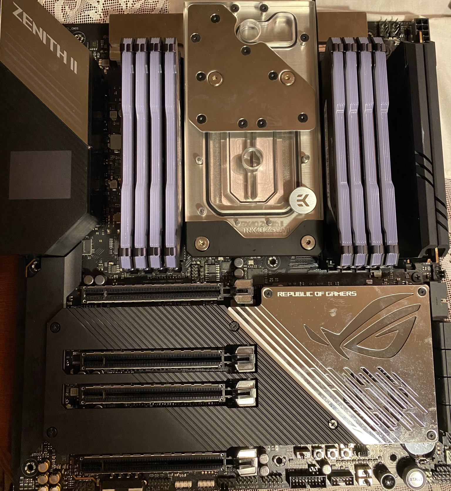

## Part 1

This post summarizes the first part of the RIEGSIL build.

It starts off from a barebones chassis and enumerates through to fan installation, modifying and installing the motherboard, and finishes on the connecting most I/O and necessary ports.

## Getting started

First, the motherboard was prepared by carefully installing the CPU (the renowned Threadripper 3990X from AMD, allowing up to 64-core 128-thread performance), and 5x M.2 1TB hard drives.

<figure>
    
    <figcaption align="center">The motherboard, installed CPU, and two M.2 hard drives</figcaption>
</figure>

Then, the monoblock (a waterblock for a CPU that also covers the chipsets of the motherboard) was also installed, but not before much careful measuring and cutting of thermal pads.

<figure>
    
    <figcaption align="center">The motherboard, installed CPU, M.2 drives, and monoblock</figcaption>
</figure>

Finally, 8x 32GB RAM sticks were installed, to provide fast DDR4 speeds for calculations.

<figure>
    
    <figcaption align="center">The fully assembled motherboard with monoblock and RAM</figcaption>
</figure>