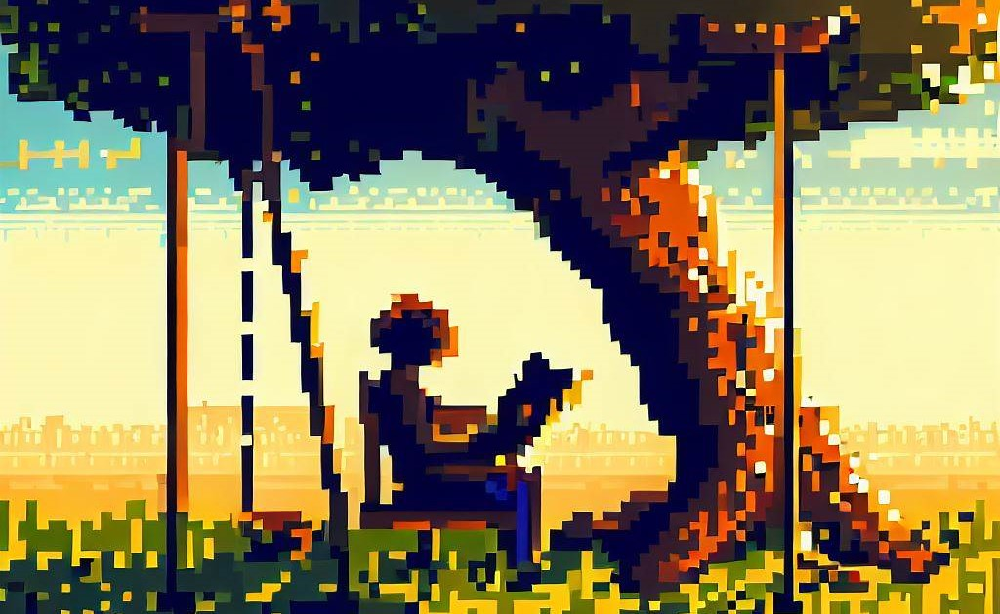

## Oh, the places you'll go!

When I was a kid, I always liked Dr. Seuss in ways difficult to describe as a kid; his words seemed all so exciting and *out there* and *FUN*!

But now, reflecting back as an adult, I've come to realize it was his avant-garde style, his intrepedation in relationship with his outlandish art;

a *kind* juxtoposition with messages any child would understand, all done so in a tone and meaning generally meant towards positivity.

Apart from the good doctor (who was *never even* a doctor, nor did he *ever* go to med school), I have since traversed many worlds, build by great people with many an interesting story to tell aphorisms to say, and hearts to teach.

Here's to ya'll out there, who terraform worlds and create realities beyond what we share.

<figure>
    
    <figcaption>
        Credits to DALLE for the above image, made using a prompt of: <i>a good book, in pixel style but very intricate, read by a person under a tree with a swing on it on a sunny day</i>
    </figcaption>
</figure>