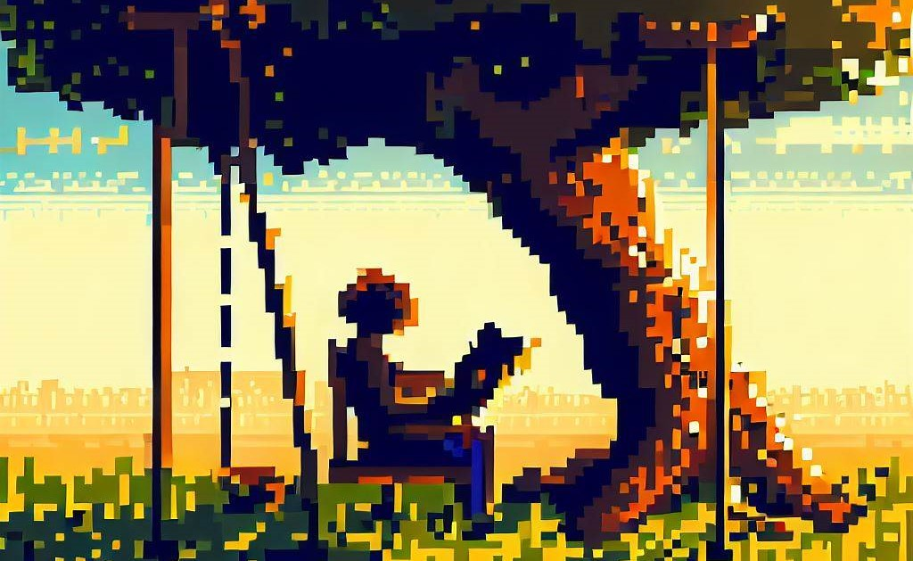

## Oh, the places you'll go!

When I was a kid, I always liked Dr. Seuss in ways unintelligible as a child; his words seemed all so exciting and *out there* and *FUN*

But now, reflecting as an adult, I've come to realize it was his avant-garde style, the intrepidation of his outlandish art, juxtoposition with a message any child would understand, all done so in a tone and meaning generally meant for a greater good.

Apart from the good doctor (who was *never even* a doctor, nor did he ever go to med school), I have since traversed to many worlds, build by great persons with many an interesting story to tell and things to teach.

Here's to ya'll, terraforming worlds and creating realities beyond our own.

Credits to DALLE for the above image, made using a prompt of:

*a good book, in pixel style but very intricate, read by a person under a tree with a swing on it on a sunny day*