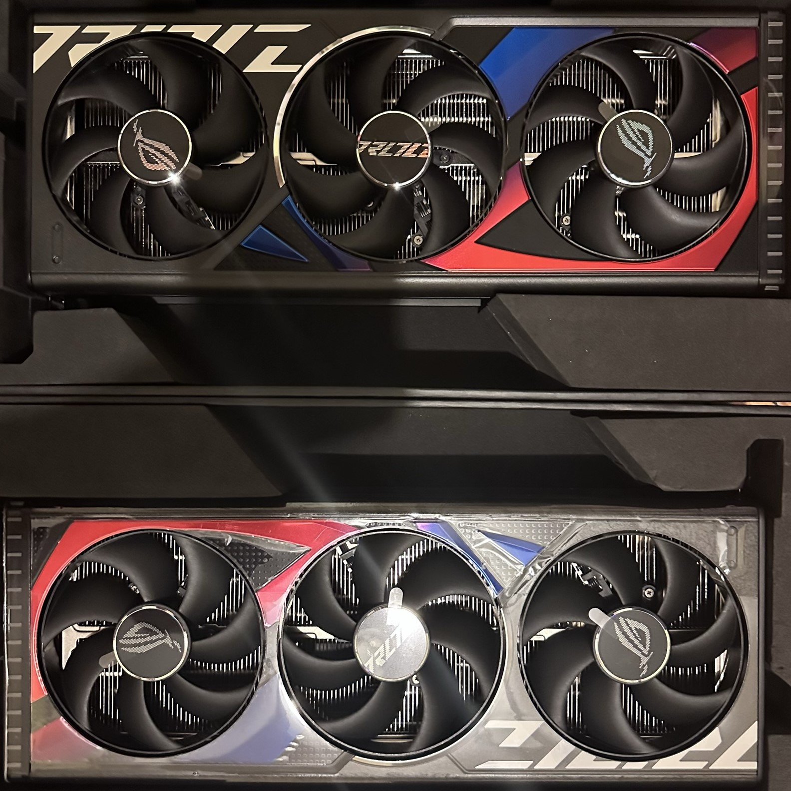
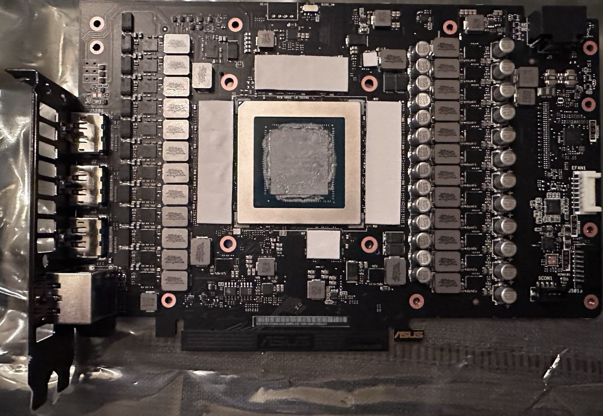
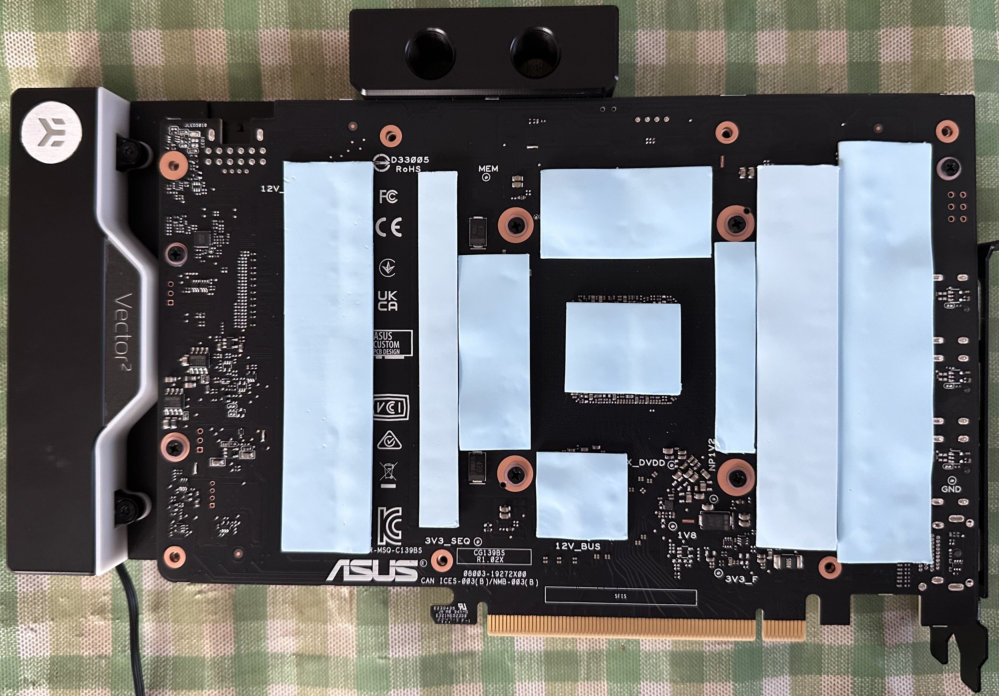
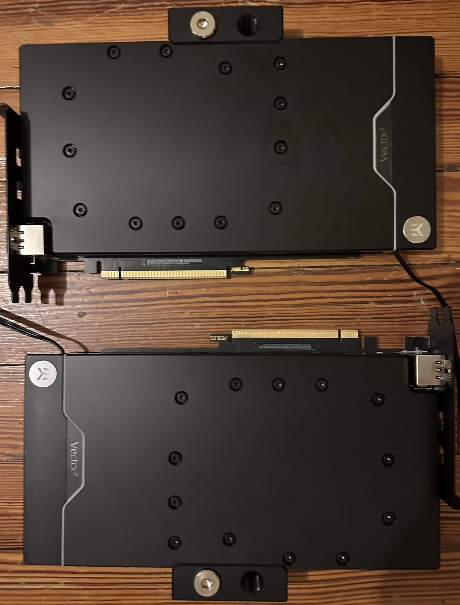

## Part 1

This post summarizes the first part of the RIEGSIL build.

It starts off from a barebones chassis and enumerates through to fan installation, modifying and installing the motherboard, and finishes on the connecting most I/O and necessary ports.

## Getting started

First, the motherboard was prepared by carefully installing the CPU (the renowned Threadripper 3990X from AMD, allowing up to 64-core 128-thread performance), and 5x M.2 2TB hard drives in RAID 0 (backed up, of course, on hard drives). The CPU was chosen for the future optionality to dedicate a part of this build as a server or remote compute device.

<figure>
    
    <figcaption align="center">The motherboard, installed CPU, and two M.2 hard drives</figcaption>
</figure>

Then, the monoblock (a waterblock for a CPU that also covers the chipsets of the motherboard) was also installed, but not before much careful measuring and cutting of thermal pads. This monoblock replaces the motherboard fan delivering cooling to the chipset, allowing for extended heat-dissapation.

<figure>
    
    <figcaption align="center">The motherboard, installed CPU, M.2 drives, and monoblock</figcaption>
</figure>

Finally, 8x 32GB RAM sticks were installed, to provide fast DDR4 speeds for calculations, and memory for multiple instances of programs and computer vision requirements.

<figure>
    
    <figcaption align="center">The fully assembled motherboard with monoblock and RAM</figcaption>
</figure>

For the GPUs, two 4090's were chosen for their performance. Although SLI/NV-LINK is not present for this generation of NVIDIA graphics processors, multi-GPU processing in Pytorch (the primary) 

<figure>
    
    <figcaption align="center">Two Strix 4090s, with their <i>massive</i> air coolers</figcaption>
</figure>

As with the motherboard, the massive stock cooler (heatsink) was removed and waterblocks by EKWB installed in their place:

<figure>
    
    
    <figcaption align="center">Before and after of a 4090 without the stock air cooler</figcaption>
</figure>

Et, voilà: a pair of cool, black, waterblock-fitted 4090s!

<figure>
    
    <figcaption align="center">Two Strix 4090s, form fitted with waterblocks</figcaption>
</figure>

To be continued, as I take the parts from the desk top (PC pun) to the case!